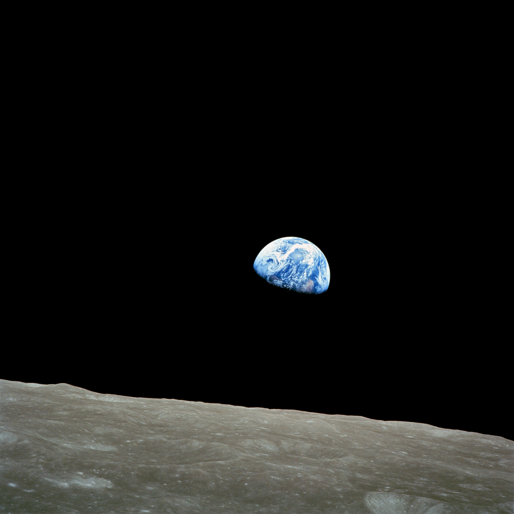
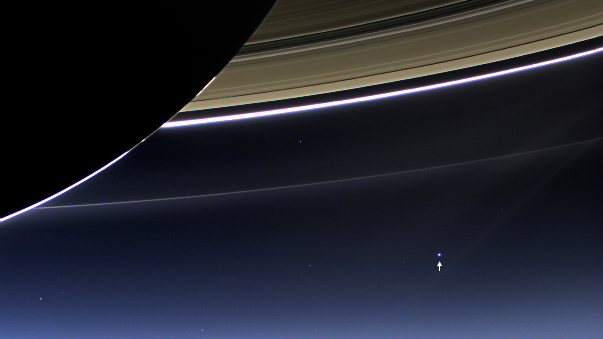
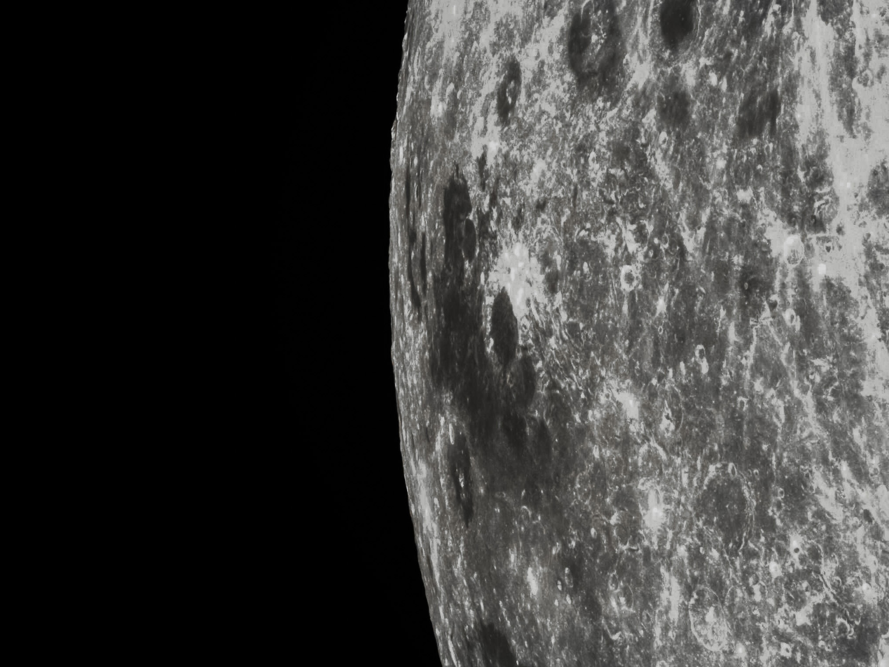
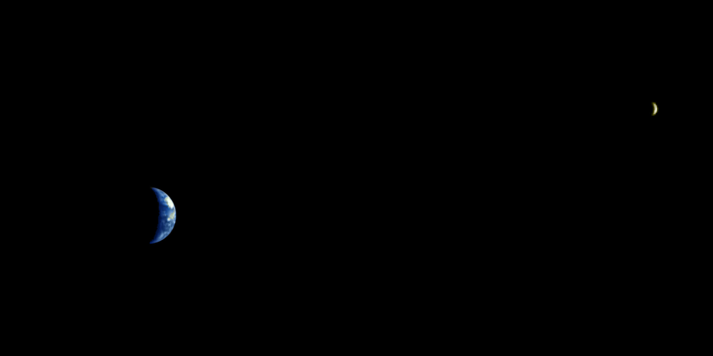
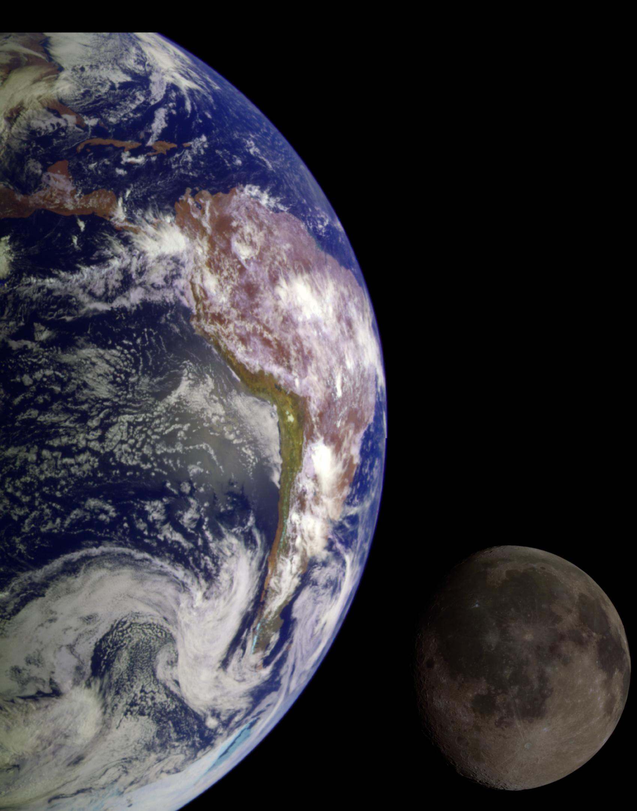

宇宙深处看地月情缘
==

这1968年的照片,由威廉·安德斯阿波罗8号——首次载人月球的轨道——可能是有史以来最有影响力的照片捕捉到人类。 称为“地出”由美国宇航局,这是第一次我们见过地球,在全彩色,来自外太空,我们第一次见过多么小,比较大,无限巨大的宇宙。 取决于人类的浪漫你的意见是,地出甚至可以被视为触发器创建整个环境/生态运动,直到今天仍然占主导地位的政治和社会。

的影响,地出,照片好像是极其罕见的。 地球的好枪,你需要几千英里之外,有些令人沮丧的是,发送宇宙飞船进入太空深处不是经常做的。 除了阿波罗计划——40多年前结束,人类只有少数低地球轨道之外的宇宙飞船。 绝大多数的太空发射用于低级卫星投入的地方,或者把货物送到国际空间站——这些都是太接近地球的得到一个完整的视图与光荣的银河系为背景。

月球的远端,地球,挂在空间。 由中国嫦娥5-T1,距离地球约200000英里的距离。
幸运的是,近年来,已经有了新的兴趣回到深太空——两个无人探测器和探测器,并最终与人类。 例子:中国的嫦娥计划。 去年,中国的嫦娥3任务 把玉兔探测器在月球上 ——人类的第一个软登月40年来! ——现在, 嫦娥5-T1 完成了一个罕见的飞越月球的远端,捕捉一个惊人的照片月亮和地球的另一边在一个单一的框架。

奇怪你完成后惊叹不已月球的远端,点击多棒从外太空看到的地球的照片——包括相当有名的蓝色大理石,和卡尔·萨根的淡蓝色点,有史以来最遥远的地球的照片捕捉(可悲的是,可能最遥远的地球的照片我们都将在接下来的几十年里)。

捕获的蓝色大理石,在1972年阿波罗17号的船员

### 蓝色大理石 ###

地出在第一个地球外层空间的彩色照片,蓝色大理石——于1972年被阿波罗17号——可能是更有名。

这张照片拍摄于大约28000英里(45000公里)的距离,阿波罗17号的船员走向月球。 最喜欢的美国国家航空航天局的早期任务,修改后的70毫米哈苏使用胶片相机。

美国宇航局已经重用的蓝色大理石名称 一系列的现代地球的照片 由合成低空高分辨率卫星图像。

地球,在卡西尼号卫星,目前轨道土星。 地球是10点钟亮斑位置(点击图片放大)。
土星光环

这张照片——可能是我最喜欢的——被最近2006年,卡西尼号通过土星的阴影。 卡西尼约130万英里远离土星在这里,和大约900亿英里(15亿公里,远离地球。 太阳直接在土星后面,这就是为什么地球及其环的边缘是如此惊人地照亮。 (它也被大大增强了美国国家航空航天局)。

卡西尼号也 在2013年也采取了类似的照片 ,你更清楚地辨认出地球和月亮:

地球和月球从卡西尼号土星的阴影。 月亮是小“撞”的白色亮点的边缘。

淡蓝色的点(地球),旅行者1号认为这是太阳系的出发——距离地球40亿英里的地方
淡蓝色的点

这张照片,被旅行者1号通过超出冥王星和海王星的轨道,是地球最遥远的形象(除非一些外星种族从远离了我们的照片,当然)。 在这张照片中,1990年被捕,“航行者”号的距离地球约37亿英里或60亿公里。 奇怪的、色彩斑斓的光线没有什么激动人心的,不幸的是,他们衍射图样(爆发)引起的明亮的阳光。

淡蓝色圆点是最极端的例子是多么微不足道的我们,提醒我们,我们应该也许让我们狂妄略。 一切人类有史以来所做的是正确的,微小的斑点。 这个相当令人羞辱的实现了卡尔·萨根笔这些淡蓝色点而美丽的思考:

点击观看[Youtube视频: Carl Sagan's Famous 'Pale Blue Dot' Quote in "Cosmos: A Spacetime Odyssey" (HD with subtitles) ](http://www.youtube.com/embed/b58SfRphkKc)可能需要翻墙

在24年以来, 旅行者1号终于离开了太阳系 和几天前,现在的总数 18小时光 从太阳,或者大约120亿英里远。 记住,离地球最近的恒星,因此最近的行星可能存在生命——半人马座阿尔法星,这是大约4光 年 遥远。 现在你看到 为什么我们需要开发经驱动器 越早越好吗?

地球,火星表面,由好奇心
更奇怪的,来自外太空的奇妙的地球的照片

最后,我将留给你一些奇怪的地球的照片,从各种各样的奇怪的位置在整个太阳系。 上面的图片是由美国宇航局 好奇心 罗孚;通常探测器不仰望天空(它的相机不适合这样的努力),但它仍然是一个相当酷的照片。

“全地球上升”,日本“月亮女神号”月球探测器
早在2007年,日本的“月亮女神号”月球探测器重建美国宇航局的原始照片使用其HDTV视频相机。

月球的母马右下方Marginis,被中国“嫦娥5-T1号”
好吧,这不是地球的,但这是一个非常酷的/怪异的月亮,捕捉到几天前,中国的“嫦娥5-T1号”。 母马右下方Marginis——字面上,大海的边缘——是对边缘的月球附近,因此我们通常无法看到它。

看到的地球和月球,火星快车上火星
这鲜明的和美丽的照片被欧洲火星快车探测器早在2003年,当它还在火星上。 宇宙飞船是距离地球约500万英里(800万公里)远的地方。

地球和月球,就像被NASA的伽利略,木星的途中
我和保存最好的(和奇怪吗?)图。 这张照片是一个组合,但规模和相对颜色/反照率(亮度/反射率)是正确的。 早在1992年,木星的伽利略卫星正,但仍然相当接近地球时,它转过身,拍一些漂亮的照片。 我不确定这张照片拍摄从一个奇怪的角度,或如果NASA月球粘贴到形象; NASA官员描述 还不清楚。

所有的照片在这个故事可以点击放大。 我认为几乎所有的高分辨率足够,你可以使用它们桌面壁纸,如果你希望如此。 如果你认为我们错过了一个特别棒的照片来自外太空的地球,在评论中让我们知道!

##

继续阅读: [The Space Shuttle legacy, in pictures](http://www.extremetech.com/extreme/90710-the-space-shuttle-legacy-in-pictures)

原文链接:  [The Earth and Moon, as seen from elsewhere in the universe](http://www.extremetech.com/extreme/193161-the-earth-and-moon-as-seen-from-elsewhere-in-the-universe)

原文日期: 2014年10月23日

翻译日期: 2014年10月24日

翻译人员: [书三生](http://t.qq.com/renfufei)
