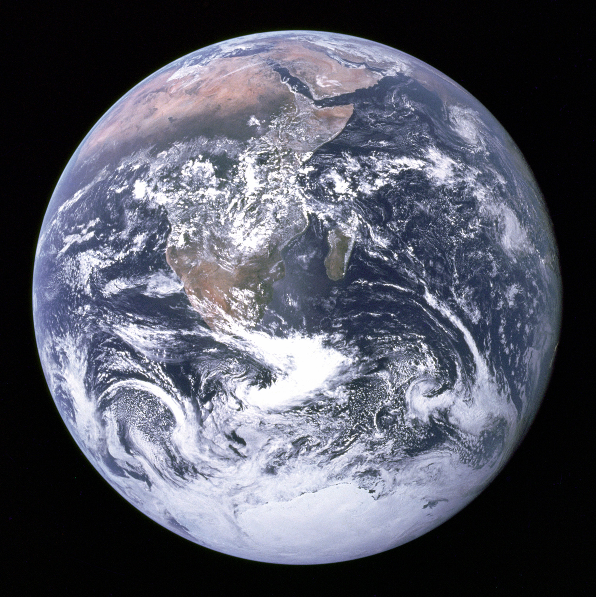
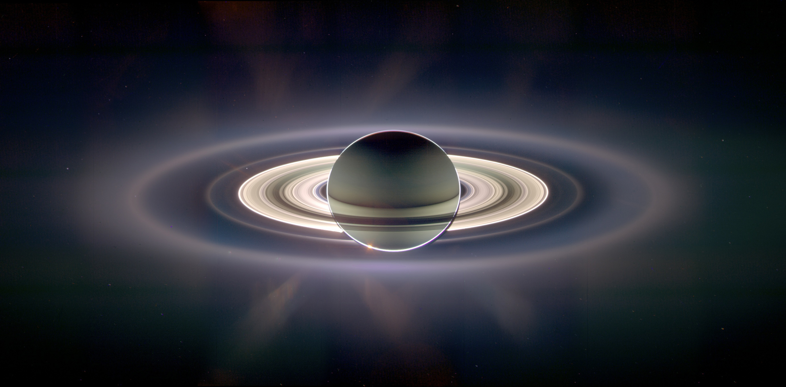

宇宙深处看地月情缘
==

1968年,威廉·安德斯(William Anders of Apollo 8)在首个绕月探测器阿波罗8号上拍下了这张照片 —— 这可能是有史以来人类拍摄的最有影响力的照片了。 NASA(美国宇航局)称之为“地出”(Earthrise), 这是我们第一次以外太空视角看到的彩色地球照片, 相对广袤无边的宇宙背景, 才发现自己这么渺小。 伴随着身为人类的你天马行空般的思维,地球的升起甚至可被视为整个社会环境的触发器,直到今天这种影响依然支配着整个社会的政治与文化。

伴随着地出的影响,像这样的照片是很罕见的。 要获得一个好的视角,你得先离开地球几千英里以外,但有些令人遗憾的是, 发送宇宙飞船到太空深处也并不是很容易的。 除了阿波罗计划 —— 但在40多年前就结束了,人类在近地轨道以外只发射了少量的宇宙飞船。 大多数的太空发射都是将卫星投放到低层级的地球轨道,或者把货物送到国际空间站( International Space Station) —— 但这些地方都因太靠近地球而很难拍到一张以璀璨深邃的银河为背景的地球靓照。

这是月球的背面,和地球一起悬挂在空中。 由中国嫦娥五号T1试验飞行器拍摄,距离地球约200000英里的距离。

幸运的是,近年来人类又有兴趣想回到深层太空—— 先是两个无人探测器与巡视器(probes and rovers),最终将会进行载人飞行。 例如: 中国的嫦娥计划。 去年, 中国的嫦娥3号任务是 [将玉兔探测器发送到月球上](http://www.extremetech.com/extreme/175410-chinas-lunar-rover-yutu-says-goodnight-humanity-in-creepy-farewell-letter-before-freezing-to-death) —— 这是人类40年以来第一个软登月! —— 现在, [嫦娥 Chang’e 5-T1](http://en.wikipedia.org/wiki/Chang%27e_5-T1) 完成了一个罕见的飞越到月球远端的任务,捕捉到一张惊人的照片: 月亮的另一边和地球都出现在同一个相框中。

在看完这张令人惊叹不已的月球远端视角之后, 下面还有更多从外太空看到的地球照片分享给你 —— 包括著名的蓝色大理石(Blue Marble),和以及卡尔·萨根(Carl Sagan)的淡蓝色点(Pale Blue Dot),这是有史以来拍摄到的最遥远的地球照片(悲剧的是,可能接下来的几十年里这也是最遥远的地球照片了).

蓝色大理石, 1972年由阿波罗17号的宇航员拍摄

## 蓝色大理石 ##

地出在第一个地球外层空间的彩色照片,蓝色大理石——于1972年被阿波罗17号——可能是更有名。

这张照片拍摄于大约28000英里(45000公里)的距离,阿波罗17号的船员走向月球。 最喜欢的美国国家航空航天局的早期任务,修改后的70毫米哈苏使用胶片相机。

美国宇航局已经重用的蓝色大理石名称 一系列的现代地球的照片 由合成低空高分辨率卫星图像。

地球,在卡西尼号卫星,目前轨道土星。 地球是10点钟亮斑位置(点击图片放大)。
土星光环

这张照片——可能是我最喜欢的——被最近2006年,卡西尼号通过土星的阴影。 卡西尼约130万英里远离土星在这里,和大约900亿英里(15亿公里,远离地球。 太阳直接在土星后面,这就是为什么地球及其环的边缘是如此惊人地照亮。 (它也被大大增强了美国国家航空航天局)。

卡西尼号也 在2013年也采取了类似的照片 ,你更清楚地辨认出地球和月亮:

地球和月球从卡西尼号土星的阴影。 月亮是小“撞”的白色亮点的边缘。

淡蓝色的点(地球),旅行者1号认为这是太阳系的出发——距离地球40亿英里的地方
淡蓝色的点

这张照片,被旅行者1号通过超出冥王星和海王星的轨道,是地球最遥远的形象(除非一些外星种族从远离了我们的照片,当然)。 在这张照片中,1990年被捕,“航行者”号的距离地球约37亿英里或60亿公里。 奇怪的、色彩斑斓的光线没有什么激动人心的,不幸的是,他们衍射图样(爆发)引起的明亮的阳光。

淡蓝色圆点是最极端的例子是多么微不足道的我们,提醒我们,我们应该也许让我们狂妄略。 一切人类有史以来所做的是正确的,微小的斑点。 这个相当令人羞辱的实现了卡尔·萨根笔这些淡蓝色点而美丽的思考:

点击观看[Youtube视频: Carl Sagan's Famous 'Pale Blue Dot' Quote in "Cosmos: A Spacetime Odyssey" (HD with subtitles) ](http://www.youtube.com/embed/b58SfRphkKc)可能需要翻墙

在24年以来, 旅行者1号终于离开了太阳系 和几天前,现在的总数 18小时光 从太阳,或者大约120亿英里远。 记住,离地球最近的恒星,因此最近的行星可能存在生命——半人马座阿尔法星,这是大约4光 年 遥远。 现在你看到 为什么我们需要开发经驱动器 越早越好吗?

地球,火星表面,由好奇心
更奇怪的,来自外太空的奇妙的地球的照片

最后,我将留给你一些奇怪的地球的照片,从各种各样的奇怪的位置在整个太阳系。 上面的图片是由美国宇航局 好奇心 罗孚;通常探测器不仰望天空(它的相机不适合这样的努力),但它仍然是一个相当酷的照片。

“全地球上升”,日本“月亮女神号”月球探测器
早在2007年,日本的“月亮女神号”月球探测器重建美国宇航局的原始照片使用其HDTV视频相机。

月球的母马右下方Marginis,被中国“嫦娥5-T1号”
好吧,这不是地球的,但这是一个非常酷的/怪异的月亮,捕捉到几天前,中国的“嫦娥5-T1号”。 母马右下方Marginis——字面上,大海的边缘——是对边缘的月球附近,因此我们通常无法看到它。

看到的地球和月球,火星快车上火星
这鲜明的和美丽的照片被欧洲火星快车探测器早在2003年,当它还在火星上。 宇宙飞船是距离地球约500万英里(800万公里)远的地方。

地球和月球,就像被NASA的伽利略,木星的途中
我和保存最好的(和奇怪吗?)图。 这张照片是一个组合,但规模和相对颜色/反照率(亮度/反射率)是正确的。 早在1992年,木星的伽利略卫星正,但仍然相当接近地球时,它转过身,拍一些漂亮的照片。 我不确定这张照片拍摄从一个奇怪的角度,或如果NASA月球粘贴到形象; NASA官员描述 还不清楚。

所有的照片在这个故事可以点击放大。 我认为几乎所有的高分辨率足够,你可以使用它们桌面壁纸,如果你希望如此。 如果你认为我们错过了一个特别棒的照片来自外太空的地球,在评论中让我们知道!

##

继续阅读: [The Space Shuttle legacy, in pictures](http://www.extremetech.com/extreme/90710-the-space-shuttle-legacy-in-pictures)

原文链接:  [The Earth and Moon, as seen from elsewhere in the universe](http://www.extremetech.com/extreme/193161-the-earth-and-moon-as-seen-from-elsewhere-in-the-universe)

原文日期: 2014年10月23日

翻译日期: 2014年10月24日

翻译人员: [书三生](http://t.qq.com/renfufei)
