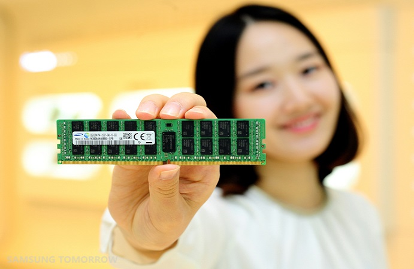
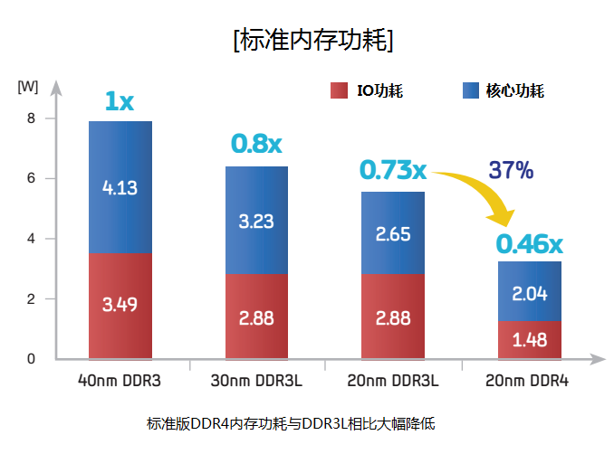

20纳米DDR4内存 —— 单条最大128GB
==

三星公告称20纳米制程的DDR4芯片已经发布, 20nm制程能突破现有内存容量的瓶颈, 使得单个DIMM内存模块支持更大的内存容量。 当前,服务器和PC机标称最大支持单条32GB内存,但该参数只是个象征参数[~2014年,服务器内存单条最大容量32GB,PC机内存最大单条8GB,厂商有制程和销量等制约]。 [新蛋网](http://www.newegg.com/Memory/Category/ID-17) 32GB单条服务器内存标价510美元,而4x8GB套装最低报价为则309美元。 在小容量市场,单条内存要比套装便宜一些. 但在高端大容量市场则价格倒转过来。

根据这份公告, 三星现在正处于大容量内存的铺货阶段。 新的20nm芯片(三星声明这是真正的20纳米DIMM,而非20~纳米级内存)每个模块现在容量为8Gbit,单条内存可达 32GB(说明: 1Byte = 8bit, 32GB = 32x8Gbit), 但后期将能达到单条最多128GB。 这一切都归功于第4代硅通孔封装技术(TSV,Through -Silicon-Via),而你可能也曾了解过道, 内存容量已经卡在当前瓶颈快5年了。

那么问题来了,当记者询问是现在开始研究 128GB DDR4模块, 这是几年以后才开始时, 三星的回答是: “只要市场有需求,我们随时可以生产128 GB 内存。” 虽然市场上短期内是见不到了,但未来几年内我们肯定可以看到高端的 128GB容量的内存面世。 三星的DDR4时钟起步为2.4GHZ,比上代要快很多,尤其是服务器内存。 DDR4速度不仅比DDR3更快,而且功耗节能以及RAM密度都有很大提高。

## DDR4与exascale ##

真正有趣的地方是高密度DDR4内存模块将在 [超标量计算机](http://www.extremetech.com/computing/185797-forget-moores-law-hot-and-slow-dram-is-a-major-roadblock-to-exascale-and-beyond) 和HPC上长期使用。 我们已经讨论过, 构建高性能超级计算机时,内存密度,功耗问题以及能源利用率将变得越来越重要. 如果三星将DDR4内存密度提高4倍,那么一个32个内存插槽的主板能集成的内存将从1TB增大到4TB。新的内存需要Intel芯片组的支持,当前Intel的15核 处理器 Xeon E7v2 每颗CPU最大支持1.5TB内存[如果是8路服务器,则可以插8颗CPU, 8x1.5TB = 12TB]。

三星宣称新的芯片比前代内存使用了更好的ECC技术,标准电压是1.2V,总功率比初代40nm DDR3降低近50%。 DDR4开始进入消费者市场 —— 当前只有 [Intel X99芯片组](http://www.extremetech.com/computing/188911-intel-haswell-e-review-the-best-consumer-performance-chip-you-can-buy-with-some-caveats) 是支持DDR4, 但预计英特尔Skylake将在2014年支持DDR4。 媒体对 [AMD Carrizo ](http://www.extremetech.com/computing/178752-amds-next-gen-carrizo-apu-features-leaked-shows-greater-focus-on-power-efficiency) 支持DDR3  还是 DDR4 尚有争议, 有可能AMD会推出同一芯片的两种版本,或者像 DDR2～DDR3的过渡一样,采用组合内存控制器。

虽然还有一些问题,不确定DDR4内存是否最先在桌面领域采用。 但可以肯定的是,两三年内我们就能看到DDR4内存在智能机上采用, 普及速度要比其他平台都快, 因为这些小容量电池设备对节能的需求是非常迫切的。

相关新闻: [三星850 Pro评论:3 d NAND和RAM缓存导致的最快,最持久的SSD金钱可以买到的](http://www.extremetech.com/computing/189003-samsung-850-pro-review-3d-nand-and-ram-caching-result-in-the-fastest-most-durable-ssd-money-can-buy)

##

原文链接: [Samsung’s new 20nm DDR4 clears the way for massive 128GB DIMMs](http://www.extremetech.com/computing/192711-samsungs-new-20nm-ddr4-clears-the-way-for-massive-128gb-dimms)

原文日期: 2014年10月23日

翻译日期: 2014年10月24日

翻译人员: [书三生](http://t.qq.com/renfufei)

[网易报导](http://digi.163.com/14/1021/10/A92TJ8I4001618JV.html)