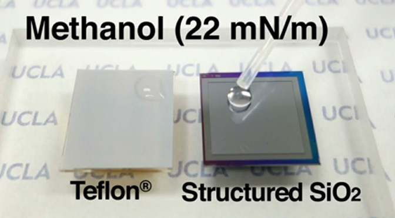

排斥所有液体的新型超疏水纳米材料
==
# New superomniphobic texture made of nanoscopic nails repels all known liquids

`hydrophobic` - 疏水性

`superhydrophobic` - 超疏水

`superomniphobic` - 超级疏水

## 1.

如果你曾住在某个多雨的城市, 靠小汽车代步, 你可能会对 Rain-X 很熟悉。 擦一些在你的挡风玻璃上, 当它稳定以后, 即便你开车时下器倾盆大雨也无需打开刮雨刷了(但不建议你真的不打开)。 Rain-X是一种疏水性涂料,不溶于水,给你刮雨刷给不了的清晰路况。 虽然疏水性涂料也不沾染其他液体,但主要还是用于防水, 如同你的白衬衫礼服, 也不沾染很多种液体,水并不是唯一。 加州大学洛杉矶分校(UCLA) 的工程师们创造了一种比普通疏水涂料强效很多倍的 superomniphobic, 它依赖表面纹理, 而不是一劳永逸的涂层。

If you have ever lived in a frequently rainy area of the world where the main mode of transportation is driving, you’re likely very familiar with products like Rain-X. Rub some of it on your windshield, let it settle, and you can practically drive through a downpour without having to turn your windshield wipers on (though we wouldn’t recommend it). Rain-X is a superhydrophobic coating that repels water, giving you a clear view of the road ahead even when wipers can’t. Though superhydrophobic coatings can repel other liquids, its main focus is water, and as your white dress shirt is probably aware, water isn’t the only liquid that can spill. Engineers at UCLA have created a liquid repellent so much more effective than superhydrophobic coating that it’s classified as superomniphobic — and it’s based on surface texture, rather than a set-and-forget coating.

## 2.

在秋寒露重的早晨, 你可曾注意那树叶上慢慢滑落的小水珠。 有些植物的叶子表面长满细密的绒毛, 也就没有足够的接触点来吸附表面上的液体, 使液体因自身的表面张力形成一个球形。 这也是水珠不粘附叶子的原因。 如果你经常做饭，就会发现油一般不会形成圆球形; 它的表面张力比水要小一些, 所以就更难清洗。 虽然现在的疏水物质会排斥像油一类表面张力比水小一些的液体, 但对那些表面张力更小的液体呢? 比如用于电气冷却的氟溶剂, 仍然是难以抵抗的.

On a cool, dewy morning, you’ll tend to notice beads of water sitting atop or rolling down leaves. Certain foliage is hairy on a microscopic level, which means the surface doesn’t have enough points of contact with water to soak it in, leaving the droplet intact thanks to its own surface tension. This is also why water beads up on a non-stick cooking pan. If you cook often, though, you’ll know that oil doesn’t bead up; it has a lower surface tension than water, and thus is more difficult to repel. Surfaces have been created that can deal with lower surface tension liquids, such as oil, but being able to repel liquids with an even lower surface tension, like fluorinated solvent — used for electrical cooling, for instance — has remained elusive.

## 3.

甲醇在新的超级疏水性纳米材料表面形成液滴

**Teflon**: 铁氟龙, 不粘锅涂层

Methanol beading on the new, textured superomniphobic surface

## 4.

通过在表面上覆盖成千上万的扁平的微观甲片,加州大学洛杉矶分校(UCLA)的研究人员 CJ Kim 和 Tingyi Liu 创造了一种表面纹理,可以 [排斥所有已知液体](http://newsroom.ucla.edu/releases/ucla-engineers-create-superomniphobic-texture-capable-of-repelling-all-liquids).  每个甲片都比人类的头发还要细,只有100微么薄,每个凸起的直径只有20微米。 

每个甲片都有一个垂直的边幔,看起来就像台布悬挂在圆桌的边缘一样. 悬挂的边幔创造出一个大约由95%的空气组成的缓冲层支撑着液体,保持液体的表面张力。 甲片由我们的老朋友的雕刻而成 —— 二氧化硅; 二氧化硅是计算机芯片的基础材料. [研究论文: [DOI: 10.1126/science.1254787](http://www.sciencemag.org/content/346/6213/1096) ]

By covering a surface with thousands of microscopic flathead nails, UCLA researchers CJ Kim and Tingyi Liu have created a surface texture that can repel all known liquids. Each nail is thinner than the width of a human hair and placed just 100 micrometers apart, and each head measures in at just 20 micrometers in diameter. Every nail has a vertical overhang coming off its head, looking similar to a tablecloth hanging over the edge of a round table. The overhang buoys liquids by creating a cushion composed of about 95% air, preserving the liquid’s surface tension. The nails are fashioned out of our old friend silica — silicon dioxide; the same stuff that lays at the base of almost every computer chip ever made. [[Research paper: DOI: 10.1126/science.1254787]((http://www.sciencemag.org/content/346/6213/1096))]

## 5.

UCLA-工程纹理排斥所有的液体,包括油、溶剂、甚至是已知表面张力最低知道液体溶剂, perfluorohexane. 更棒的是,纹理结构可以应用于各种表面, 如金属, 玻璃 以及聚合物等等. 由于表面是由纳米甲片组成,而不是使用的涂层,所以可以扛得住严苛的温度,不会从严酷的气温, 生物流体和紫外线。

The UCLA-engineered texture repelled all liquids thrown at it, including oils, solvents, and even a solvent that has the lowest known surface tension for a liquid, perfluorohexane. Even better, the nailed texture can be applied to a variety of surfaces, including metal, glass, and polymers. Due to the surface being made of nanostructured nails instead of, for example, a coating, it’s tough and wouldn’t degrade from harsh temperatures, biofluid, or ultraviolet light.

## 6.

研究人员已经申请了专利, 但还需要时间来研究和完善。 所以现在,你不要指望很快就买到表面布满疏水性纹理结构的雨衣. 纹理的存在可以用于各种各样的表面. 看起来这种材料的完善对研究人员来说仅仅是需要点时间而已。

The researchers have filed a patent for the creation, but need time to explore and perfect it. So for now, you shouldn’t expect to purchase a raincoat covered in the texture anytime soon. The texture exists, though, and can be applied to a variety of surfaces. It seems all the researchers need to perfect the material is time.

## 

继续阅读: [麻省理工学院创造了疏水性材料,可以彻底改变火电厂与核能发电站](http://www.extremetech.com/extreme/138315-mit-creates-hydrophobic-material-that-could-revolutionize-fossil-and-nuclear-power-plants)

Now read: [MIT creates hydrophobic material that could revolutionize fossil fuel and nuclear power plants]((http://www.extremetech.com/extreme/138315-mit-creates-hydrophobic-material-that-could-revolutionize-fossil-and-nuclear-power-plants))

原文链接: [New superomniphobic texture made of nanoscopic nails repels all known liquids](http://www.extremetech.com/extreme/195176-new-superomniphobic-texture-made-of-nanoscopic-nails-repels-all-known-liquids)

原文日期: 2014-12-02

翻译日期: 2014-12-13

翻译人员: [书三生](http://t.qq.com/renfufei)
