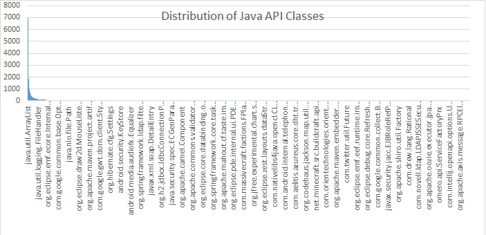

最常用的Java类 Top 100
====

大部分Java开发都会使用各种类库/框架及其API。 作者从10000个开源Java项目中提取并统计了各个 API Class 的使用频率，包括Java标准库和第三方类库。在每个项目中一个 class 只计数1次(这种方法也有一定的道理,因为有封装和重用,出现次数多不一定就是用的多)。下面列出了排名前100的 `Class` 。

## 1. Top 100 Java Classes ##

下面括号中的数字表示出现频率, 范围从 1 到 10000; 例如, “`java.util.ArrayList (6958)`” 代表在这10000个项目中, 有 **5958** 个使用到 `java.util.ArrayList`; 如果感兴趣,你也可以 [查看详细统计列表](http://www.programcreek.com/java-api-examples/?action=index)

1. [java.util.ArrayList](http://www.programcreek.com/java-api-examples/index.php?api=java.util.ArrayList)(6958)
1. [java.io.IOException](http://www.programcreek.com/java-api-examples/index.php?api=java.io.IOException)(6866)
1. [java.util.List](http://www.programcreek.com/java-api-examples/index.php?api=java.util.List)(6784)
1. [java.util.HashMap](http://www.programcreek.com/java-api-examples/index.php?api=java.util.HashMap)(5590)
1. [java.util.Map](http://www.programcreek.com/java-api-examples/index.php?api=java.util.Map)(5413)
1. [java.io.File](http://www.programcreek.com/java-api-examples/index.php?api=java.io.File)(5097)
1. [java.io.InputStream](http://www.programcreek.com/java-api-examples/index.php?api=java.io.InputStream)(4234)
1. [java.util.Set](http://www.programcreek.com/java-api-examples/index.php?api=java.util.Set)(3915)
1. [java.util.Arrays](http://www.programcreek.com/java-api-examples/index.php?api=java.util.Arrays)(3884)
1. [java.util.Iterator](http://www.programcreek.com/java-api-examples/index.php?api=java.util.Iterator)(3856)
1. [java.util.Collections](http://www.programcreek.com/java-api-examples/index.php?api=java.util.Collections)(3643)
1. [java.util.Date](http://www.programcreek.com/java-api-examples/index.php?api=java.util.Date)(3461)
1. [java.util.HashSet](http://www.programcreek.com/java-api-examples/index.php?api=java.util.HashSet)(3278)
1. [java.io.BufferedReader](http://www.programcreek.com/java-api-examples/index.php?api=java.io.BufferedReader)(3257)
1. [java.util.Collection](http://www.programcreek.com/java-api-examples/index.php?api=java.util.Collection)(3192)
1. [java.net.URL](http://www.programcreek.com/java-api-examples/index.php?api=java.net.URL)(3168)
1. [java.io.FileInputStream](http://www.programcreek.com/java-api-examples/index.php?api=java.io.FileInputStream)(3044)
1. [java.io.InputStreamReader](http://www.programcreek.com/java-api-examples/index.php?api=java.io.InputStreamReader)(3023)
1. [org.junit.Test](http://www.programcreek.com/java-api-examples/index.php?api=org.junit.Test)(3008)
1. [java.io.FileOutputStream](http://www.programcreek.com/java-api-examples/index.php?api=java.io.FileOutputStream)(2843)
1. [java.io.FileNotFoundException](http://www.programcreek.com/java-api-examples/index.php?api=java.io.FileNotFoundException)(2669)
1. [java.io.OutputStream](http://www.programcreek.com/java-api-examples/index.php?api=java.io.OutputStream)(2563)
1. [java.util.regex.Pattern](http://www.programcreek.com/java-api-examples/index.php?api=java.util.regex.Pattern)(2469)
1. [java.io.Serializable](http://www.programcreek.com/java-api-examples/index.php?api=java.io.Serializable)(2437)
1. [java.util.LinkedList](http://www.programcreek.com/java-api-examples/index.php?api=java.util.LinkedList)(2372)
1. [java.text.SimpleDateFormat](http://www.programcreek.com/java-api-examples/index.php?api=java.text.SimpleDateFormat)(2245)
1. [java.util.Properties](http://www.programcreek.com/java-api-examples/index.php?api=java.util.Properties)(2190)
1. [java.util.Random](http://www.programcreek.com/java-api-examples/index.php?api=java.util.Random)(2171)
1. [java.lang.reflect.Method](http://www.programcreek.com/java-api-examples/index.php?api=java.lang.reflect.Method)(2141)
1. [java.io.ByteArrayOutputStream](http://www.programcreek.com/java-api-examples/index.php?api=java.io.ByteArrayOutputStream)(2112)
1. [java.util.regex.Matcher](http://www.programcreek.com/java-api-examples/index.php?api=java.util.regex.Matcher)(2012)
1. [android.os.Bundle](http://www.programcreek.com/java-api-examples/index.php?api=android.os.Bundle)(2007)
1. [java.util.logging.Logger](http://www.programcreek.com/java-api-examples/index.php?api=java.util.logging.Logger)(1999)
1. [java.io.UnsupportedEncodingException](http://www.programcreek.com/java-api-examples/index.php?api=java.io.UnsupportedEncodingException)(1968)
1. [org.junit.Before](http://www.programcreek.com/java-api-examples/index.php?api=org.junit.Before)(1920)
1. [java.util.Comparator](http://www.programcreek.com/java-api-examples/index.php?api=java.util.Comparator)(1896)
1. [java.io.ByteArrayInputStream](http://www.programcreek.com/java-api-examples/index.php?api=java.io.ByteArrayInputStream)(1868)
1. [java.io.PrintWriter](http://www.programcreek.com/java-api-examples/index.php?api=java.io.PrintWriter)(1862)
1. [java.util.Calendar](http://www.programcreek.com/java-api-examples/index.php?api=java.util.Calendar)(1854)
1. [android.app.Activity](http://www.programcreek.com/java-api-examples/index.php?api=android.app.Activity)(1843)
1. [java.net.MalformedURLException](http://www.programcreek.com/java-api-examples/index.php?api=java.net.MalformedURLException)(1828)
1. [android.content.Context](http://www.programcreek.com/java-api-examples/index.php?api=android.content.Context)(1780)
1. [android.view.View](http://www.programcreek.com/java-api-examples/index.php?api=android.view.View)(1731)
1. [java.util.Locale](http://www.programcreek.com/java-api-examples/index.php?api=java.util.Locale)(1719)
1. [java.util.Enumeration](http://www.programcreek.com/java-api-examples/index.php?api=java.util.Enumeration)(1709)
1. [java.util.Map.Entry](http://www.programcreek.com/java-api-examples/index.php?api=java.util.Map.Entry)(1705)
1. [java.io.FileWriter](http://www.programcreek.com/java-api-examples/index.php?api=java.io.FileWriter)(1677)
1. [java.io.FileReader](http://www.programcreek.com/java-api-examples/index.php?api=java.io.FileReader)(1651)
1. [android.util.Log](http://www.programcreek.com/java-api-examples/index.php?api=android.util.Log)(1614)
1. [android.content.Intent](http://www.programcreek.com/java-api-examples/index.php?api=android.content.Intent)(1601)
1. [java.lang.reflect.InvocationTargetException](http://www.programcreek.com/java-api-examples/index.php?api=java.lang.reflect.InvocationTargetException)(1594)
1. [java.util.logging.Level](http://www.programcreek.com/java-api-examples/index.php?api=java.util.logging.Level)(1557)
1. [java.lang.reflect.Field](http://www.programcreek.com/java-api-examples/index.php?api=java.lang.reflect.Field)(1499)
1. [java.io.StringWriter](http://www.programcreek.com/java-api-examples/index.php?api=java.io.StringWriter)(1499)
1. [android.widget.TextView](http://www.programcreek.com/java-api-examples/index.php?api=android.widget.TextView)(1442)
1. [java.util.LinkedHashMap](http://www.programcreek.com/java-api-examples/index.php?api=java.util.LinkedHashMap)(1409)
1. [java.io.Reader](http://www.programcreek.com/java-api-examples/index.php?api=java.io.Reader)(1390)
1. [java.net.URI](http://www.programcreek.com/java-api-examples/index.php?api=java.net.URI)(1377)
1. [java.io.Writer](http://www.programcreek.com/java-api-examples/index.php?api=java.io.Writer)(1339)
1. [java.text.ParseException](http://www.programcreek.com/java-api-examples/index.php?api=java.text.ParseException)(1318)
1. [junit.framework.TestCase](http://www.programcreek.com/java-api-examples/index.php?api=junit.framework.TestCase)(1318)
1. [java.io.OutputStreamWriter](http://www.programcreek.com/java-api-examples/index.php?api=java.io.OutputStreamWriter)(1295)
1. [java.io.StringReader](http://www.programcreek.com/java-api-examples/index.php?api=java.io.StringReader)(1279)
1. [java.io.BufferedWriter](http://www.programcreek.com/java-api-examples/index.php?api=java.io.BufferedWriter)(1265)
1. [java.util.Vector](http://www.programcreek.com/java-api-examples/index.php?api=java.util.Vector)(1254)
1. [java.util.StringTokenizer](http://www.programcreek.com/java-api-examples/index.php?api=java.util.StringTokenizer)(1251)
1. [java.text.DateFormat](http://www.programcreek.com/java-api-examples/index.php?api=java.text.DateFormat)(1246)
1. [java.util.concurrent.TimeUnit](http://www.programcreek.com/java-api-examples/index.php?api=java.util.concurrent.TimeUnit)(1237)
1. [java.io.BufferedInputStream](http://www.programcreek.com/java-api-examples/index.php?api=java.io.BufferedInputStream)(1235)
1. [java.util.TreeMap](http://www.programcreek.com/java-api-examples/index.php?api=java.util.TreeMap)(1227)
1. [org.xml.sax.SAXException](http://www.programcreek.com/java-api-examples/index.php?api=org.xml.sax.SAXException)(1218)
1. [javax.servlet.http.HttpServletRequest](http://www.programcreek.com/java-api-examples/index.php?api=javax.servlet.http.HttpServletRequest)(1175)
1. [java.io.PrintStream](http://www.programcreek.com/java-api-examples/index.php?api=java.io.PrintStream)(1168)
1. [java.util.TreeSet](http://www.programcreek.com/java-api-examples/index.php?api=java.util.TreeSet)(1160)
1. [android.widget.Toast](http://www.programcreek.com/java-api-examples/index.php?api=android.widget.Toast)(1157)
1. [java.util.Hashtable](http://www.programcreek.com/java-api-examples/index.php?api=java.util.Hashtable)(1154)
1. [java.lang.reflect.Constructor](http://www.programcreek.com/java-api-examples/index.php?api=java.lang.reflect.Constructor)(1139)
1. [java.net.URLEncoder](http://www.programcreek.com/java-api-examples/index.php?api=java.net.URLEncoder)(1134)
1. [java.security.NoSuchAlgorithmException](http://www.programcreek.com/java-api-examples/index.php?api=java.security.NoSuchAlgorithmException)(1134)
1. [org.w3c.dom.Document](http://www.programcreek.com/java-api-examples/index.php?api=org.w3c.dom.Document)(1130)
1. [android.widget.Button](http://www.programcreek.com/java-api-examples/index.php?api=android.widget.Button)(1129)
1. [org.junit.After](http://www.programcreek.com/java-api-examples/index.php?api=org.junit.After)(1128)
1. [javax.servlet.http.HttpServletResponse](http://www.programcreek.com/java-api-examples/index.php?api=javax.servlet.http.HttpServletResponse)(1109)
1. [java.awt.Color](http://www.programcreek.com/java-api-examples/index.php?api=java.awt.Color)(1099)
1. [java.net.URISyntaxException](http://www.programcreek.com/java-api-examples/index.php?api=java.net.URISyntaxException)(1085)
1. [javax.servlet.ServletException](http://www.programcreek.com/java-api-examples/index.php?api=javax.servlet.ServletException)(1081)
1. [javax.xml.parsers.DocumentBuilderFactory](http://www.programcreek.com/java-api-examples/index.php?api=javax.xml.parsers.DocumentBuilderFactory)(1076)
1. [java.lang.annotation.Retention](http://www.programcreek.com/java-api-examples/index.php?api=java.lang.annotation.Retention)(1075)
1. [java.security.MessageDigest](http://www.programcreek.com/java-api-examples/index.php?api=java.security.MessageDigest)(1072)
1. [java.util.concurrent.Executors](http://www.programcreek.com/java-api-examples/index.php?api=java.util.concurrent.Executors)(1062)
1. [java.net.UnknownHostException](http://www.programcreek.com/java-api-examples/index.php?api=java.net.UnknownHostException)(1057)
1. [org.slf4j.Logger](http://www.programcreek.com/java-api-examples/index.php?api=org.slf4j.Logger)(1054)
1. [java.sql.SQLException](http://www.programcreek.com/java-api-examples/index.php?api=java.sql.SQLException)(1043)
1. [org.slf4j.LoggerFactory](http://www.programcreek.com/java-api-examples/index.php?api=org.slf4j.LoggerFactory)(1042)
1. [java.util.UUID](http://www.programcreek.com/java-api-examples/index.php?api=java.util.UUID)(1040)
1. [java.net.InetAddress](http://www.programcreek.com/java-api-examples/index.php?api=java.net.InetAddress)(1026)
1. [junit.framework.Assert](http://www.programcreek.com/java-api-examples/index.php?api=junit.framework.Assert)(1011)
1. [android.view.ViewGroup](http://www.programcreek.com/java-api-examples/index.php?api=android.view.ViewGroup)(1005)
1. [java.util.concurrent.ConcurrentHashMap](http://www.programcreek.com/java-api-examples/index.php?api=java.util.concurrent.ConcurrentHashMap)(1001)
1. [java.awt.event.ActionEvent](http://www.programcreek.com/java-api-examples/index.php?api=java.awt.event.ActionEvent)(995)

## 2. 潜在的使用频率列表 ##

其中的85个来自于Java标准类库,这并不奇怪,因为标准库是语言的一个组成部分。在这85个标准类中, 大部分位于 `java.util`, `java.lang` 和 `java.io` 包中.

关于上面的列表,使用说明如下:

1. 一个类的使用频率反映其流行程度和重要性。 对Java初学者来说, 多花心思学习最有用的这些 API 可能是个很主意。
2. 全世界大多数程序员的选择反映了Java开发的趋势。 在这100个类中,我们可以看到, Android 是非常受欢迎的。
3. 如果两个类具有 同样/相似 的功能, 则频率越高意味着这个类被优先考虑。 一个类被优先考虑的原因可能各不相同,比如可用性(usability), API文档(documentation), 时间复杂度(complexity)、 电量消耗(energy consumption)等。

## 3. 整个列表的分布 ##

如下面的图表所示, 整个列表具有非常明显的长尾效应。 我们一般只对顶部区域感兴趣。

这项调查只统计明确引入的那些类， 而形如 java.lang.* 这种通配符的形式的 import 被忽略了, 所以像 String, Math, StringBuilder 这些类都没进入统计, 因为在默认语言包内,没有必要显式引入它们。
如果你感兴趣,也可以做做大数据分析,记得将你的结果分享给大家哦!

### 更多阅读... ###

1. [4 types of Java inner classes](http://www.programcreek.com/2009/02/4-inner-classes-tutorial-examples/)
1. [Learn Eclipse RCP framework by using open source projects](http://www.programcreek.com/2012/09/learn-eclipse-rcp-framework-by-using-open-source-projects/)
1. [Collection Classes Summary Table](http://www.programcreek.com/2009/02/collection-interface-concrete-implementation-classes-summary-and-some-examples/)
1. [How to make a method thread-safe in Java?](http://www.programcreek.com/2014/02/how-to-make-a-method-thread-safe-in-java/)