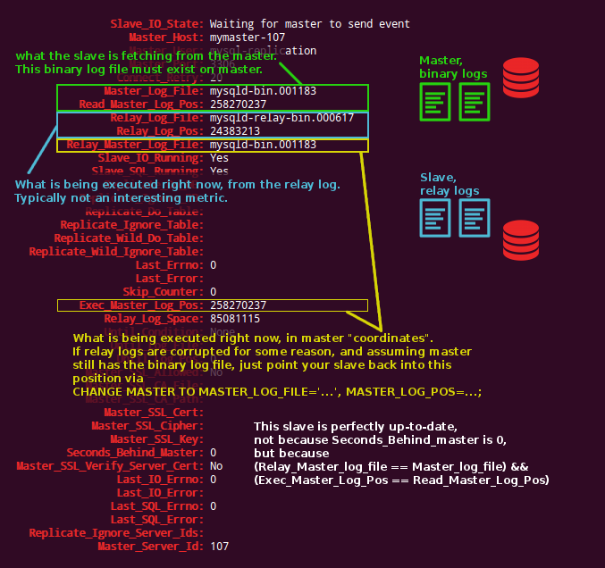

“一劳永逸”地解析 `SHOW SLAVE STATUS` 日志文件和位置
==

2014年3月6日
诚然,GTID(全局事务标识符)已经在 MySQL 5.6中得到支持, 此外,还可以通过 Tungsten replicator 软件来实现(2009年以后一直有谷歌在维护,不是吗?)。

但是我们中的一些人仍然使用标准的复制使用MySQL 5.5,和“所有这些二进制日志文件和立场”问题是爆发。 的输出 显示奴隶状态 混淆人们的新。 它混淆我一次又一次。

这是半视觉指南解读 显示奴隶状态。

## 关于 binary logs 和 relay logs ##

大师写二进制日志。 这些都是典型的和传统的 mysql-bin。# # # # # 或 mysqld-bin。# # # # # (用数字代替# # # # #)。

一个奴隶连接到它的主人,从主人的二进制日志读取条目。 奴隶将这些条目写入自己的中继日志。 这些都是典型的和传统的 mysql-relay。# # # # # 或 mysqld-relay。# # # # # (用数字代替# # # # #)。

并没有别的东西,连接的名称或一个奴隶的中继日志与主人的二进制日志。 并没有别的东西在继电器连接位置在主二进制日志日志的位置。 文件刷新/旋转;有不同大小配置;重建。 然而奴隶并跟踪当前relay-log条目:它知道什么匹配条目在主人的二进制日志。 这是一个重要的信息。

而奴隶获取条目和写在日志(通过继电器 IO_THREAD ),它还读取(通过中继日志重播这些条目 SQL_THREAD )。

所以在每个时间点上我们感兴趣以下“坐标”:

我们抓取从主呢? 哪些文件是我们获取,从哪个位置?
我们写这个在哪里? (这是隐式的最新中继日志文件和它的大小)
当前执行的奴隶的位置查询,relay-log坐标吗? 奴隶落后这些坐标远比写入位置(小)。
当前执行的奴隶的位置查询,在主binary-log坐标吗? 这个信息真的告诉我们我们之间的差距有多远从主。
我们如何解释上面的 显示奴隶状态 输出? 以下面两个图片为指导方针。 第一个提供了一个最新的奴隶,第二个提出了落后的奴隶。

希望这“一劳永逸”的解释将会持续几周。

原文链接: [The "once and for all" SHOW SLAVE STATUS log files & positions explained](http://code.openark.org/blog/mysql/the-once-and-for-all-show-slave-status-log-files-positions-explained)

原文日期: 2014年03月06日

翻译日期: 2014年10月17日

翻译人员: 铁锚 