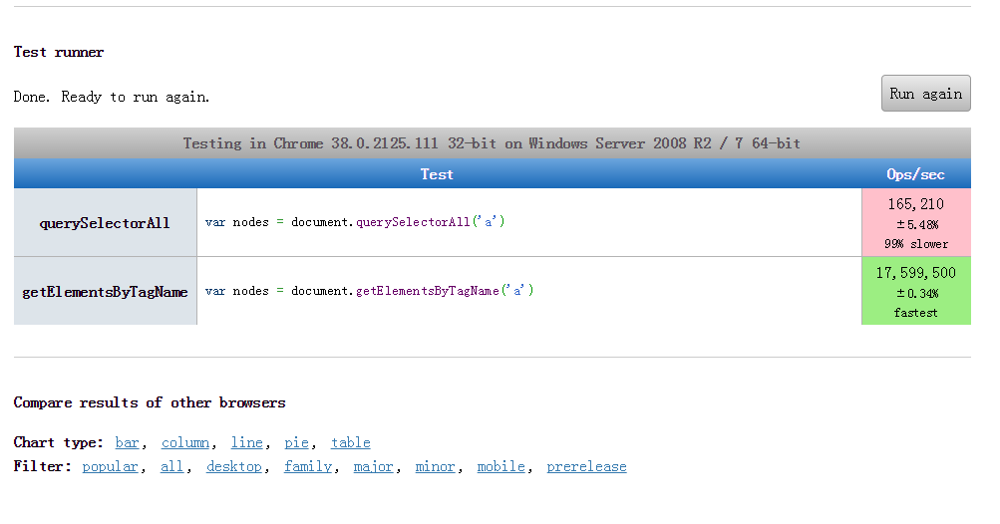

为何getElementsByTagName()比querySelectorAll()快100倍
==

昨天,我在雅虎的同事 [Scott Schiller](http://www.schillmania.com/) (斯科特·席勒, 同时也是SoundManager创造者) 发Twitter询问为何 `getElementsByTagName("a")` 在所有浏览器上都比 `querySelectorAll("a")` 要快好多倍。 有一个 专门的 [JSPerf测试页面](http://jsperf.com/queryselectorall-vs-getelementsbytagname), 通过对比就能发现两者的速度差异相当明显。 比如作者在Windows XP下使用的 Firefox 3.6.8 浏览器, `querySelectorAll("a")` 比 `getElementsByTagName("a")` 的运行速度要低98%. 我和 Scott, 以及 YUI团队的 [Ryan Grove](http://www.wonko.com/) 有一个活跃的Twitter-sation， 关于这种现象的原因,以及情理之中让人沮丧的结果。 我想好好地解释说明下到底为什么会发生这种情况,以及为什么未来也可能不会改变。

在深入细节之前需要了解这两个方法间一个非常重要的区别,我想说的并不是他们接收的参数一个是标签名,另一个是整个CSS选择器。 而其**最大的区别在于返回值的不同**: `getElementsByTagName()` 方法返回一个动态的(live) `NodeList`,  而 `querySelectorAll()` 返回的是一个静态的(static) `NodeList`. 理解这一点是非常必要的.

## 动态 NodeList ##

这是一个主要的文档对象模型的陷阱。 的 节点列表 对象(而且, HTMLCollection 对象在HTML DOM)是一种特殊类型的对象。 的 DOM Level 3规范 说对 HTMLCollection 对象:

节点列表 和 NamedNodeMap 在DOM对象 生活 ;也就是说,底层文档结构的变化反映在所有相关 节点列表 和 NamedNodeMap 对象。 例如,如果一个用户得到一个DOM 节点列表 对象包含的孩子 元素 随后补充道,更多的孩子,元素(或删除孩子,或修改它们),这些更改将自动反映在 节点列表 用户的,没有进一步的行动。 同样地,更改 节点 在树上反映在所有引用 节点 在 节点列表 和 NamedNodeMap 对象。

的 getElementsByTagName() 方法返回一个活的集合元素自动更新文档时发生了变化。 因此,实际上是一个无限循环如下:

	var divs = document.getElementsByTagName("div"),
	    i=0;
	
	while(i < divs.length){
	    document.body.appendChild(document.createElement("div"));
	    i++;
	}

无限循环是因为 divs.length 通过循环每次都重新计算。 由于在循环的每次迭代是添加一个新的 < div > ,这意味着 divs.length 正在增加每通过一次循环 我 也正在增加,永远无法赶上和终端条件不会触发。

这些生活集合可能似乎是一个坏主意,但他们可以用于使相同的对象 document.images , document.forms 和其他类似pre-DOM集合,在浏览器变得司空见惯。

## 静态 NodeList ##

的 querySelectorAll() 方法是不同的,因为它是一个静态的 节点列表 而不是一个生活。 这是表示的 选择器API规范 :

的 节点列表 返回的对象 querySelectorAll() 方法 必须 是静态的,而不是生活((dom level 3 core) 1.1.1节)。 后续更改底层文档的结构 不得 是反映在 节点列表 对象。 这意味着对象将包含匹配的列表 元素 节点在文档的创建列表。

所以即使的返回值 querySelectorAll() 有相同的方法和行为返回的相同吗 getElementsByTagName() 实际上,他们是非常不同的。 在前一种情况下, 节点列表 是文档的状态的快照方法被调用时,而后者总是会及时了解文档的当前状态。 这是 不 一个无限循环:

	var divs = document.querySelectorAll("div"),
	    i=0;
	
	while(i < divs.length){
	    document.body.appendChild(document.createElement("div"));
	    i++;
	}

在这种情况下没有无限循环。 的价值 divs.length 永远不会改变,所以循环将本质上的数量增加一倍 < div > 文档中的元素,然后退出。

## 那么,为什么动态节点更快呢? ##

生活 节点列表 对象可以创建并返回浏览器更快,因为他们不需要静态时前面的所有信息 节点列表 年代需要从一开始就有他们所有的数据。 再三强调这一点,WebKit的源代码有单独为每个类型的源文件 节点列表 : DynamicNodeList.cpp 和 StaticNodeList.cpp 。 中创建的两个对象类型是非常不同的方式。

的 DynamicNodeList 创建的对象 注册它的存在 在一个缓存。 从本质上讲,听到创建一个新的 DynamicNodeList 是令人难以置信的小,因为它没有做任何前期工作。 每当 DynamicNodeList 访问,必须查询文档的变化,证明了这一点吗 长度 财产 和 项目() 方法 (这是一样使用括号)。

相比之下, StaticNodeList 对象,其中的实例中创建另一个文件,然后填充所有的数据 在一个循环 。 前期成本上运行一个查询文档比当使用更重要 DynamicNodeList 实例。

如果你看一看真正的WebKit的源代码 创建一个返回值 为 querySelectorAll() ,您将看到一个循环使用每一个结果和建立一个 节点列表 这是最终返回。

## 结论 ##

真正的原因 getElementsByTagName() 是速度比 querySelectorAll() 是因为生活和静态的区别 节点列表 对象。 尽管我肯定有方法来优化这个,没有前期工作生活 节点列表 通常总是快于做所有的工作来创建一个静态的 节点列表 。 确定使用哪个方法是高度依赖于你想做什么。 如果你只是寻找元素标记名称,你不需要一个快照,然后 getElementsByTagName() 应该使用;如果你需要一个快照的结果或CSS查询,你做一个更复杂的呢 querySelectorAll() 应该被使用。

原文链接: [Why is getElementsByTagName() faster than querySelectorAll()?](http://www.nczonline.net/blog/2010/09/28/why-is-getelementsbytagname-faster-that-queryselectorall/)

原文日期: 2010-09-28

翻译日期: 2014-11-23

标签: [getElementsByTagName](http://www.nczonline.net/blog/tag/getelementsbytagname/), [JavaScript](http://www.nczonline.net/blog/tag/javascript/), [NodeList](http://www.nczonline.net/blog/tag/nodelist/), [querySelectorAll](http://www.nczonline.net/blog/tag/queryselectorall/)