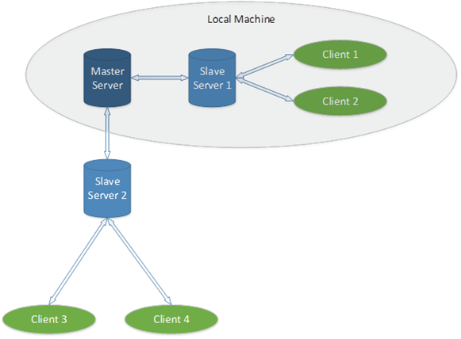

可靠的Windows版Redis
==

#### 副标题: 评论更精彩,教你怎么解决64位Windows版Redis狂占C盘的问题. ####

MS Open Tech 技术团队最近花了很多时间来测试最新构建的Windows版Redis(可在 [MS Open Tech Github 仓库下载](https://github.com/MSOpenTech/redis)). 当我们测试计划快要完成时,我们认为应该分享一些振奋人心的结果。

在压力测试的第一阶段,我们让Redis在Windows上进行各种测试,执行时间从1天到16天,以及简单的单master配置,到如下图所示的更复杂的配置,包括1个Master以及4个replicas。 你可以在 [我们的wiki页面](https://github.com/MSOpenTech/redis/wiki/REDIS-Stress-Test-Report-%E2%80%93-Phase-I) 看到使用的总体测试策略和配置.

测试结果令人振奋 —— 我们只发现了一个 BUG,当然我们已经修正了.

这些已经完成的测试是基于Linux版的Redis2.6.8迁移到 Windows 版的, 这个版本完成了我们[在1月宣布的所有目标](http://msopentech.com/blog/2013/01/15/one-step-closer-to-full-support-for-redis-on-windows-ms-open-tech-releases-64-bit-and-azure-installer), 比如支持64位系统。 我们的目标是确保开发者可以放心地在Windows上使用Redis,包括高靠性要求的业务场景. 我们计划继续在更“严苛”的场景中进行测试, 确保我们没有漏过任何东西。

如果您对业务场景和测试计划/策略有什么意见或建议,请务必告诉作者们。 我们很乐意使用Redis开发者觉得适合的任意app或场景。

## 评论更精彩 ##

### 1楼: ###

很高兴看到你们的进步. 我们喜欢在分布式项目中使用Redis,但一直运行独立的linux服务器或Redis专属的虚拟机上。 当然这也不是什么大事啦,根据具体情况决定吧。

干得不错!(Good work!)

### 2楼: ###

Good work! 做windows上做开发或者简单测试时确实是不错的。

### 3楼: ###

Redis 2.8.12 ——  我有两个版本的 redis-server.exe : 一个是32位,另一个是64位, 在启动这两个版本时都会创建一个 RedisQFork.dat文件, 当我运行32位exe时这个文件的大小是500 MB, 而运行64位时RedisQFork.dat文件变成了 16GB,这就是问题所在。

那么请问有什么方法(比如配置某些参数)能让Redis不去创建这个16GB 的文件吗?(顺便说一下我的服务器是 windows 2012, 所以我希望能使用64位的exe), 回到问题… 我想说的是有没有什么办法让redis不要去创建这个巨大的文件,或者假如必须创建这个文件, 那有什么办法可以让Redis去其他磁盘或网络上(unc路径)创建呢, 比如有大容量存储空间的地方。

你能解释这个文件的目的是什么。

谢谢, 
Rushdeep

### 4楼: ###

我也遇到了和 Rushdeep 一样的问题, 就是在64位版本上 RedisQFork_nnnn.dat 文件占用16GB磁盘空间的问题. 
这是一个bug吗?

### 5楼: ###

我碰到了同样的问题. 我不确定 RedisQFork 文件是否变小一点, 但我确定, 你可以通过设置Redis启动参数 `heapdir` 来调整这个文件的位置. 例如: `redis-server.exe -heapdir D:\redisdata`

## 铁锚备注: ##
当然啦,铁锚也碰到这个问题好久了.今晚上被 [向上老大指点了一番](http://www.eeqee.com/jforum/forums/list.page), 知道了人生不应该瞎混的道理,所以回家来就着手解决这个问题,百度一搜 RedisQFork,就发现了这篇文章,当然,按照5楼的处理思路,这个算是解决了. 

我在 `redis.windows.conf`文件中搜索 "`heapdir`",然后在默认注释掉的内容下面添加一行,指定Redis内存映射文件(memory mapped file)存放的路径: 

	# heapdir指定内存映射文件路径名,不能是文件名
	# heapdir <directory path(absolute or relative)>
	heapdir D:/temp/redis_heapdir/

具体文件和目录就请你根据自己的磁盘进行指定啦. 我的症状和情况是这样的, 16GB内存,Windows版64bit的Redis，启动Redis后就在C盘的 `C:\Windows\ServiceProfiles\NetworkService\AppData\Local\Redis` 目录下面生成一个16GB大小的 RedisQFork_8792.dat 文件(8792是本次启动的进程PID, 关闭redis 则此文件自动被删除). 本来当初为了省钱只上了64GB的固态硬盘,结果16G一吃下来,C盘就只有16GB空余空间,自从设置到D盘,重启以后,感觉强迫症就好多了。

当然,铁锚要废话不是想说这些,而是想引入2个参数:
	
	# maxheap指定最大heap字节数,比如 10000000
	# maxheap <bytes>
	
	# maxmemory 指定最大使用内存,单位:字节
	# maxmemory <bytes>

具体的参数请参考配置文件内的说明,一搜索就知道.(主要是铁锚配置这两个参数就一直出错,半天启动不起来,等研究明白再说吧.)

原文链接: [Redis on Windows – stable and reliable](http://msopentech.com/blog/2013/04/22/redis-on-windows-stable-and-reliable/)

原文日期: 2013-04-22

翻译日期: 2014-11-16

翻译人员: [铁锚](http://blog.csdn.net/renfufei)
