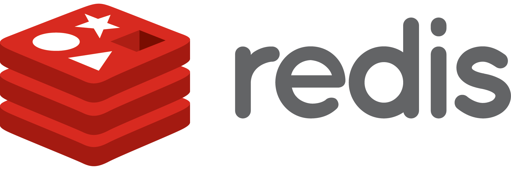
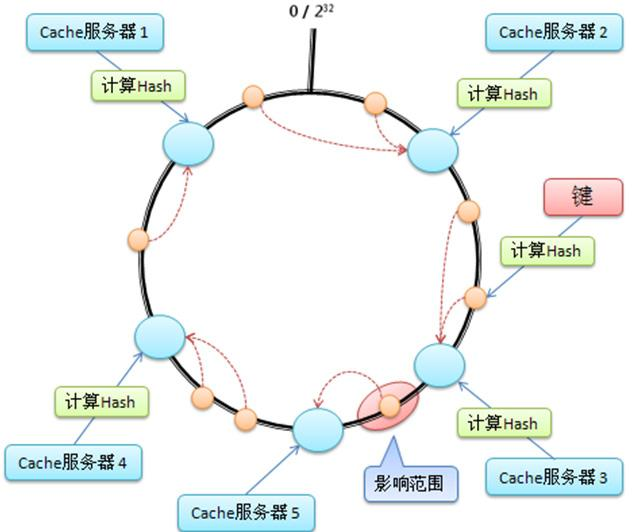

Redis为何Bigger比Memcached高
==

##

#### Redis是新兴的通用存储系统,而Memcached仍有其适用领域 ####

Memcached还是Redis? 在现代高性能Web应用中这一直是个争论不休的话题。 在基于关系型数据库的Web应用需要提高性能时,使用缓存是绝大多数架构师的第一选择,自然，Memcached和Redis通常是优先选择。

### 共同特征 ###

- 都是 key-value 形式的内存数据库
- 都是NoSQL家族的数据管理解决方案
- 都基于同样的key-value 数据模型
- 所有数据全部放在内存中(这也是适用于缓存的原因)
- 性能得分不分伯仲,包括数据吞吐量和延迟等指标
- 都是成熟的、广受开源项目欢迎的 key-value存储系统

Memcached最初在2003年由 Brad Fitzpatrick 为 LiveJournal网站开发。然后又用C语言重写了一遍(初版为Perl实现),并开放给公众使用,从此成为现代Web系统开发的基石。 当前Memcached的发展方向是改进稳定性和性能优化,而不是添加新功能特性。

Redis于2009年由 Salvatore Sanfilippo 创建, 直到今天 Sanfilippo 依然是Redis的唯一开发者和代码维护者。 Redis也被称为 "Memcached增强版(Memcached on steroids)", 这一点也不令人惊讶, 因为 Redis 有一部分就是在 Memcached 的经验总结之上构建的的。 Redis比Memcached具有更多的功能特性,这使得它更灵活,更强大也更复杂。

Memcached和Redis被众多企业以及大量生产系统所采用, 支持各种语言开发的客户端,有丰富的SDK。 事实上, 在上点规模的互联网Web开发语言中,基本上没有不支持Memcached或Redis的。

为什么Memcached和Redis如此流行? 不仅是其具有超高的性能,还因为相对来说他们都非常简单。 对程序员来说上手使用Memcached或Redis相当容易。 安装和设置并集成到系统中可能**只需要几分钟**时间。 因此花费一点点时间和精力就能立刻大幅提升系统性能 —— 通常是提升一个数量级。 一个简洁的解决方案却能获得巨大的性能收益: 这酸爽简直超乎你的想象。

###  Memcached 适用场景 ###

因为Redis是新兴解决方案,提供了更多的功能特性,比起Memcached来说, Redis一般都是更好的选择。 在两个特定场景下Memcached可能是更好的选择。 

第一种是**很细碎的静态数据**,如HTML代码片段。 Memcached的内存管理不像Redis那么复杂,所以性能更高一些,原因是 **Memcached 的元数据metadata更小**,相对来说额外开销就很少。 Memcached唯一支持的数据类型是字符串 `String`,非常适合缓存只读数据,因为字符串不需要额外的处理。

第二个场景,是**Memcached比Redis更容易水平扩展**。 原因在于它的设计和和功能很简单,Memcached更容易扩展。 消息显示, Redis在即将到来的3.0版([阅读CA版本发布笔记](http://antirez.com/news/79))将内置可靠的集群支持[但一直在跳票]。

### Redis 用武之地 ###

除非受环境制约(如遗留系统),或者业务符合上面的2种情况,否则你应该优先选择Redis。 使用Redis作为缓存,通过调优缓存内容,系统效率能获得极其提升。

很明显Redis的优势在于缓存管理。 缓存通过某种数据回收机制(data eviction mechanism)在必要时将旧数据从内存中删除,为新数据腾出空间。 Memcached的数据回收机制使用**LRU**(Least Recently Used,最近最少使用)算法,同时优先清除与新数据大小差不多的旧数据块。 相比之下,Redis允许细粒度控制过期缓存,有6种不同的策略可供选择。 Redis还采用了一些更复杂的内存管理方法和回收策略。

**Redis对缓存的对象提供更大的灵活性**。 而Memcached限制 key
为250字节,限制 value 为1 MB,且只能通过纯文本String通信. **Redis的 key 和 value 大小限制都是512 MB**,是二进制安全的【即不丢数据,与编码无关】。 Redis提供6种数据类型,使缓存以及管理缓存变得更加智能和方便,为应用程序开发者打开了一个无限可能的世界。

相比将对象序列化后通过字符串存储, Redis 通过 Hash来存储一个对象的字段和值,并可以通过单个key来管理它们。 

看看用Memcached更新一个对象需要干什么: 

1. 获取整个字符串
2. 反序列化为对象
3. 修改其中的值
4. 再次序列化该对象
5. 在缓存中将整个字符串替换为新字符串

并且每次更新都要干这些破事。

而使用Redis Hash的方式, 可以大幅度降低资源消耗并提高性能。 Redis的其他数据类型,如List 或者 Set,可用来实现更复杂的缓存管理模式。

Redis的另一个重大优点是其存储的数据是不透明的,这意味着在服务器端可以直接操纵这些数据。 160多个命令中的大部分都可以用来进行数据操作, 所以通过服务端脚本调用进行数据处理成为现实。 这些内置命令和用户脚本可以让你直接灵活地处理数据任务,而无需通过网络将数据传输给另一个系统进行处理。

Redis提供了可选/可调整的数据持久化, 目的是为了在 崩溃/重启后可以快速加载缓存。 虽然我们一般认为缓存中的数据是不稳定,瞬时的, 但在缓存系统中将数据持久化到磁盘还是很有价值的。 在重启后立即加载预热的方式耗时很短, 而且减轻了主数据库系统的开销。

最后, Redis提供主从复制(replication)。 Replication 可用于实现高可用的cache系统,允许某些服务器宕机的情况下也能提供不间断的服务。 假设要求在某台缓存服务器崩溃时, 只有少部分用户和程序在短时间内受影响, 大多数情况下就需要有一个行之有效的解决方案,来保证缓存内容和服务的可用性。

当今开源软件一直在提供最佳的实用技术方案。 需要使用缓存来提高应用系统性能时,Redis和Memcached是最佳的产品级解决方案。 但考虑到其丰富的功能和先进的设计,绝大多数时候Redis都应该是你的第一选择。

**作者简介**: Itamar Haber ([@itamarhaber](https://twitter.com/itamarhaber)) 是 Redis Labs的首席开发人员, 该企业为开发人员提供完全托管的Memcached和Redis云服务。 具有多年软件产品研发经验,曾在 Xeround, Etagon, Amicada, and M.N.S Ltd.担任管理和领导职位. Itamar 获得 Northwestern and Tel-Aviv Universitiesd 的Kellogg-Recanati工商管理硕士, 以及 Science in Computer Science 学士。  

##

**相关阅读:**

- [用Memcached提升Java企业应用性能,Part 1:体系结构和配置](http://www.javaworld.com/article/2078565/open-source-tools/use-memcached-for-java-enterprise-performance--part-1--architecture-and-setup.html)
- [用Memcached提升Java企业应用性能,Part 2:基于数据库的webApp](http://www.javaworld.com/article/2078584/open-source-tools/use-memcached-for-java-enterprise-performance--part-2--database-driven-web-apps.html)
- [Cache之争: Azure和AWS升级缓存服务](http://www.javaworld.com/article/2078868/java-app-dev/cache-warfare--azure-and-aws-get-updated-caching-services.html)

原文链接: [Why Redis beats Memcached for caching](http://www.javaworld.com/article/2836878/developer-tools-ide/why-redis-beats-memcached-for-caching.html)

原文日期: 2014-10-15

翻译日期: 2014-10-23

翻译人员: [铁锚](http://blog.csdn.net/renfufei)
