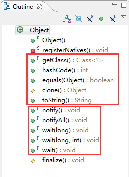

Object类源码分析
==

Object类是所有类继承层次中的根.

每个类最终的超类(superclass)都是 Object.

所有对象, 包括数组(array),都具有Object类中方法的实现.

类的完全限定名: `java.lang.Object`

基础定义:	`public class Object`

## registerNatives()

类开始的地方,是一个私有的native静态方法:

    private static native void registerNatives();
    static {
        registerNatives();
    }

并且指定了静态块在类被加载后进行注册. 源码对此方法没有注释,根据Java命名规范和约定,猜测是注册本地方法,也就是和JVM进行通信,调用一些钩子函数之类的东西.

Object类中只有这么一个 static 方法,其余的都是实例方法, 也就是具体对象

## getClass()

然后是实例的 getClass() 方法, 此方法定义是 `final` 的: 

	public final native Class<?> getClass();

注释信息: 

返回当前对象(this,谁调用就是谁)的运行时类.

返回的 Class 对象就是该对象的类定义中 `static synchronized` 方法的默认锁资源.

实际的返回类型是 `Class<? extends |X|>`, 但在调用 getClass 时 `|X|` 已经被类型擦除了(只存在于编译期检查, Java的运行期没有泛型). 例如,下面的代码中就不需要类型转换:

	Number n = 0;                             
	Class<? extends Number> c = n.getClass();

## hashCode()

返回代表此对象的hash code(散列码)值. 返回值类型为 `int`. 

默认的实现如下:

    public native int hashCode();

hashCode()方法是为了支持哈希表(hash tables)而提供的,比如 `java.util.HashMap`.

`hashCode`方法的通用约定如下:

-

## equals()

判断其他对象是否 "等于" 此对象.

默认实现如下:

    public boolean equals(Object obj) {
        return (this == obj);
    }

也就是判断是不是同样的内存地址. 如果没有重写 equals方法,则只有 this 等于 this.(原因是同一个对象可能会有多个引用指向它).

## clone()

    protected native Object clone() throws 
		CloneNotSupportedException;

## toString()

toString方法的默认实现很简单,可以看到, 就是获取类名,加上 @, 再加上 hashCode()转换为16进制后的表现形式:

    public String toString() {
        return getClass().getName() 
		+ "@" 
		+ Integer.toHexString(hashCode());
    }

## notify()

    public final native void notify();

## notifyAll()

    public final native void notifyAll();

## wait()

    public final native void wait(long timeout) 
		throws InterruptedException;

然后

    public final void wait() throws InterruptedException {
        wait(0);
    }

此外,

    public final void wait(long timeout, int nanos) 
		throws InterruptedException {
        if (timeout < 0) {
            throw new IllegalArgumentException(
				"timeout value is negative");
        }

        if (nanos < 0 || nanos > 999999) {
            throw new IllegalArgumentException(
              "nanosecond timeout value out of range");
        }

        if (nanos >= 500000 
			|| (nanos != 0 && timeout == 0)) {
            timeout++;
        }

        wait(timeout);
    }

## finalize()

    protected void finalize() throws Throwable { }

## 示例

## 总结

在Eclipse中可以看到如下的 OutLine:

可以看到, Object也有一个自动生成的无参构造方法. 

看来Sun和Oracle都希望我们快速编码,非必要时就不去定义默认的那个无参构造方法.

这是Java追求的目标之一,就是节省程序员的时间和精力,当然,同时也节省了软件开发的成本. 这些成本总是需要企业或者老板支付的.

自动垃圾回收, Spring, 以及很多框架的设计目的都是为了减少重复而又没有太大价值的代码. 反观备受冷落的 EJB,很明显就是加重了程序员和企业的开发运行成本.

Object类源码中总共有12个方法,没有属性域. 这样的设计保证了没有多余的内存被占用.

其中,静态方法1个,而且是私有的,不需要我们关心.

然后是5个常用方法:

以及5个同步块中的等待和通知方法:

最后还有一个一般不使用的方法:

 `finalize()`.
