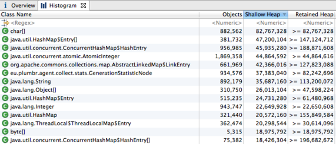

Solving OutOfMemoryError (part 3) – where do you start?
==

How do I know that the application is actually suffering from memory leaks? Where and how can I find the cause of the possible memory leak? An experienced developer usually begins its troubleshooting by answering the aforementiond fundamental questions.

Lets see a typical flow when trying to answer those two simple questions.

1. First – you should find evidence hidden somewhere in the logs. If you are lucky you can have a peek at production logs. In most cases there is a pack of angry Kerberos – like guys guarding the access – both from operations and security units of the corporation.

2. Lets assume that you can bypass the walls separating you from the vital information. Is it anyhow helpful? Most likely not. You find your good’ol friend Exception in thread “main” java.lang.OutOfMemoryError: while grepping through logs, but nothing interesting seems to precede its creation. There might be hints from monitoring logs that performance degradation started minutes before the actual error. But besides this – business as usual.

When you have reached thus far you have successfully answered the first question – for some reason the application has run out of the heap space available. Great! But this was the easy part – how can you now find the cause of the problem?

First, lets try to get our hands on memory dump right before we run out of heap space. If you already have -XX:+HeapDumpOnOutOfMemoryError parameter in your JVM startup script – good for you. You now just have to get the dump from the Kerberos, but you are good at it anyway, so no problems here. If not, then you have to ask the operations to create the dump manually right before they restart the JVM by invoking jmap -dump on the process.

If you have sucessfully received the dump, you should dig into it with your favourite tool – most of us tend to be familiar with Eclipse MAT, so lets assume you have parsed the dump with MAT and are now looking something like this:

What can you conclude from here? Should you use less Strings or char arrays in you application? It takes a lot of knowledge to find out what is actually leaking while looking at the analysis results. And even if you find the class whose instances are leaking – you still have no clue where those object references are kept and where the objects were created.

> **广告:** Did you know that 20% of Java applications have memory leaks? Don’t kill your application – instead find and fix leaks with [Plumbr](https://plumbr.eu/memory-leak) in minutes.

You might try to reproduce the problem in your test environment to understand the usage patterns causing the leakage. You would then also attach the JVM profiler (Yourkit, VisualVM, …) to gather vital information about the cause. If you are lucky you have some testing scripts simulating end-user behavior ready. In most cases you don’t, though. Creating those scripts would take days you don’t have. At least when The Boss is breathing down your neck.

Nevertheless – lets assume some heavenly force helped you with the scripts you now can play back using your favorite tool. You configure the test to simulate ten times the load the application is supposed to face in production, but without much success – the application just won’t break.

Now what? You have a (repeatedly) dying patient, who just before death seems completely fine. And you are not allowed to see nor speak to the patient. But you have given your Hippocratic oath to cure him, so you just cannot give up.

—

In our next article we will look into more details about which tools you can use and what they are actually able to show you. This will cover (in more details) the arsenal already referred in this article, but we will also look into other standard equipment, such as jhat, jconsole, visualvm and others.

### Solving OutOfMemoryError 系列文章

- [Solving OutOfMemoryError (part 1) – story of a developer](01_story_of_a_developer.md)

- [Solving OutOfMemoryError (part 2) – why didn’t operations solve it?](02_why_did_not_operations_solve_it.md)

- [Solving OutOfMemoryError (part 3) – where do you start?](03_where_do_you_start.md)

- [Solving OutOfMemoryError (part 4) – memory profilers](04_memory_profilers.md)

- [Solving OutOfMemoryError (part 5) – JDK Tools](05_JDK_Tools.md)

- [Solving OutOfMemoryError (part 6) – Dump is not a waste](06_Dump_is_not_a_waste.md)

原文日期: 2011年08月29日

翻译日期: 2015年10月26日

翻译人员: [铁锚 http://blog.csdn.net/renfufei](http://blog.csdn.net/renfufei)
