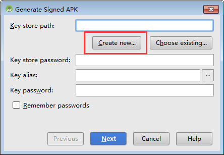
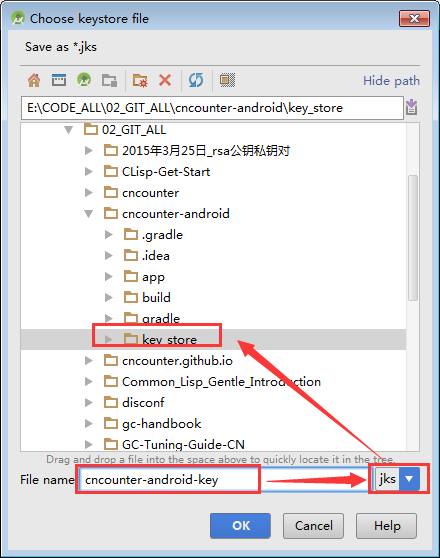
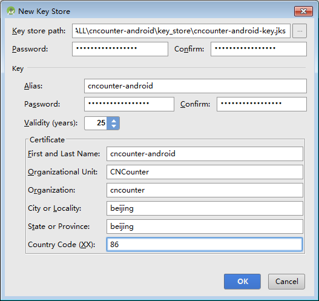
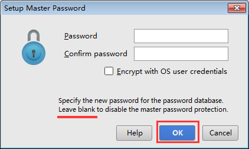
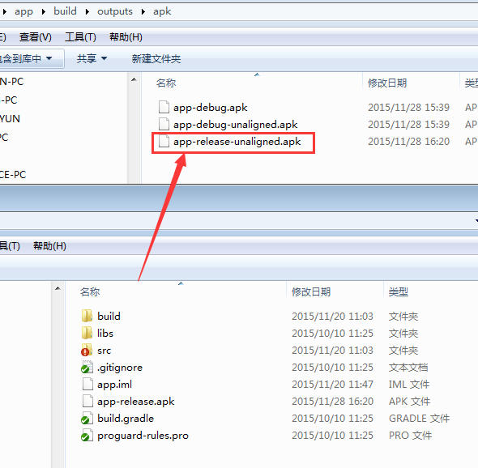
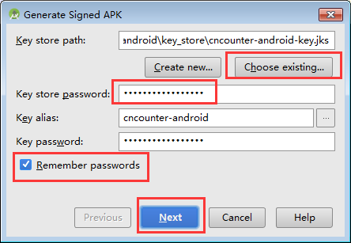
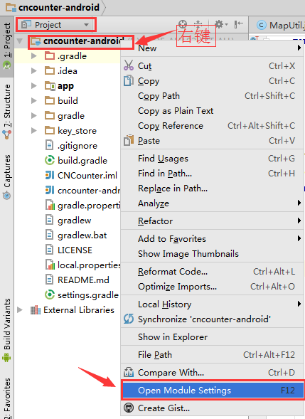
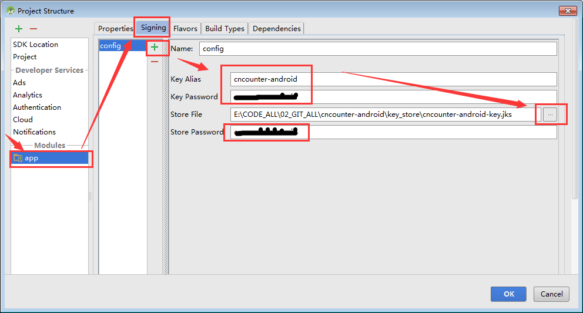
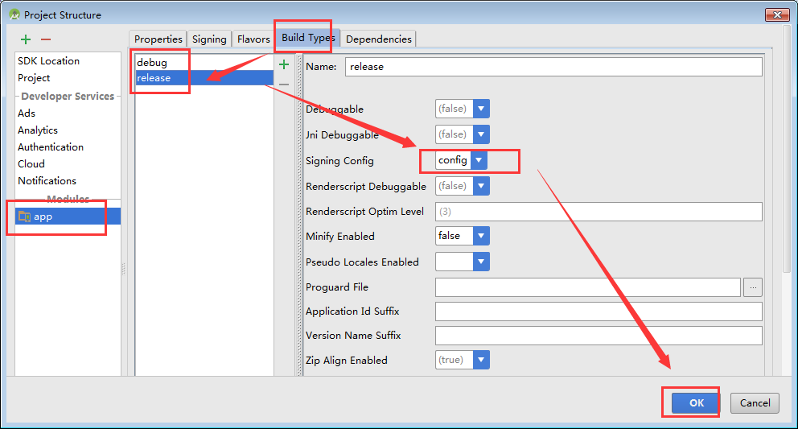

# Android Studio 生成签名的APK

## 生成签名

打开项目以后,点击项目，选择 **Build** 菜单, 然后选择 **Generate Signed APK**. 如下图所示:

打开生成对话框：

选择 **Create new...** 按钮, 生成新的Key, 弹出新生成对话框:

首先选择 Key 存储的路径. 

可能是有BUG, 在弹出的选择 keystore file 对话框中，需要先输入 File name, 如 ``, 文件后缀名 保持默认的 jks 不变。然后再改变保存的路径(否则输入不了名字).

最后的路径可能是这样的: `E:\CODE_ALL\02_GIT_ALL\cncounter-android\key_store\cncounter-android-key.jks`

接着输入密码, 建议不要太简单,也不要太复杂。 此处示例的密码为: 

	cncounter-android

为了简单起见， 所有密码都设置为同一个：

	cncounter-android

有效时间默认25年，以支撑你的整个APP周期。

Country Code (XX) 应该是 **CN**, 如下图所示: 

然后点击**OK**, 回到生成界面。

勾选上记住密码，然后点击下一步.

如果弹出输入密码保护,可以选择留空,不使用这种保护。

点击OK，进入下一步:

选择 **release** 是发布版本，选择 debug 是调试版本。 此处, 选择 **release** , 然后点击完成按钮即可。

然后会告诉你生成完毕，可以选择查看:

生成的aPK如下所示:

下次需要生成，只需要从  **Build** 菜单, 选择 **Generate Signed APK** 即可。 如下图所示:

因为上次选择了记住密码，所以这里不需要记住密码。

然后继续即可。

## 自动签名

在 Android Studio 中, 可以通过配置在构建过程中自动签名 release 版本的APK:

### 1. 选择 project 浏览视图, 在 app 上点击鼠标右键, 选择 Open Module Settings 菜单, 如下图所示:

### 2. 在打开的 Project Structure 窗口中, 选择 Modules 下面的 app 模块.
### 3. 切换到 Signing 标签页.
### 4. 选择 keystore 文件, 输入此配置的 name(当然, 也可以通过加号创建多个配置), 以及其他必须的信息,比如各种密码.

### 5. 然后切换到 Build Types 选项卡.
### 6. 选择 release build.
### 7. 然后在右边的 Signing Config, 选择上面创建的配置项.

### 8. 点击 OK 即可.

然后就可以了。 你的 debug 版本也可以采用同样的方式配置,但是建议使用 debug专用的 keystore 进行签名。

多个项目成员进行开发都采用同一个 debug 的store, 而 release 版本的 keystore 则只允许部分人员使用。

## 优化对齐

在 Android SDK 中包含一个名为 “zipalign” 的工具，它能够对打包后的 app 进行优化。 其位于 SDK 的 build-tools 目录下, 例如: `D:\Develop\Android\sdk\build-tools\23.0.2\zipalign.exe` 。

如果你将路径 `D:\Develop\Android\sdk\build-tools\23.0.2` 添加到 Path 之中,则可以直接使用 zipalign.exe ; 否则需要指定全路径。

### 用法示例

将 infile.apk 对齐,并保存为 outfile.apk:

	zipalign [-f] [-v] <alignment> infile.apk outfile.apk

验证 existing.apk 是否对齐:

	zipalign -c -v <alignment> existing.apk

占位符 `<alignment>` 是指字节对齐边界的一个整数。apk 文件的对齐字节数必须是 4 (也就是 4*8 = 32-bit 的对齐)。其他数字无效。

标志:

	-f : 强制覆盖已存在的输出文件
	-v : 输出详细日志(verbose output)
	-c : 校验时使用, 验证指定的文件是否对齐

下面是使用示例:

首先,进入到 apk 文件所在的目录(否则全路径命令行就会很长):

	e:
	cd E:\CODE_ALL\02_GIT_ALL\cncounter-android\app\build\outputs\apk

然后找到你的 zipalign 程序路径

	D:\Develop\Android\sdk\build-tools\23.0.2\zipalign.exe -c -v 4 app-release-unaligned.apk

可以看到类似下面这样的输出，失败信息:

	  209814 res/mipmap-hdpi-v4/ic_launcher.png (BAD - 2)
	  212824 res/mipmap-mdpi-v4/ic_launcher.png (OK)
	  246707 res/xml/pref_data_sync.xml (OK - compressed)
	  248751 resources.arsc (BAD - 3)
	  459180 classes.dex (OK - compressed)
	 1218706 META-INF/MANIFEST.MF (OK - compressed)
	 1229010 META-INF/CERT.SF (OK - compressed)
	 1239389 META-INF/CERT.RSA (OK - compressed)
	Verification FAILED

可以看到校验失败,因为我们校验的是一个未对齐(unaligned)的 apk。

下面，我们来进行对齐(注意,不支持换行):

	D:\Develop\Android\sdk\build-tools\23.0.2\zipalign.exe  -f -v 4 app-release-unaligned.apk cnc-v0.1.20151216.apk

输出内容大致如下所示:

	  225300 res/mipmap-xxxhdpi-v4/ic_launcher.png (OK)
	  247015 res/xml/pref_data_sync.xml (OK - compressed)
	  249060 resources.arsc (OK)
	  459489 classes.dex (OK - compressed)
	 1219015 META-INF/MANIFEST.MF (OK - compressed)
	 1229319 META-INF/CERT.SF (OK - compressed)
	 1239698 META-INF/CERT.RSA (OK - compressed)
	Verification succesful

提示对齐成功,我们可以验证一下:

	D:\Develop\Android\sdk\build-tools\23.0.2\zipalign.exe -c -v 4 cnc-v0.1.20151216.apk

提示的内容大致如下:

	  248574 res/xml/pref_notification.xml (OK - compressed)
	  249060 resources.arsc (OK)
	  459489 classes.dex (OK - compressed)
	 1219015 META-INF/MANIFEST.MF (OK - compressed)
	 1229319 META-INF/CERT.SF (OK - compressed)
	 1239698 META-INF/CERT.RSA (OK - compressed)
	Verification succesful

OK. 此时算是可以交付给用户下载的版本了。 

对齐之后的 apk 文件最好不要修改。

如果需要了解更多,请参考官方链接。

官方链接:[http://developer.android.com/intl/zh-cn/tools/publishing/app-signing.html](http://developer.android.com/intl/zh-cn/tools/publishing/app-signing.html)

简单优化:Zipalign [http://www.cnblogs.com/xirihanlin/archive/2010/04/12/1710164.html](http://www.cnblogs.com/xirihanlin/archive/2010/04/12/1710164.html)

日期: 2015年11月28日

作者: [铁锚 http://blog.csdn.net/renfufei](http://blog.csdn.net/renfufei)

