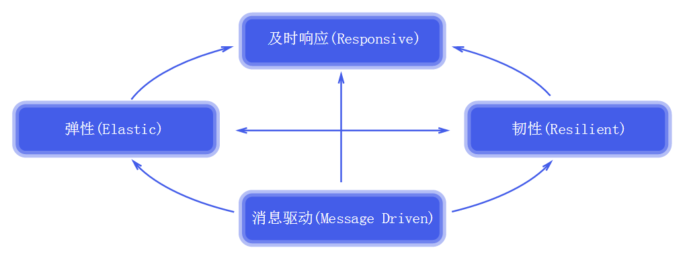

# 反应式宣言

##(The Reactive Manifesto)

Organisations working in disparate domains are independently discovering patterns for building software that look the same. These systems are more robust, more resilient, more flexible and better positioned to meet modern demands.

各个领域的不同组织都在追寻一种相似的软件构建模式。这种系统鲁棒性更好、更有韧性, 更加灵活, 能更好地应对现代化开发的需要。

These changes are happening because application requirements have changed dramatically in recent years. Only a few years ago a large application had tens of servers, seconds of response time, hours of offline maintenance and gigabytes of data. Today applications are deployed on everything from mobile devices to cloud-based clusters running thousands of multi-core processors. Users expect millisecond response times and 100% uptime. Data is measured in Petabytes. Today's demands are simply not met by yesterday’s software architectures.

由于系统需求近年来发生了巨大变化, 所以软件开发方式也正在改变。以前的大型应用系统会部署在几十台服务器, 响应时间大多是秒级, 可能还经常需要几个小时的离线维护, 数据量一般是GB级。今天的应用分布在各种移动终端, 服务端会部署到云集群上, 通常有上万个CPU核心在运转。用户需要的是毫秒级的响应时间, 而且期待的是100%的正常服务时间。数据量少则以PB为单位。过去的软件架构再也不能满足今天面临的各种需求。

We believe that a coherent approach to systems architecture is needed, and we believe that all necessary aspects are already recognised individually: we want systems that are Responsive, Resilient, Elastic and Message Driven. We call these Reactive Systems.

我们相信, 确实需要有一种清晰的系统架构方法, 其中很多必要特性已得到大家认可: 我们想要的系统要具备 **快速响应**(`Responsive`)、**韧性**(`Resilient`)、**可伸缩性**(`Elastic`) 及 **消息驱动**(`Message Driven`) 等特征。我们把具备这些特性的系统称为 **反应式系统**(`Reactive System`)。

Systems built as Reactive Systems are more flexible, loosely-coupled and scalable. This makes them easier to develop and amenable to change. They are significantly more tolerant of failure and when failure does occur they meet it with elegance rather than disaster. Reactive Systems are highly responsive, giving users effective interactive feedback.

构建为反应式的系统可以更加灵活(flexible)、松耦合(loosely-coupled),而且是可扩展的([scalable](http://www.reactivemanifesto.org/glossary#Scalability))。 这些优点让系统容易开发, 轻松应对需求变更。 对失败的容忍度更高, [故障](http://www.reactivemanifesto.org/glossary#Failure)发生时能从容应对, 而不会整体崩溃。 反应式系统响应迅速, 给[用户](http://www.reactivemanifesto.org/glossary#User)提供更有效的交互体验。

### 反应式系统的四大特性:

Responsive: The system responds in a timely manner if at all possible. Responsiveness is the cornerstone of usability and utility, but more than that, responsiveness means that problems may be detected quickly and dealt with effectively. Responsive systems focus on providing rapid and consistent response times, establishing reliable upper bounds so they deliver a consistent quality of service. This consistent behaviour in turn simplifies error handling, builds end user confidence, and encourages further interaction.

**快速响应**(`Responsive`): [系统](http://www.reactivemanifesto.org/glossary#System)在各种情况下都会尽全力保证及时响应。响应性是可用性和实用性的基础, 此外,响应性还意味着问题能被迅速发现,并得到有效处理。反应式系统致力于提供快速和一致的响应时间,建立确定可靠的时间上限,并以此来交付质量稳定的服务。这种一致的行为反过来又简化了错误处理，逐渐了增强终端用户的信心，并促进了更进一步的交互。

Resilient: The system stays responsive in the face of failure. This applies not only to highly-available, mission critical systems — any system that is not resilient will be unresponsive after a failure. Resilience is achieved by replication, containment, isolation and delegation. Failures are contained within each component, isolating components from each other and thereby ensuring that parts of the system can fail and recover without compromising the system as a whole. Recovery of each component is delegated to another (external) component and high-availability is ensured by replication where necessary. The client of a component is not burdened with handling its failures.

**韧性**(`Resilient`): 系统在面临[失败](http://www.reactivemanifesto.org/glossary#Failure)时依然保持快速响应。不仅对高可用系统,关键任务系统是这样; 所有不具备韧性的系统, 在失败后都不再具有快速响应特性。韧性是通过[复制(replication)](http://www.reactivemanifesto.org/glossary#Replication)、封闭(containment)、[隔离(isolation)](http://www.reactivemanifesto.org/glossary#Isolation)和[委托(delegation)](http://www.reactivemanifesto.org/glossary#Delegation)来实现的. 失败被包含在单个[组件](http://www.reactivemanifesto.org/glossary#Component)中, 且各组件相互隔离, 使系统在部分失败和恢复时,可以不影响整体的功能. 每个组件的恢复都委托给另一个(外部)组件, 高可用在必要时通过复制来保证. 组件的客户端也没有处理组件失败的负担。

Elastic: The system stays responsive under varying workload. Reactive Systems can react to changes in the input rate by increasing or decreasing the resources allocated to service these inputs. This implies designs that have no contention points or central bottlenecks, resulting in the ability to shard or replicate components and distribute inputs among them. Reactive Systems support predictive, as well as Reactive, scaling algorithms by providing relevant live performance measures. They achieve elasticity in a cost-effective way on commodity hardware and software platforms.

**可伸缩性**(`Elastic`,弹性扩容): 系统在不同的负载下都能保持快速的响应。反应式系统可以根据服务的请求量, 动态增加或减少相应的[资源](http://www.reactivemanifesto.org/glossary#Resource). 这也暗示系统设计中没有竞争点(contention point)和中心瓶颈(central bottleneck), 通过分片和组件复制, 将请求分发处理。 利用实时性能监控, 通过相应的缩放算法, 支持预测(predictive), 以确保反应式特性。 在商业的软件和硬件平台上, 以具有成本优势的方式实现了[可伸缩性](http://www.reactivemanifesto.org/glossary#Elasticity)。
。

Message Driven: Reactive Systems rely on asynchronous message-passing to establish a boundary between components that ensures loose coupling, isolation, location transparency, and provides the means to delegate errors as messages. Employing explicit message-passing enables load management, elasticity, and flow control by shaping and monitoring the message queues in the system and applying back-pressure when necessary. Location transparent messaging as a means of communication makes it possible for the management of failure to work with the same constructs and semantics across a cluster or within a single host. Non-blocking communication allows recipients to only consume resources while active, leading to less system overhead.

**消息驱动**(`Message Driven`): 反应式系统依赖[异步](http://www.reactivemanifesto.org/glossary#Asynchronous) [消息传递](http://www.reactivemanifesto.org/glossary#Message-Driven)机制, 以确定各种组件的边界, 并确保松耦合(loose coupling)、隔离性(isolation)、[位置透明性(location transparency)](http://www.reactivemanifesto.org/glossary#Location-Transparency), 并提供将[错误](http://www.reactivemanifesto.org/glossary#Failure)封装为消息的手段。采用显式的消息传递, 通过监测系统中的消息队列, 以支持负载管理(load management), 弹性扩容(elasticity) 和流量控制(flow control)。必要时甚至可以采用[背压(back-pressure)](http://www.reactivemanifesto.org/glossary#Back-Pressure)。 位置透明的消息传递机制, 使得对集群和单个主机的失败管理具有相同的结构和语义。[非阻塞](http://www.reactivemanifesto.org/glossary#Non-Blocking)通信允许接收者只在活动时消耗[资源](http://www.reactivemanifesto.org/glossary#Resource)，有效减少系统开销。

Large systems are composed of smaller ones and therefore depend on the Reactive properties of their constituents. This means that Reactive Systems apply design principles so these properties apply at all levels of scale, making them composable. The largest systems in the world rely upon architectures based on these properties and serve the needs of billions of people daily. It is time to apply these design principles consciously from the start instead of rediscovering them each time.

大型系统由多个小系统组成, 因此也依赖于小型系统的反应式特性. 也就是说,反应式系统的设计原则适用于各个级别,各种规模的系统, 以便能很好地组合在一起. 最大型的系统要依赖具备这种特性的架构, 以服务数十亿人的服务需求. 应用这些设计原则的时刻到了,而且要从一开始就有意识地应用, 而不要等问题出现了才后悔莫及!

> **说明:** `Reactive System` 翻译为 `反应式系统`。如有更恰当的词汇,请留言!

快翻译完时百度搜索, 发现04年的一篇翻译: [http://www.ituring.com.cn/article/131783](http://www.ituring.com.cn/article/131783)

欢迎加入: [CNC开源组件开发交流群 316630025](http://jq.qq.com/?_wv=1027&k=Z4v6kn)

翻译人员: [铁锚 http://blog.csdn.net/renfufei](http://blog.csdn.net/renfufei)

翻译日期: 2016年3月29日

原文日期: 2014年9月16日

原文链接: [http://www.reactivemanifesto.org/](http://www.reactivemanifesto.org/)

