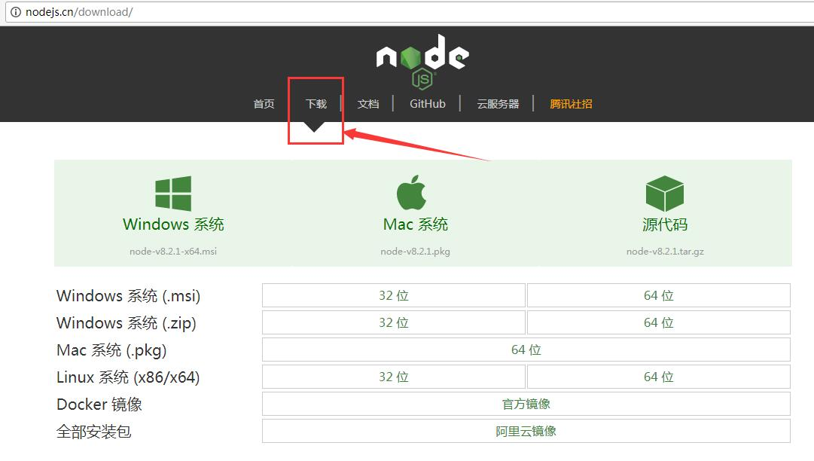
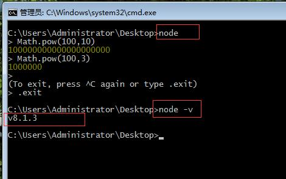
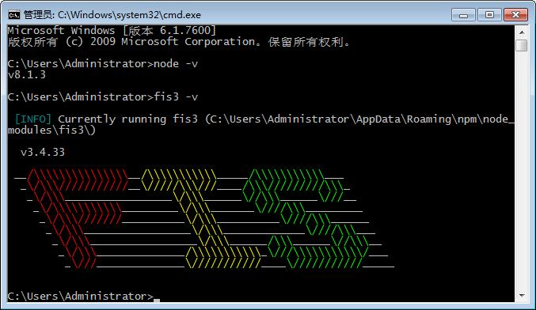

# 前端构建工具-fis3使用入门

> FIS3 是面向前端的工程构建工具。解决前端工程中性能优化、资源加载（异步、同步、按需、预加载、依赖管理、合并、内嵌）、模块化开发、自动化工具、开发规范、代码部署等问题。

官网地址是: <https://fex-team.github.io/fis3/index.html>

我们要做前后端分离，将静态资源部署到CDN。调研了几个前端构建工具之后，选择了 fis3, 原因是能满足我们的需求、并且轻量级、配置简单、使用方便、安装也不容易报错。


## 下载安装

### 1. 安装NodeJS


fis3基于NodeJS, NodeJS中文网站是: <http://nodejs.cn/>, 简介如下:

> * Node.js 是一个基于 Chrome V8 引擎的 JavaScript 运行环境。 
> * Node.js 使用了一个事件驱动、非阻塞式 I/O 的模型，使其轻量又高效。 
> * Node.js 的包管理器 npm，是全球最大的开源库生态系统。

下载地址: <http://nodejs.cn/download/>

NodeJS下载界面如下所示:




建议下载最新版本,如 NodeJS v8.1.3+ 等。

安装到默认目录,完成后查看版本号: `node -v`


NodeJS安装完成后, 自动安装了 node, npm 等工具。

其中, node 是一个 REPL 环境, 可以执行各种JS脚本, 示例如下所示:



npm 全称就是 node package manage,是软件包管理工具.

如果某些安装包被墙,则可以配置代理, 或者使用淘宝的npm注册中心:

```
npm config set registry "https://registry.npm.taobao.org" 
```

### 2. npm安装fis3
  
在 cmd/shell 中执行: `npm install -g fis3`

安装fis3后,在 cmd/shell 中执行 `fis3 -v` 判断是否安装成功


如下图所示:



相关的 shell 命令如下:

```
node -v
npm install -g fis3
fis3 -v
```

## 简单使用

> **说明:** fis3等前端构建工具,依赖的是相对路径, 如`./xxx/xxx.js`, `images/logo.png` 等; 识别: ``、`<link href="">`、 `<script src="">`  `url('')` 等资源配置。
>
> 如果项目不符合此要求, 需要进行一定的修改。


使用fis3时,可以指定打包版本, 例如:

```
fis3 release prod -d cdn_release.prod
```

如果不指定, 则默认为 `dev` 环境(fis3中称为media).

简单解释一下, `fis.media('prod')` 意思是生产环境的配置。

指定输出目录是 `-d` 选项,可以指定绝对路径,相对路径；


首先,在前端代码的根目录中,创建文件 `fis-conf.js`。 fis3 会查找此文件作为配置。


其中, `fis.match` 是很简单的配置,后面会覆盖前面。

其中, `useHash` 指定是否根据内容生成 hash, 例如 `common-utils.js` 在生成目录下会变成: `common-utils_331734d.js`; 

`optimizer` 指定优化配置,例如文件压缩、合并,内联等; 

其他插件可能需要安装额外的 npm 组件/插件;


`fis-conf.js`文件的内容如下:


```
// ignore
fis.set('project.ignore', [
  '*.cmd',
  'fis-conf.js'
]);


// 配置不同环境的CDN资源前缀
fis.media('prod').match('*.{js,css,png,gif,jpg}', {
  domain: 'http://res.online.ybscdn.com/online'
});

fis.media('demo').match('*.{js,css,png,gif,jpg}', {
  domain: 'http://demo.res.online.yiboshi.com/online'
});

fis.media('beta').match('*.{js,css,png,gif,jpg}', {
  domain: 'http://beta.res.online.yiboshi.com/online'
});

fis.media('dev').match('*.{js,css,png,gif,jpg}', {
  domain: '/online'
});


// 所有js, css 加 hash
fis.match('*.{js,css,png,gif,jpg}', {
  useHash: true
}).match('/static/js/layer/**', {
  useHash: false,
  optimizer: null
}).match('/static/js/jquery/**', {
  useHash: false,
  optimizer: null
});

// 生产环境进行JS压缩
fis.media('prod').match('*.js', {
  optimizer: fis.plugin('uglify-js')
}).match('/static/js/layer/**.js', {
  useHash: false,
  optimizer: null
}).match('/static/js/jquery/**.js', {
  useHash: false,
  optimizer: null
});

// dev 环境不加hash, 不进行压缩和优化
fis.media('dev').match('*.{js,css,png,gif,jpg}', {
  useHash: false,
  optimizer: null
});

```


## 示例

Windows 使用示例(cmd 环境):

```
E:
cd E:\CODE_ALL\06_YHBJ_ALL\exam-online\online-static\src
dir fis-conf.js
fis3 release prod -d ../cdn_release.prod
```

Linux 或者 Mac 大同小异, 请根据需要自己配置,或者参考官网。


然后,进入 `cdn_release.prod` 目录, 看看对应的 html,css,js 等文件的变化吧。

如果项目未拆分, 与 MAVEN 一起组合使用时, 先执行 fis3 的构建(可以指定 html 等文件的输出目录), 然后通过 copy-resources 等插件进行组装。 


如果需要更复杂的功能,请参考官方的配置文档: <https://fex-team.github.io/fis3/docs/beginning/release.html>


## 构建与发布

考虑到 exam-online 项目的实际情况: 资源并不是特别多。

为了简单起见,发布流程暂定如下(beta环境):

1. 代码开发(配置Nginx做alias转发)
2. 生成 .beta 版本的CDN资源, push到git版本库/保证git有各种CDN历史版本
3. 生成 beta 环境的 war包/zip包
4. 使用war包解压替换Nginx的 static 目录
5. 部署到 beta 环境的Tomcat/也可以在beta环境从git获取后打包部署


prod环境类似.

1. 生成 prod 环境的CDN资源,并上传到git仓库
2. 打包 prod 版本.
3. 发布static资源到nginx/CDN回源域名
4. 发布web服务器/此步骤可并行


dev本地机器的 Nginx 配置文件如下:


```
# http 内部
upstream online_upstream {
    server localhost:8080;
}

# 参考: http://nginx.org/en/docs/http/ngx_http_core_module.html#alias
# nginx 映射虚拟目录-Windows版
# /online/index.html 会访问到 E:/exam-online/online-static/src/index.html
# http.server 内部
location / {
    root   html;
    index  index.html index.htm;
}
location ~ ^/online/(.*)$ {
    alias E:/exam-online/online-static/src/$1;
}
location /online/api {
    proxy_pass http://online_upstream;
}
location /online/druid {
    proxy_pass http://online_upstream;
}

```


## 更多资源:

* [大公司里怎样开发和部署前端代码？](https://www.zhihu.com/question/20790576/answer/32602154)

* [从配置文件带你认识FIS3](http://www.jianshu.com/p/1bbd5fa05a86)

* [前端构建工具漫谈，fis3、webpack、rollup.js](https://zhuanlan.zhihu.com/p/20933749)

* [Webpack、Browserify和Gulp三者之间到底是怎样的关系？](https://www.zhihu.com/question/37020798)

