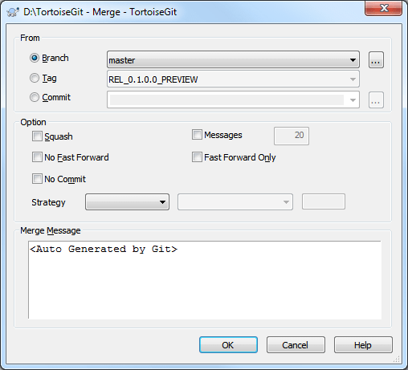
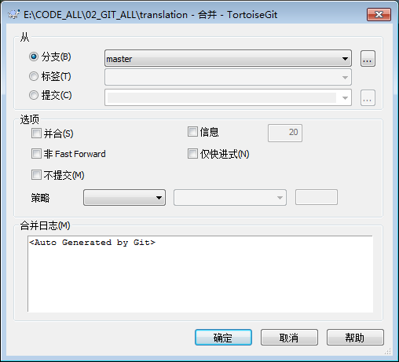

#2.28. TortoiseGit - Merging

Where branches are used to maintain separate lines of development, at some stage you will want to merge the changes made on one branch back into the other branch, or vice versa. 

It is important to understand how branching and merging works in Git before you start using it, as it can become quite complex. For hints where to find more information about Git and merging see [Section 2, “Reading Guide”](tgit-preface-readingguide.html). 

The next point to note is that merging *always* takes place within a working tree. If you want to merge changes *into* a branch, you have to have a working tree for that branch checked out, and invoke the merge wizard from that working tree using TortoiseGit → Merge.... 

**Figure 2.43. Merge dialog**





```
​对应的中文版本如下所示:
```





In general it is a good idea to perform a merge into an unmodified working tree. If you have made other changes in your working tree, commit those first. If the merge does not go as you expect, you may want to revert the changes, and the Revert command will discard *all* changes including any you made before the merge. 

You can choose one commit that you want to merge from. 

- HEAD

  Current commit checked out. 

- Branch

  The latest commit of chosen branch. 

- Tag

  The commit of chosen tag. 

- Commit

  Any commit, you click ... to launch log dialog to choose commit. You also can input commit hash, or friendly commit name, such as HEAD~4. 

Squash Just merge change from the other branch. Can't recorder Merge information. The new commit will not record merge branch as one parent commit. Log view will not show merge line between two branch. 

No Fast Forward Generate a merge commit even if the merge resolved as a fast-forward. 

No Commit Do not automatically create a commit after merge. 

Messages Populate the log message with one-line descriptions from the actual commits that are being merged. Can specify the number of commits to be included in the merge message. 

You can see more information at [Section G.3.79, “git-merge(1)”](git-command.html#git-merge(1)) 

Although major merge working is done by git automatically, conflict maybe happen during merge, please see [Section 2.31, “Resolving Conflicts”](tgit-dug-conflicts.html) to how to resolve conflict. 


