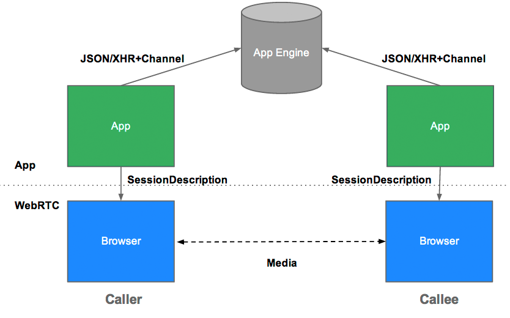
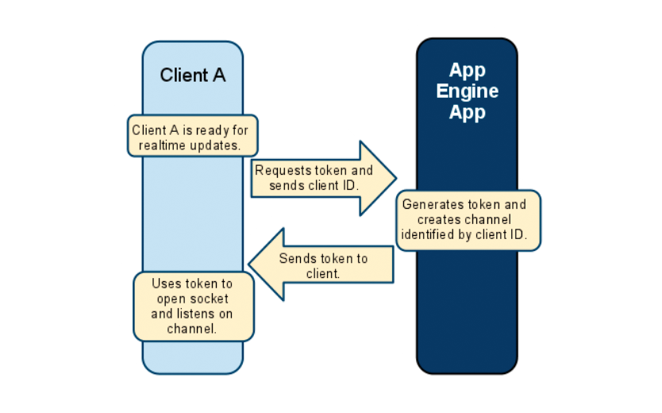
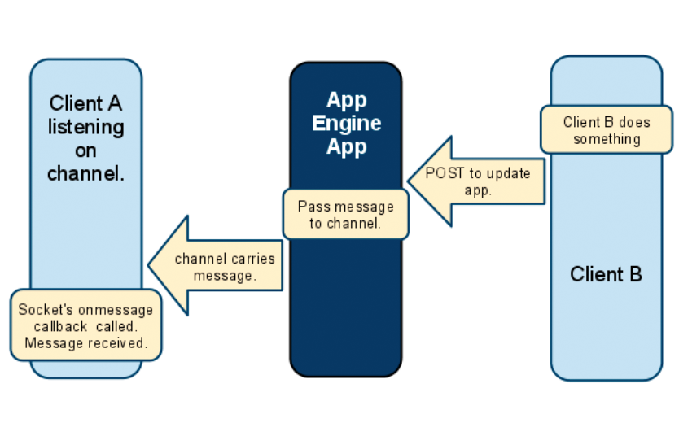
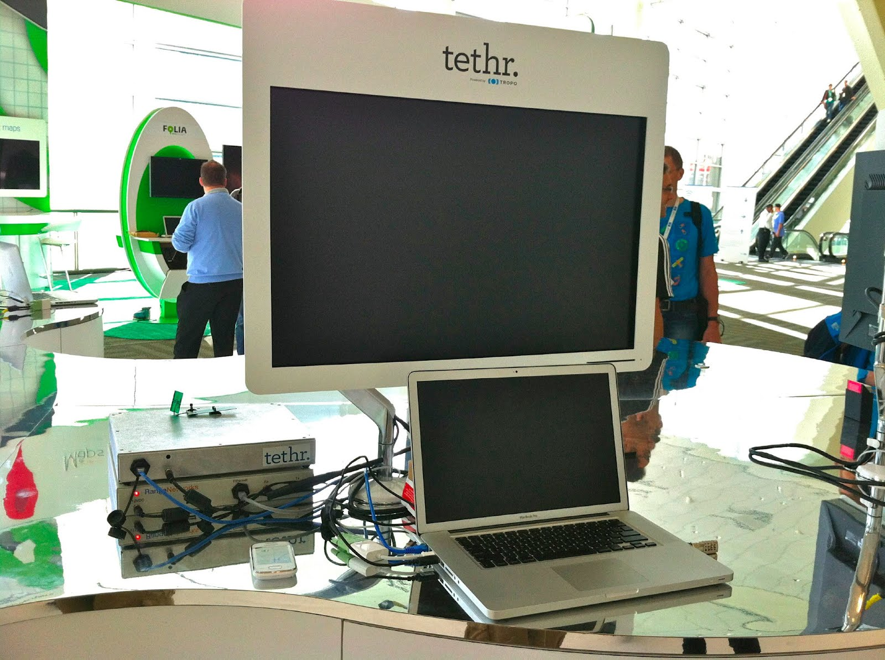
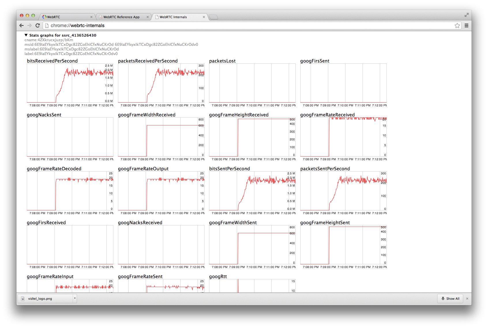

# Getting Started with WebRTC

# WebRTC入门简介

> WebRTC is a new front in the long war for an open and unencumbered web.
>
>  ---- By : [Brendan Eich](http://hacks.mozilla.org/2012/03/video-mobile-and-the-open-web/), inventor of JavaScript

> JavaScript创始人说: WebRTC是自由开放网络中的先锋战士!

## Real-time communication without plugins

## 无需插件, 在浏览器中视频聊天

Imagine a world where your phone, TV and computer could all communicate on a common platform. Imagine it was easy to add video chat and peer-to-peer data sharing to your web application. That's the vision of WebRTC.

想象一下, 手机, 电脑, 电视可以通过平台进行实时的聊天和通信。通过Web应用, 即可远程视频聊天, 传输文件以和数据. 没有监控,不用担心泄密, 蓝天将会变得多么美好! 这就是WebRTC的目标和未来。

Want to try it out? WebRTC is available now in Google Chrome, Opera and Firefox. A good place to start is the simple video chat application at [apprtc.appspot.com](https://apprtc.appspot.com/):

当前最新版本的 Google Chrome, Opera 和 Firefox 浏览器都已经支持 WebRTC, 相关的demo请访问: <https://apprtc.appspot.com/>


1. Open [apprtc.appspot.com](https://apprtc.appspot.com/) in Chrome, Opera or Firefox.
2. Click the Allow button to let the app use your webcam.
3. Open the URL displayed at the bottom of the page in a new tab or, better still, on a different computer.

1. 使用新浏览器访问 <https://apprtc.appspot.com/>
2. 如果有弹框/要求webcam摄像头授权,允许即可
3. 页面底部显示聊天室URL, 在另一台电脑, 或者新标签页中打开, 确定参与(Join)视频聊天即可。

There is a walkthrough of this application.

下面对这个程序进行简单的介绍。


## Quick start

## 快速学习

Haven't got time to read this article, or just want code?

没有时间去阅读这篇文章,或者只是想要代码?

1. Get an overview of WebRTC from the Google I/O presentation (the slides are [here](http://io13webrtc.appspot.com/)):

   

2. If you haven't used getUserMedia, take a look at the [HTML5 Rocks article](http://www.html5rocks.com/en/tutorials/getusermedia/intro/) on the subject, and view the source for the simple example at [simpl.info/gum](http://www.simpl.info/getusermedia).

3. Get to grips with the RTCPeerConnection API by reading through the simple example below and the demo at [simpl.info/pc](http://www.simpl.info/pc), which implements WebRTC on a single web page.

4. Learn more about how WebRTC uses servers for signaling, and firewall and NAT traversal, by reading through the code and console logs from [apprtc.appspot.com](https://apprtc.appspot.com/).

5. Can’t wait and just want to try out WebRTC right now? Try out some of the [20+ demos](https://webrtc.github.io/samples) that exercise the WebRTC JavaScript APIs.


6. Having trouble with your machine and WebRTC? Try out our troubleshooting page [test.webrtc.org](https://test.webrtc.org/).

<br/>
​
1. 观看 Google I/O 大会上演示的 [WebRTC-PPT](http://io13webrtc.appspot.com/) 或者视频: <https://www.youtube.com/embed/p2HzZkd2A40>

2. 如果对 getUserMedia 还不熟悉, 可以参考 [使用HTML5捕捉视频和声音](https://www.html5rocks.com/zh/tutorials/getusermedia/intro/), 相关的Demo页面: <http://www.simpl.info/getusermedia>。

3. 掌握RTCPeerConnection 相关的API, 示例页面为: <http://www.simpl.info/pc>, 其在单个网页中实现了WebRTC。

4. 想要深入学习 WebRTC 内部的信令传输，穿墙打洞等技术细节, 请访问 <https://apprtc.appspot.com/>, 并通过F12打开控制台, 查看日志.

5. GitHub上有很多WebRTC相关的示例, 请访问: <https://webrtc.github.io/samples>

6. 如果使用 WebRTC 出错, 可以尝试访问诊断页面 <https://test.webrtc.org/>。

Alternatively, jump straight into our [WebRTC codelab](https://www.bitbucket.org/webrtc/codelab): a step-by-step guide that explains how to build a complete video chat app, including a simple signaling server.

另外, 可以打开我们的实验室页面 <https://www.bitbucket.org/webrtc/codelab>, 跟着教程, 学习如何构建一个完整的视频聊天程序, 其中包括搭建一个简单的信令服务器。


## A very short history of WebRTC

## WebRTC 简史

One of the last major challenges for the web is to enable human communication via voice and video: Real Time Communication, RTC for short. RTC should be as natural in a web application as entering text in a text input. Without it, we're limited in our ability to innovate and develop new ways for people to interact.

Historically, RTC has been corporate and complex, requiring expensive audio and video technologies to be licensed or developed in house. Integrating RTC technology with existing content, data and services has been difficult and time consuming, particularly on the web.

Gmail video chat became popular in 2008, and in 2011 Google introduced Hangouts, which use the Google Talk service (as does Gmail). Google bought GIPS, a company which had developed many components required for RTC, such as codecs and echo cancellation techniques. Google open sourced the technologies developed by GIPS and engaged with relevant standards bodies at the IETF and W3C to ensure industry consensus. In May 2011, Ericsson built [the first implementation of WebRTC](https://labs.ericsson.com/developer-community/blog/beyond-html5-peer-peer-conversational-video).

WebRTC has now implemented open standards for real-time, plugin-free video, audio and data communication. The need is real:

- Many web services already use RTC, but need downloads, native apps or plugins. These includes Skype, Facebook (which uses Skype) and Google Hangouts (which use the Google Talk plugin).
- Downloading, installing and updating plugins can be complex, error prone and annoying.
- Plugins can be difficult to deploy, debug, troubleshoot, test and maintain—and may require licensing and integration with complex, expensive technology. It's often difficult to persuade people to install plugins in the first place!

The guiding principles of the WebRTC project are that its APIs should be open source, free, standardized, built into web browsers and more efficient than existing technologies.

## Where are we now?

WebRTC is used in various apps like WhatsApp, Facebook Messenger, appear.in and platforms such as TokBox. There is even an experimental WebRTC enabled iOS Browser named Bowser. WebRTC has also been integrated with [WebKitGTK+](https://labs.ericsson.com/developer-community/blog/beyond-html5-conversational-voice-and-video-implemented-webkit-gtk)and [Qt](https://www.youtube.com/watch?v=Vm5ebKWKNE8) native apps.

Microsoft added MediaCapture and Stream APIs to [Edge](http://blogs.windows.com/msedgedev/2015/05/13/announcing-media-capture-functionality-in-microsoft-edge/).

WebRTC implements three APIs:

- `MediaStream` (aka `getUserMedia`)
- `RTCPeerConnection`
- `RTCDataChannel`

`**getUserMedia**` is available in Chrome, Opera, Firefox and Edge. Take a look at the cross-browser demo at [demo](https://webrtc.github.io/samples/src/content/getusermedia/gum/) and Chris Wilson's [amazing examples](http://webaudiodemos.appspot.com/) using `getUserMedia` as input for Web Audio.

`**RTCPeerConnection**` is in Chrome (on desktop and for Android), Opera (on desktop and in the latest Android Beta) and in Firefox. A word of explanation about the name: after several iterations, `RTCPeerConnection` is currently implemented by Chrome and Opera as `webkitRTCPeerConnection` and by Firefox as `mozRTCPeerConnection`. Other names and implementations have been deprecated. When the standards process has stabilized, the prefixes will be removed. There's an ultra-simple demo of Chromium's RTCPeerConnection implementation at [GitHub](https://webrtc.github.io/samples/src/content/peerconnection/pc1/) and a great video chat application at [apprtc.appspot.com](https://apprtc.appspot.com/). This app uses [adapter.js](https://github.com/webrtc/adapter), a JavaScript shim, maintained Google with help from the [WebRTC community](https://github.com/webrtc/adapter/graphs/contributors), that abstracts away browser differences and spec changes.

**RTCDataChannel** is supported by Chrome, Opera and Firefox. Check out one of the data channel demos at [GitHub](https://webrtc.github.io/samples/) to see it in action.

### A word of warning

Be skeptical of reports that a platform 'supports WebRTC'. Often this actually just means that `getUserMedia` is supported, but not any of the other RTC components.

## My first WebRTC

WebRTC applications need to do several things:

- Get streaming audio, video or other data.
- Get network information such as IP addresses and ports, and exchange this with other WebRTC clients (known as *peers*) to enable connection, even through [NATs](http://en.wikipedia.org/wiki/NAT_traversal) and firewalls.
- Coordinate signaling communication to report errors and initiate or close sessions.
- Exchange information about media and client capability, such as resolution and codecs.
- Communicate streaming audio, video or data.

To acquire and communicate streaming data, WebRTC implements the following APIs:

- [MediaStream](https://dvcs.w3.org/hg/audio/raw-file/tip/streams/StreamProcessing.html): get access to data streams, such as from the user's camera and microphone.
- [RTCPeerConnection](http://dev.w3.org/2011/webrtc/editor/webrtc.html#rtcpeerconnection-interface): audio or video calling, with facilities for encryption and bandwidth management.
- [RTCDataChannel](http://dev.w3.org/2011/webrtc/editor/webrtc.html#rtcdatachannel): peer-to-peer communication of generic data.

(There is detailed discussion of the network and signaling aspects of WebRTC below.)

## MediaStream (aka getUserMedia)

The [MediaStream API](http://dev.w3.org/2011/webrtc/editor/getusermedia.html) represents synchronized streams of media. For example, a stream taken from camera and microphone input has synchronized video and audio tracks. (Don't confuse MediaStream tracks with the <track> element, which is something [entirely different](http://www.html5rocks.com/en/tutorials/track/basics/).)

Probably the easiest way to understand MediaStream is to look at it in the wild:

1. In Chrome or Opera, open the demo at [https://webrtc.github.io/samples/src/content/getusermedia/gum](https://webrtc.github.io/samples/src/content/getusermedia/gum/).
2. Open the console.
3. Inspect the `stream` variable, which is in global scope.

Each MediaStream has an input, which might be a MediaStream generated by `navigator.getUserMedia()`, and an output, which might be passed to a video element or an RTCPeerConnection.

The `getUserMedia()` method takes three parameters:

- A constraints object.
- A success callback which, if called, is passed a MediaStream.
- A failure callback which, if called, is passed an error object.

Each MediaStream has a `label`, such as'Xk7EuLhsuHKbnjLWkW4yYGNJJ8ONsgwHBvLQ'. An array of MediaStreamTracks is returned by the `getAudioTracks()` and `getVideoTracks()` methods.

For the [https://webrtc.github.io/samples/src/content/getusermedia/gum](https://webrtc.github.io/samples/src/content/getusermedia/gum/). example, `stream.getAudioTracks()` returns an empty array (because there's no audio) and, assuming a working webcam is connected, `stream.getVideoTracks()`returns an array of one MediaStreamTrack representing the stream from the webcam. Each MediaStreamTrack has a kind ('video' or 'audio'), and a label (something like 'FaceTime HD Camera (Built-in)'), and represents one or more channels of either audio or video. In this case, there is only one video track and no audio, but it is easy to imagine use cases where there are more: for example, a chat application that gets streams from the front camera, rear camera, microphone, and a 'screenshared' application.

In Chrome or Opera, the `URL.createObjectURL()` method converts a MediaStream to a [Blob URL](http://www.html5rocks.com/tutorials/workers/basics/#toc-inlineworkers-bloburis) which can be set as the `src` of a video element. (In Firefox and Opera, the `src` of the video can be set from the stream itself.) Since version M25, Chromium-based browsers (Chrome and Opera) allow audio data from `getUserMedia` to be passed to an audio or video element (but note that by default the media element will be muted in this case).

`getUserMedia` can also be used [as an input node for the Web Audio API](http://updates.html5rocks.com/2012/09/Live-Web-Audio-Input-Enabled):

```
function gotStream(stream) {
    window.AudioContext = window.AudioContext || window.webkitAudioContext;
    var audioContext = new AudioContext();

    // Create an AudioNode from the stream
    var mediaStreamSource = audioContext.createMediaStreamSource(stream);

    // Connect it to destination to hear yourself
    // or any other node for processing!
    mediaStreamSource.connect(audioContext.destination);
}

navigator.getUserMedia({audio:true}, gotStream);
```

Chromium-based apps and extensions can also incorporate `getUserMedia`. Adding `audioCapture` and/or `videoCapture` [permissions](https://developer.chrome.com/extensions/manifest.html#permissions) to the manifest enables permission to be requested and granted only once, on installation. Thereafter the user is not asked for permission for camera or microphone access.

Likewise on pages using HTTPS: permission only has to be granted once for for `getUserMedia()` (in Chrome at least). First time around, an Always Allow button is displayed in the browser's [infobar](http://dev.chromium.org/user-experience/infobars).

Also, Chrome will deprecate HTTP access for getUserMedia() at the end of 2015 due to it being classified as a [Powerful feature](https://sites.google.com/a/chromium.org/dev/Home/chromium-security/deprecating-powerful-features-on-insecure-origins). You can already see a warning when invoked on a HTTP page on Chrome M44.

The intention is eventually to enable a MediaStream for any streaming data source, not just a camera or microphone. This would enable streaming from disc, or from arbitrary data sources such as sensors or other inputs.

Note that `getUserMedia()` must be used on a server, not the local file system, otherwise a `PERMISSION_DENIED: 1` error will be thrown.

`getUserMedia()` really comes to life in combination with other JavaScript APIs and libraries:

- [Webcam Toy](http://webcamtoy.com/app/) is a photobooth app that uses WebGL to add weird and wonderful effects to photos which can be shared or saved locally.
- [FaceKat](http://www.shinydemos.com/facekat/) is a 'face tracking' game built with [headtrackr.js](https://www.html5rocks.com/en/tutorials/webrtc/basics/headtrackr%20library%20for%20realtime%20face%20and%20head%20tracking).
- [ASCII Camera](http://idevelop.ro/ascii-camera/) uses the Canvas API to generate ASCII images.


### Constraints

[Constraints](http://tools.ietf.org/html/draft-alvestrand-constraints-resolution-00#page-4) have been implemented since Chrome, Firefox and Opera. These can be used to set values for video resolution for `getUserMedia()` and RTCPeerConnection `addStream()` calls. The intention is to implement [support for other constraints](http://dev.w3.org/2011/webrtc/editor/getusermedia.html#the-model-sources-sinks-constraints-and-states) such as aspect ratio, facing mode (front or back camera), frame rate, height and width, along with an [`applyConstraints()` method](http://dev.w3.org/2011/webrtc/editor/getusermedia.html#methods-1).

There's an example at [https://webrtc.github.io/samples/src/content/getusermedia/resolution/](https://webrtc.github.io/samples/src/content/getusermedia/resolution/l).

One gotcha: `getUserMedia` constraints set in one browser tab affect constraints for all tabs opened subsequently. Setting a disallowed value for constraints gives a rather cryptic error message:

```
navigator.getUserMedia error:
NavigatorUserMediaError {code: 1, PERMISSION_DENIED: 1}
```

#### Screen and tab capture

Chrome apps also make it possible to share a live 'video' of a single browser tab or the entire desktop via [chrome.tabCapture](http://developer.chrome.com/dev/extensions/tabCapture) and [chrome.desktopCapture](https://developer.chrome.com/extensions/desktopCapture) APIs. A desktop capture sample extension can be found in the [WebRTC samples GitHub repository](https://github.com/webrtc/samples/tree/master/src/content/getusermedia/desktopcapture). For screencast, code and more information, see the HTML5 Rocks update: [Screensharing with WebRTC](http://updates.html5rocks.com/2012/12/Screensharing-with-WebRTC).

It's also possible to use screen capture as a MediaStream source in Chrome using the experimental chromeMediaSource constraint, as in [this demo](https://html5-demos.appspot.com/static/getusermedia/screenshare.html). Note that screen capture requires HTTPS and should only be used for development due to it being enabled via a command line flag as explaind in this discuss-webrtc [post](https://groups.google.com/forum/#!msg/discuss-webrtc/TPQVKZnsF5g/Hlpy8kqaLnEJ).

## Signaling: session control, network and media information

WebRTC uses RTCPeerConnection to communicate streaming data between browsers (aka peers), but also needs a mechanism to coordinate communication and to send control messages, a process known as signaling. Signaling methods and protocols are *not* specified by WebRTC: signaling is not part of the RTCPeerConnection API.

Instead, WebRTC app developers can choose whatever messaging protocol they prefer, such as SIP or XMPP, and any appropriate duplex (two-way) communication channel. The [apprtc.appspot.com](https://apprtc.appspot.com/) example uses XHR and the Channel API as the signaling mechanism. The [codelab](http://www.bitbucket.org/webrtc/codelab) we built uses [Socket.io](http://socket.io/)running on a [Node server](http://nodejs.org/).

Signaling is used to exchange three types of information:

- Session control messages: to initialize or close communication and report errors.
- Network configuration: to the outside world, what's my computer's IP address and port?
- Media capabilities: what codecs and resolutions can be handled by my browser and the browser it wants to communicate with?

The exchange of information via signaling must have completed successfully before peer-to-peer streaming can begin.

For example, imagine Alice wants to communicate with Bob. Here's a code sample from the [WebRTC W3C Working Draft](http://www.w3.org/TR/webrtc/#simple-example), which shows the signaling process in action. The code assumes the existence of some signaling mechanism, created in the `createSignalingChannel()` method. Also note that on Chrome and Opera, RTCPeerConnection is currently prefixed.

```
var signalingChannel = createSignalingChannel();
var pc;
var configuration = ...;

// run start(true) to initiate a call
function start(isCaller) {
    pc = new RTCPeerConnection(configuration);

    // send any ice candidates to the other peer
    pc.onicecandidate = function (evt) {
        signalingChannel.send(JSON.stringify({ "candidate": evt.candidate }));
    };

    // once remote stream arrives, show it in the remote video element
    pc.onaddstream = function (evt) {
        remoteView.src = URL.createObjectURL(evt.stream);
    };

    // get the local stream, show it in the local video element and send it
    navigator.getUserMedia({ "audio": true, "video": true }, function (stream) {
        selfView.src = URL.createObjectURL(stream);
        pc.addStream(stream);

        if (isCaller)
            pc.createOffer(gotDescription);
        else
            pc.createAnswer(pc.remoteDescription, gotDescription);

        function gotDescription(desc) {
            pc.setLocalDescription(desc);
            signalingChannel.send(JSON.stringify({ "sdp": desc }));
        }
    });
}

signalingChannel.onmessage = function (evt) {
    if (!pc)
        start(false);

    var signal = JSON.parse(evt.data);
    if (signal.sdp)
        pc.setRemoteDescription(new RTCSessionDescription(signal.sdp));
    else
        pc.addIceCandidate(new RTCIceCandidate(signal.candidate));
};
```

First up, Alice and Bob exchange network information. (The expression 'finding candidates' refers to the process of finding network interfaces and ports using the ICE framework.)

1. Alice creates an RTCPeerConnection object with an `onicecandidate`handler.
2. The handler is run when network candidates become available.
3. Alice sends serialized candidate data to Bob, via whatever signaling channel they are using: WebSocket or some other mechanism.
4. When Bob gets a candidate message from Alice, he calls `addIceCandidate`, to add the candidate to the remote peer description.

WebRTC clients (known as **peers**, aka Alice and Bob) also need to ascertain and exchange local and remote audio and video media information, such as resolution and codec capabilities. Signaling to exchange media configuration information proceeds by exchanging an *offer* and an *answer* using the Session Description Protocol (SDP):

1. Alice runs the RTCPeerConnection `createOffer()` method. The callback argument of this is passed an RTCSessionDescription: Alice's local session description.
2. In the callback, Alice sets the local description using `setLocalDescription()` and then sends this session description to Bob via their signaling channel. Note that RTCPeerConnection won't start gathering candidates until `setLocalDescription()` is called: this is codified in [JSEP IETF draft](http://tools.ietf.org/html/draft-ietf-rtcweb-jsep-03#section-4.2.4).
3. Bob sets the description Alice sent him as the remote description using `setRemoteDescription()`.
4. Bob runs the RTCPeerConnection `createAnswer()` method, passing it the remote description he got from Alice, so a local session can be generated that is compatible with hers. The `createAnswer()` callback is passed an RTCSessionDescription: Bob sets that as the local description and sends it to Alice.
5. When Alice gets Bob's session description, she sets that as the remote description with `setRemoteDescription`.
6. Ping!

RTCSessionDescription objects are blobs that conform to the [Session Description Protocol](http://en.wikipedia.org/wiki/Session_Description_Protocol), SDP. Serialized, an SDP object looks like this:

```
v=0
o=- 3883943731 1 IN IP4 127.0.0.1
s=
t=0 0
a=group:BUNDLE audio video
m=audio 1 RTP/SAVPF 103 104 0 8 106 105 13 126

// ...

a=ssrc:2223794119 label:H4fjnMzxy3dPIgQ7HxuCTLb4wLLLeRHnFxh810
```

The acquisition and exchange of network and media information can be done simultaneously, but both processes must have completed before audio and video streaming between peers can begin.

The offer/answer architecture described above is called [JSEP](http://tools.ietf.org/html/draft-ietf-rtcweb-jsep-00), JavaScript Session Establishment Protocol. (There's an excellent animation explaining the process of signaling and streaming in [Ericsson's demo video](http://www.ericsson.com/research-blog/context-aware-communication/beyond-html5-peer-peer-conversational-video/) for its first WebRTC implementation.)


Once the signaling process has completed successfully, data can be streamed directly peer to peer, between the caller and callee—or if that fails, via an intermediary relay server (more about that below). Streaming is the job of RTCPeerConnection.

## RTCPeerConnection

RTCPeerConnection is the WebRTC component that handles stable and efficient communication of streaming data between peers.

Below is a WebRTC architecture diagram showing the role of RTCPeerConnection. As you will notice, the green parts are complex!


From a JavaScript perspective, the main thing to understand from this diagram is that RTCPeerConnection shields web developers from the myriad complexities that lurk beneath. The codecs and protocols used by WebRTC do a huge amount of work to make real-time communication possible, even over unreliable networks:

- packet loss concealment
- echo cancellation
- bandwidth adaptivity
- dynamic jitter buffering
- automatic gain control
- noise reduction and suppression
- image 'cleaning'.

The W3C code above shows a simplified example of WebRTC from a signaling perspective. Below are walkthroughs of two working WebRTC applications: the first is a simple example to demonstrate RTCPeerConnection; the second is a fully operational video chat client.

### RTCPeerConnection without servers

The code below is taken from the 'single page' WebRTC demo at [https://webrtc.github.io/samples/src/content/peerconnection/pc1](https://webrtc.github.io/samples/src/content/peerconnection/pc1/), which has local *and* remote RTCPeerConnection (and local and remote video) on one web page. This doesn't constitute anything very useful—caller and callee are on the same page—but it does make the workings of the RTCPeerConnection API a little clearer, since the RTCPeerConnection objects on the page can exchange data and messages directly without having to use intermediary signaling mechanisms.

One gotcha: the optional second 'constraints' parameter of the `RTCPeerConnection()` constructor is different from the constraints type used by `getUserMedia()`: see [w3.org/TR/webrtc/#constraints](http://www.w3.org/TR/webrtc/#constraints) for more information.

In this example, `pc1` represents the local peer (caller) and `pc2` represents the remote peer (callee).

### Caller

1. Create a new RTCPeerConnection and add the stream from `getUserMedia()`:

   ```
   // servers is an optional config file (see TURN and STUN discussion below)
   pc1 = new webkitRTCPeerConnection(servers);
   // ...
   pc1.addStream(localStream); 
   ```

2. Create an offer and set it as the local description for `pc1` and as the remote description for `pc2`. This can be done directly in the code without using signaling, because both caller and callee are on the same page:

   ```
   pc1.createOffer(gotDescription1);
   //...
   function gotDescription1(desc){
     pc1.setLocalDescription(desc);
     trace("Offer from pc1 \n" + desc.sdp);
     pc2.setRemoteDescription(desc);
     pc2.createAnswer(gotDescription2);
   }
   ```

### Callee

1. Create `pc2` and, when the stream from `pc1` is added, display it in a video element:

   ```
   pc2 = new webkitRTCPeerConnection(servers);
   pc2.onaddstream = gotRemoteStream;
   //...
   function gotRemoteStream(e){
     vid2.src = URL.createObjectURL(e.stream);
   }
   ```

### RTCPeerConnection plus servers

In the real world, WebRTC needs servers, however simple, so the following can happen:

- Users discover each other and exchange 'real world' details such as names.
- WebRTC client applications (peers) exchange network information.
- Peers exchange data about media such as video format and resolution.
- WebRTC client applications traverse [NAT gateways](http://en.wikipedia.org/wiki/NAT_traversal) and firewalls.

In other words, WebRTC needs four types of server-side functionality:

- User discovery and communication.
- Signaling.
- NAT/firewall traversal.
- Relay servers in case peer-to-peer communication fails.

NAT traversal, peer-to-peer networking, and the requirements for building a server app for user discovery and signaling, are beyond the scope of this article. Suffice to say that the [STUN](http://en.wikipedia.org/wiki/STUN) protocol and its extension [TURN](http://en.wikipedia.org/wiki/Traversal_Using_Relay_NAT) are used by the [ICE](http://en.wikipedia.org/wiki/Interactive_Connectivity_Establishment)framework to enable RTCPeerConnection to cope with NAT traversal and other network vagaries.

ICE is a framework for connecting peers, such as two video chat clients. Initially, ICE tries to connect peers *directly*, with the lowest possible latency, via UDP. In this process, STUN servers have a single task: to enable a peer behind a NAT to find out its public address and port. (Google has a couple of STUN severs, one of which is used in the apprtc.appspot.com example.)


If UDP fails, ICE tries TCP: first HTTP, then HTTPS. If direct connection fails—in particular, because of enterprise NAT traversal and firewalls—ICE uses an intermediary (relay) TURN server. In other words, ICE will first use STUN with UDP to directly connect peers and, if that fails, will fall back to a TURN relay server. The expression 'finding candidates' refers to the process of finding network interfaces and ports.

WebRTC data pathways

WebRTC engineer Justin Uberti provides more information about ICE, STUN and TURN in the [2013 Google I/O WebRTC presentation](https://www.youtube.com/watch?v=p2HzZkd2A40&t=21m12s). (The presentation [slides](http://io13webrtc.appspot.com/#52) give examples of TURN and STUN server implementations.)

#### A simple video chat client

The walkthrough below describes the signaling mechanism used by [apprtc.appspot.com](https://apprtc.appspot.com/).

> If you find this somewhat baffling, you may prefer our [WebRTC codelab](https://www.bitbucket.org/webrtc/codelab). This step-by-step guide explains how to build a complete video chat application, including a simple signaling server built with [Socket.io](http://socket.io/) running on a [Node server](http://nodejs.org/).

A good place to try out WebRTC, complete with signaling and NAT/firewall traversal using a STUN server, is the video chat demo at [apprtc.appspot.com](https://apprtc.appspot.com/). This app uses [adapter.js](https://github.com/webrtc/adapter) to cope with different RTCPeerConnection and `getUserMedia()` implementations.

The code is deliberately verbose in its logging: check the console to understand the order of events. Below we give a detailed walk-through of the code.

### What's going on?

The demo starts by running the `initialize()` function:

```
function initialize() {
    console.log("Initializing; room=99688636.");
    card = document.getElementById("card");
    localVideo = document.getElementById("localVideo");
    miniVideo = document.getElementById("miniVideo");
    remoteVideo = document.getElementById("remoteVideo");
    resetStatus();
    openChannel('AHRlWrqvgCpvbd9B-Gl5vZ2F1BlpwFv0xBUwRgLF/* ...*/');
    doGetUserMedia();
  }
```

Note that values such as the `room` variable and the token used by `openChannel()`, are provided by the Google App Engine app itself: take a look at the [index.html template](https://github.com/webrtc/apprtc/blob/master/src/web_app/html/index_template.html) in the repository to see what values are added.

This code initializes variables for the HTML video elements that will display video streams from the local camera (`localVideo`) and from the camera on the remote client (`remoteVideo`). `resetStatus()` simply sets a status message.

The `openChannel()` function sets up messaging between WebRTC clients:

```
function openChannel(channelToken) {
  console.log("Opening channel.");
  var channel = new goog.appengine.Channel(channelToken);
  var handler = {
    'onopen': onChannelOpened,
    'onmessage': onChannelMessage,
    'onerror': onChannelError,
    'onclose': onChannelClosed
  };
  socket = channel.open(handler);
}
```

For signaling, this demo uses the Google App Engine [Channel API](http://code.google.com/appengine/docs/python/channel/overview.html), which enables messaging between JavaScript clients without polling. (WebRTC signaling is covered in more detail above).

Architecture of the apprtc video chat application

Establishing a channel with the Channel API works like this:

1. Client A generates a unique ID.
2. Client A requests a Channel token from the App Engine app, passing its ID.
3. App Engine app requests a channel and a token for the client's ID from the Channel API.
4. App sends the token to Client A.
5. Client A opens a socket and listens on the channel set up on the server.

The Google Channel API: establishing a channel

Sending a message works like this:

1. Client B makes a POST request to the App Engine app with an update.
2. The App Engine app passes a request to the channel.
3. The channel carries a message to Client A.
4. Client A's onmessage callback is called.

The Google Channel API: sending a message

Just to reiterate: signaling messages are communicated via whatever mechanism the developer chooses: the signaling mechanism is not specified by WebRTC. The Channel API is used in this demo, but other methods (such as WebSocket) could be used instead.

After the call to `openChannel()`, the `getUserMedia()` function called by `initialize()` checks if the browser supports the `getUserMedia` API. (Find out more about getUserMedia on [HTML5 Rocks](http://www.html5rocks.com/en/tutorials/getusermedia/intro/).) If all is well, onUserMediaSuccess is called:

```
function onUserMediaSuccess(stream) {
  console.log("User has granted access to local media.");
  // Call the polyfill wrapper to attach the media stream to this element.
  attachMediaStream(localVideo, stream);
  localVideo.style.opacity = 1;
  localStream = stream;
  // Caller creates PeerConnection.
  if (initiator) maybeStart();
}
```

This causes video from the local camera to be displayed in the `localVideo`element, by creating an [object (Blob) URL](http://www.html5rocks.com/tutorials/workers/basics/#toc-inlineworkers-bloburis) for the camera's data stream and then setting that URL as the `src` for the element. (`createObjectURL` is used here as a way to get a URI for an 'in memory' binary resource, i.e. the LocalDataStream for the video.) The data stream is also set as the value of `localStream`, which is subsequently made available to the remote user.

At this point, `initiator` has been set to 1 (and it stays that way until the caller's session has terminated) so `maybeStart()` is called:

```
function maybeStart() {
  if (!started && localStream && channelReady) {
    // ...
    createPeerConnection();
    // ...
    pc.addStream(localStream);
    started = true;
    // Caller initiates offer to peer.
    if (initiator)
      doCall();
  }
}
```

This function uses a handy construct when working with multiple asynchronous callbacks: `maybeStart()` may be called by any one of several functions, but the code in it is run only when `localStream` has been defined *and* `channelReady` has been set to true *and* communication hasn't already started. So—if a connection hasn't already been made, and a local stream is available, and a channel is ready for signaling, a connection is created and passed the local video stream. Once that happens, `started` is set to true, so a connection won't be started more than once.

#### RTCPeerConnection: making a call

`createPeerConnection()`, called by `maybeStart()`, is where the real action begins:

```
function createPeerConnection() {
  var pc_config = {"iceServers": [{"url": "stun:stun.l.google.com:19302"}]};
  try {
    // Create an RTCPeerConnection via the polyfill (adapter.js).
    pc = new RTCPeerConnection(pc_config);
    pc.onicecandidate = onIceCandidate;
    console.log("Created RTCPeerConnnection with config:\n" + "  \"" +
      JSON.stringify(pc_config) + "\".");
  } catch (e) {
    console.log("Failed to create PeerConnection, exception: " + e.message);
    alert("Cannot create RTCPeerConnection object; WebRTC is not supported by this browser.");
      return;
  }

  pc.onconnecting = onSessionConnecting;
  pc.onopen = onSessionOpened;
  pc.onaddstream = onRemoteStreamAdded;
  pc.onremovestream = onRemoteStreamRemoved;
}
```

The underlying purpose is to set up a connection, using a STUN server, with `onIceCandidate()` as the callback (see above for an explanation of ICE, STUN and 'candidate'). Handlers are then set for each of the RTCPeerConnection events: when a session is connecting or open, and when a remote stream is added or removed. In fact, in this example these handlers only log status messages—except for `onRemoteStreamAdded()`, which sets the source for the `remoteVideo` element:

```
function onRemoteStreamAdded(event) {
  // ...
  miniVideo.src = localVideo.src;
  attachMediaStream(remoteVideo, event.stream);
  remoteStream = event.stream;
  waitForRemoteVideo();
}
```

Once `createPeerConnection()` has been invoked in `maybeStart()`, a call is intitiated by creating and offer and sending it to the callee:

```
function doCall() {
  console.log("Sending offer to peer.");
  pc.createOffer(setLocalAndSendMessage, null, mediaConstraints);
}
```

The offer creation process here is similar to the no-signaling example above but, in addition, a message is sent to the remote peer, giving a serialized SessionDescription for the offer. This process is handled by `setLocalAndSendMessage():`

```
function setLocalAndSendMessage(sessionDescription) {
  // Set Opus as the preferred codec in SDP if Opus is present.
  sessionDescription.sdp = preferOpus(sessionDescription.sdp);
  pc.setLocalDescription(sessionDescription);
  sendMessage(sessionDescription);
}
```

#### Signaling with the Channel API

The `onIceCandidate()` callback invoked when the RTCPeerConnection is successfully created in `createPeerConnection()` sends information about candidates as they are 'gathered':

```
function onIceCandidate(event) {
    if (event.candidate) {
      sendMessage({type: 'candidate',
        label: event.candidate.sdpMLineIndex,
        id: event.candidate.sdpMid,
        candidate: event.candidate.candidate});
    } else {
      console.log("End of candidates.");
    }
  }
```

Outbound messaging, from the client to the server, is done by `sendMessage()` with an XHR request:

```
function sendMessage(message) {
  var msgString = JSON.stringify(message);
  console.log('C->S: ' + msgString);
  path = '/message?r=99688636' + '&u=92246248';
  var xhr = new XMLHttpRequest();
  xhr.open('POST', path, true);
  xhr.send(msgString);
}
```

XHR works fine for sending signaling messages from the client to the server, but some mechanism is needed for server-to-client messaging: this application uses the Google App Engine Channel API. Messages from the API (i.e. from the App Engine server) are handled by `processSignalingMessage()`:

```
function processSignalingMessage(message) {
  var msg = JSON.parse(message);

  if (msg.type === 'offer') {
    // Callee creates PeerConnection
    if (!initiator && !started)
      maybeStart();

    pc.setRemoteDescription(new RTCSessionDescription(msg));
    doAnswer();
  } else if (msg.type === 'answer' && started) {
    pc.setRemoteDescription(new RTCSessionDescription(msg));
  } else if (msg.type === 'candidate' && started) {
    var candidate = new RTCIceCandidate({sdpMLineIndex:msg.label,
                                         candidate:msg.candidate});
    pc.addIceCandidate(candidate);
  } else if (msg.type === 'bye' && started) {
    onRemoteHangup();
  }
}
```

If the message is an answer from a peer (a response to an offer), RTCPeerConnection sets the remote SessionDescription and communication can begin. If the message is an offer (i.e. a message from the callee) RTCPeerConnection sets the remote SessionDescription, sends an answer to the callee, and starts connection by invoking the RTCPeerConnection `startIce()`method:

```
function doAnswer() {
  console.log("Sending answer to peer.");
  pc.createAnswer(setLocalAndSendMessage, null, mediaConstraints);
}
```

And that's it! The caller and callee have discovered each other and exchanged information about their capabilities, a call session is initiated, and real-time data communication can begin.

### Network topologies

WebRTC as currently implemented only supports one-to-one communication, but could be used in more complex network scenarios: for example, with multiple peers each communicating each other directly, peer-to-peer, or via a [Multipoint Control Unit](http://en.wikipedia.org/wiki/Multipoint_control_unit) (MCU), a server that can handle large numbers of participants and do selective stream forwarding, and mixing or recording of audio and video:

Multipoint Control Unit topology example

Many existing WebRTC apps only demonstrate communication between web browsers, but gateway servers can enable a WebRTC app running on a browser to interact with devices such as [telephones](http://en.wikipedia.org/wiki/Public_switched_telephone_network) (aka [PSTN](https://en.wikipedia.org/wiki/Public_switched_telephone_network)) and with [VOIP](http://en.wikipedia.org/wiki/Voice_over_IP) systems. In May 2012, Doubango Telecom open-sourced the [sipml5 SIP client](http://sipml5.org/), built with WebRTC and WebSocket which (among other potential uses) enables video calls between browsers and apps running on iOS or Android. At Google I/O, Tethr and Tropo demonstrated [a framework for disaster communications](http://tethr.tumblr.com/post/25513708436/tethr-and-tropo-in-the-google-i-o-sandbox) 'in a briefcase', using an [OpenBTS cell](http://en.wikipedia.org/wiki/OpenBTS) to enable communications between feature phones and computers via WebRTC. Telephone communication without a carrier!

Tethr/Tropo: disaster communications in a briefcase

## RTCDataChannel

As well as audio and video, WebRTC supports real-time communication for other types of data.

The RTCDataChannel API enables peer-to-peer exchange of arbitrary data, with low latency and high throughput. There's a simple 'single page' demo at [http://webrtc.github.io/samples/src/content/datachannel/datatransfer](http://webrtc.github.io/samples/src/content/datachannel/datatransfer/).

There are many potential use cases for the API, including:

- Gaming
- Remote desktop applications
- Real-time text chat
- File transfer
- Decentralized networks

The API has several features to make the most of RTCPeerConnection and enable powerful and flexible peer-to-peer communication:

- Leveraging of RTCPeerConnection session setup.
- Multiple simultaneous channels, with prioritization.
- Reliable and unreliable delivery semantics.
- Built-in security (DTLS) and congestion control.
- Ability to use with or without audio or video.

The syntax is deliberately similar to WebSocket, with a `send()` method and a `message` event:

```
var pc = new webkitRTCPeerConnection(servers,
  {optional: [{RtpDataChannels: true}]});

pc.ondatachannel = function(event) {
  receiveChannel = event.channel;
  receiveChannel.onmessage = function(event){
    document.querySelector("div#receive").innerHTML = event.data;
  };
};

sendChannel = pc.createDataChannel("sendDataChannel", {reliable: false});

document.querySelector("button#send").onclick = function (){
  var data = document.querySelector("textarea#send").value;
  sendChannel.send(data);
};
```

Communication occurs directly between browsers, so RTCDataChannel can be much faster than WebSocket even if a relay (TURN) server is required when 'hole punching' to cope with firewalls and NATs fails.

RTCDataChannel is available in Chrome, Opera and Firefox. The magnificent [Cube Slam](http://www.cubeslam.com/) game uses the API to communicate game state: play a friend or play the bear! [Sharefest](http://www.sharefest.me/) enables file sharing via RTCDataChannel, and [peerCDN](https://peercdn.com/) offers a glimpse of how WebRTC could enable peer-to-peer content distribution.

For more information about RTCDataChannel, take a look at the IETF's [draft protocol spec](http://tools.ietf.org/html/draft-jesup-rtcweb-data-protocol-00).

## Security

There are several ways a real-time communication application or plugin might compromise security. For example:

- Unencrypted media or data might be intercepted en route between browsers, or between a browser and a server.
- An application might record and distribute video or audio without the user knowing.
- Malware or viruses might be installed alongside an apparently innocuous plugin or application.

WebRTC has several features to avoid these problems:

- WebRTC implementations use secure protocols such as [DTLS](http://en.wikipedia.org/wiki/Datagram_Transport_Layer_Security) and [SRTP](http://en.wikipedia.org/wiki/Secure_Real-time_Transport_Protocol).
- Encryption is mandatory for all WebRTC components, including signaling mechanisms.
- WebRTC is not a plugin: its components run in the browser sandbox and not in a separate process, components do not require separate installation, and are updated whenever the browser is updated.
- Camera and microphone access must be granted explicitly and, when the camera or microphone are running, this is clearly shown by the user interface.

A full discussion of security for streaming media is out of scope for this article. For more information, see the [WebRTC Security Architecture](http://www.ietf.org/proceedings/82/slides/rtcweb-13.pdf) proposed by the IETF.

## In conclusion

## 总结

The APIs and standards of WebRTC can democratize and decentralize tools for content creation and communication—for telephony, gaming, video production, music making, news gathering and many other applications.

Technology doesn't get much more [disruptive](http://en.wikipedia.org/wiki/Disruptive_innovation) than this.

We look forward to what JavaScript developers make of WebRTC as it becomes widely implemented. As blogger Phil Edholm [put it](http://www.nojitter.com/post/232901042/webrtc-is-it-a-game-changer), 'Potentially, WebRTC and HTML5 could enable the same transformation for real-time communications that the original browser did for information.'

## 开发工具与类库

- WebRTC stats for an ongoing session can be found at:
  - **chrome://webrtc-internals** page in Chrome
  - **opera://webrtc-internals** page in Opera
  - **about:webrtc** page in Firefox
  - Example:chrome://webrtc-internals screenshot
- Cross browser [interop notes](http://www.webrtc.org/web-apis/interop)
- [adapter.js](https://github.com/webrtc/adapter) is a JavaScript shim for WebRTC, maintained by Google with help from the [WebRTC community](https://github.com/webrtc/adapter/graphs/contributors), that abstracts vendor prefixes, browser differences and spec changes
- To learn more about WebRTC signaling processes, check the [apprtc.appspot.com](https://apprtc.appspot.com/) log output to the console
- If it's all too much, you may prefer to use a [WebRTC framework](http://io13webrtc.appspot.com/#69) or even a complete [WebRTC service](http://io13webrtc.appspot.com/#72)
- Bug reports and feature requests are always appreciated:
  - [WebRTC bugs](https://code.google.com/p/webrtc/issues/entry)
  - [Chrome bugs](https://www.crbug.com/new)
  - [Opera bugs](https://bugs.opera.com/wizard/)
  - [Firefox bugs](https://bugzilla.mozilla.org/)
  - [WebRTC demo bugs](https://github.com/webrtc/samples/issues/new)
  - [Adapter.js bugs](https://github.com/webrtc/adapter/issues/new)

## 相关学习资料

- [WebRTC presentation at Google I/O 2013](https://www.youtube.com/watch?v=p2HzZkd2A40) (the slides are at [io13webrtc.appspot.com](http://io13webrtc.appspot.com/))
- [Justin Uberti's WebRTC session at Google I/O 2012](https://www.youtube.com/watch?v=E8C8ouiXHHk)
- Alan B. Johnston and Daniel C. Burnett maintain a WebRTC book, now in its second edition in print and eBook formats: [webrtcbook.com](http://www.webrtcbook.com/)
- [webrtc.org](http://www.webrtc.org/) is home to all things WebRTC: demos, documentation and discussion
- [webrtc.org demo page](https://github.com/webrtc/samples): links to demos
- [discuss-webrtc](https://groups.google.com/forum/?fromgroups#!forum/discuss-webrtc): Google Group for technical WebRTC discussion
- [+webrtc](https://plus.sandbox.google.com/113817074606039822053/posts)
- [@webrtc](https://twitter.com/webrtc)
- Google Developers [Google Talk documentation](https://developers.google.com/talk/libjingle/important_concepts#connections), which gives more information about NAT traversal, STUN, relay servers and candidate gathering
- [WebRTC on GitHub](https://github.com/webrtc)
- [Stack Overflow](http://stackoverflow.com/questions/tagged/webrtc) is a good place to look for answers and ask questions about WebRTC

## 相关协议与标准

- [The WebRTC W3C Editor's Draft](http://dev.w3.org/2011/webrtc/editor/webrtc.html)
- [W3C Editor's Draft: Media Capture and Streams](http://dev.w3.org/2011/webrtc/editor/getusermedia.html) (aka getUserMedia)
- [IETF Working Group Charter](http://tools.ietf.org/wg/rtcweb/charters)
- [IETF WebRTC Data Channel Protocol Draft](http://tools.ietf.org/html/draft-jesup-rtcweb-data-protocol-01)
- [IETF JSEP Draft](http://tools.ietf.org/html/draft-uberti-rtcweb-jsep-02)
- [IETF proposed standard for ICE](http://tools.ietf.org/html/rfc5245)
- IETF RTCWEB Working Group Internet-Draft: [Web Real-Time Communication Use-cases and Requirements](http://tools.ietf.org/html/draft-ietf-rtcweb-use-cases-and-requirements-10)

## WebRTC浏览器兼容

### MediaStream 和 getUserMedia 兼容情况

- Chrome desktop 18.0.1008+; Chrome for Android 29+
- Opera 18+; Opera for Android 20+
- Opera 12, Opera Mobile 12 (based on the Presto engine)
- Firefox 17+
- Microsoft Edge

### RTCPeerConnection 兼容情况

也可以用来获取局域网IP地址, Demo: <http://www.cncounter.com/test/getLocalIP.jsp>

- Chrome desktop 20+ (now 'flagless', i.e. no need to set about:flags); Chrome for Android 29+ (flagless)
- Opera 18+ (on by default); Opera for Android 20+ (on by default)
- Firefox 22+ (on by default)

### RTCDataChannel 兼容情况

- Experimental version in Chrome 25, more stable (and with Firefox interoperability) in Chrome 26+; Chrome for Android 29+
- Stable version (and with Firefox interoperability) in Opera 18+; Opera for Android 20+
- Firefox 22+ (on by default)

RTCPeerConnection 相关的Native API文档请参考: <http://www.webrtc.org/native-code/native-apis>.

各个浏览器对 getUserMedia 等API的支持情况, 请参考: <http://caniuse.com/stream>.


原文链接: <https://www.html5rocks.com/en/tutorials/webrtc/basics/>

原文日期: 2014年02月21日

