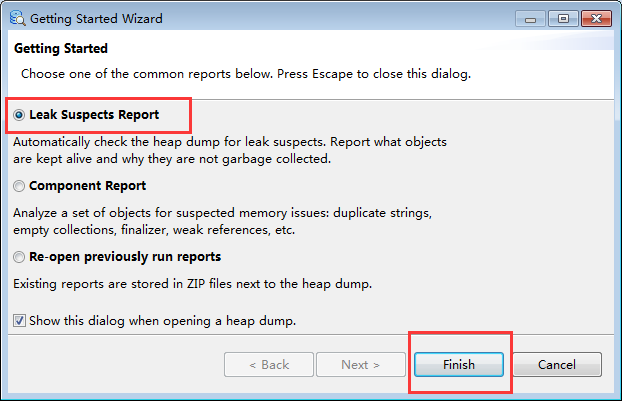
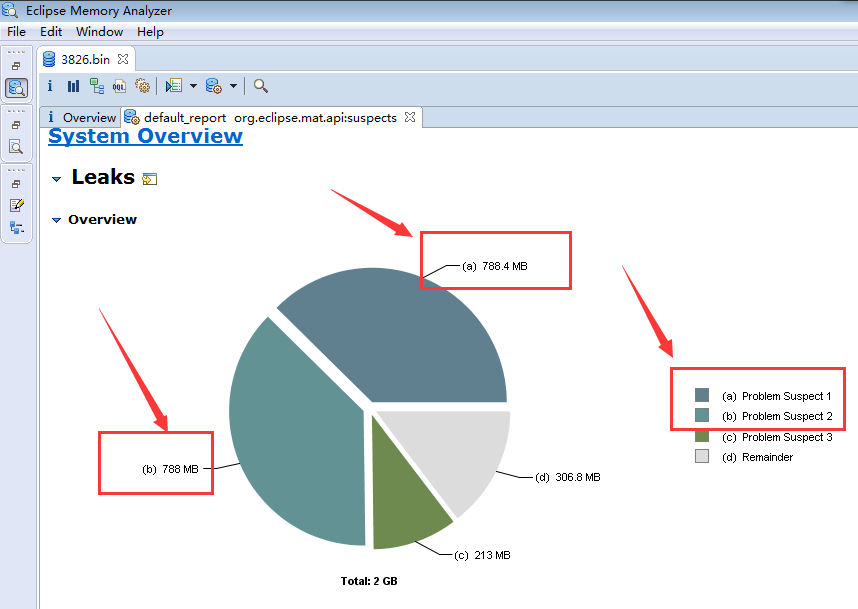
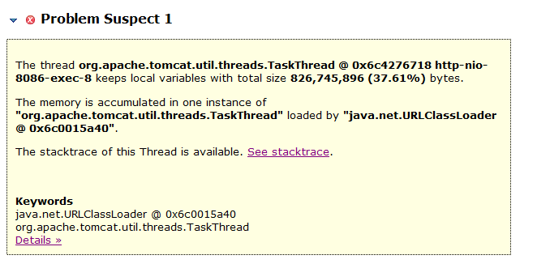
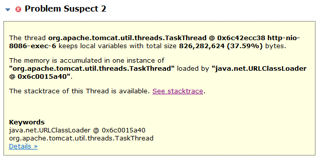
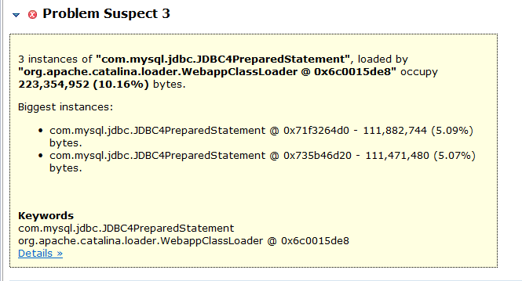
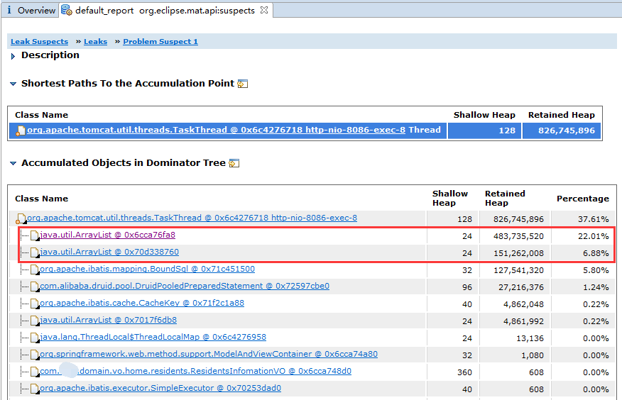
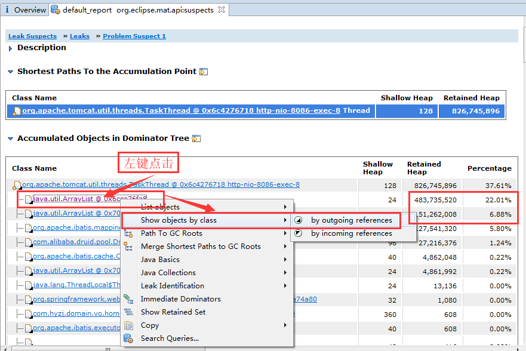
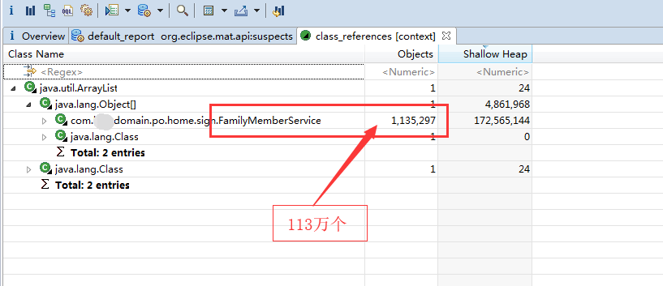

# MAT分析内存泄露

> 记一次老年代内存不足的案例

## 配置信息:

    服务器 : 阿里云ECS, CentOS 7.2
    IP地址 : 192.168.1.52
    CPU    : 4核-虚拟CPU Intel Xeon E5-2650 2.60GHz
    物理内存: 8GB

## 现象描述:

系统进行慢SQL优化调整之后上线。 在测试环境没有发现什么问题。

但运行一段时间之后发现CPU跑满, 查看GC日志


## 基本信息搜集


JVM启动参数:

```
export JAVA_OPTS="-Xms4g -Xmx4g -Xmn2g -verbose:gc -XX:+PrintGCDateStamps -XX:+PrintGCDetails -Xloggc:$CATALINA_BASE/logs/gc.log -server "
```


查看端口监听:

```
netstat -ntlp

```


查看本机的Java进程:

```
jps -v

```

> 如果用户权限不够, 看不到对应的进程, 可以需要使用 `sudo` 权限。


查看进程信息


```
ps aux | grep 3826
```

或者: 

```
ps -ef | grep 3826
```

> 实际上这和 jps 看到的信息差不多。


查看系统负载:

```
top

```

或者按内存排序:

```
top -o %MEM

```

发现目标进程ID为 `3826`, 占用CPU为 400%, 也就是4个核心全部占满。

这种现象很可能是内存占满, 持续进行 Full GC 引起的。


查看GC日志:

```
cd $CATALINA_BASE

tail -20f logs/gc.log

```

> 如果需要退出 tail, 使用 `CTRL+C` 即可。


看到控制台不间断地打印类似下面这样的 Full GC 日志:

```
2018-05-31T09:58:50.356+0800: 2665.861: 
    [Full GC (Ergonomics) 
      [PSYoungGen: 1007995K->675903K(1552896K)] 
      [ParOldGen: 2092745K->2092742K(2097152K)] 
      3100741K->2768645K(3650048K), 
      [Metaspace: 84412K->84412K(1130496K)], 
      2.4240583 secs] 
    [Times: user=7.14 sys=0.01, real=2.42 secs]
 
```

> 此处进行了手工排版, 实际上只是其中的一行GC日志。


简单解读:

- 当前时间: `2018-05-31T09:58:50.356+0800`
- JVM运行时长: `2665.861` 秒。
- GC类型: `Full GC (Ergonomics)`
- 年轻代变化: `PSYoungGen: 1007995K->675903K(1552896K)`, 从1G变为675MB左右。最大大小是1.5G左右。
- 老年代变化: `ParOldGen: 2092745K->2092742K(2097152K)`, 减少了3KB。基本上没什么变化。
- 总的堆内存: `3100741K->2768645K(3650048K)`, GC回收了300MB。
- Meta区: `[Metaspace: 84412K->84412K(1130496K)]`, 占用84MB, GC时一般不怎么变化。如果占用空间太大可能会有点问题。
- GC耗时: `2.4240583 secs`, 2.42秒一般来说算是比较严重了。
- 耗时分布: `[Times: user=7.14 sys=0.01, real=2.42 secs]`, 实际耗时(`real=2.42 secs`)和上一行相同; 系统调用耗时 `sys=0.01` 秒;  GC逻辑执行总耗时: `user=7.14` 秒, 考虑到有4个CPU, 可知每个CPU并发执行了不到 2S, 还有一部分操作是串行执行的。 

还是经验不足, 怀疑是内存泄露。 

实际上仔细分析下来, 可以发现, 是分配过快引起的。因为年轻代一直在分配，而且一直在回收。


备份GC日志:

```
cp -a logs/gc.log ~/
```


查看那个类的对象最多:

```
jmap -histo 3826
```

结果大致如下:

```
 num     #instances         #bytes  class name
----------------------------------------------
   1:       7136946      633792432  [C
   2:       2270596      345130592  com.****.domain.po.home.sign.XXXXPO
   3:      11146835      267524040  java.lang.Long
   4:       4026491      186644464  [B
   5:       7134162      171219888  java.lang.String
   6:       2270600      127153600  org.apache.ibatis.mapping.ParameterMapping
   7:       2281792      109526016  java.util.HashMap
   8:       2384251       76296032  java.util.HashMap$Node
   9:         57691       42643840  [Ljava.lang.Object;
```

像 `[C` 表示 `char[]`,  `[B` 表示 `byte[]`, 这种基础数据类型很难分析出什么问题。

关键是找到我们自己的 package, 如: `com.****.domain.po.home.sign`。这里可以看到, 存在了227万个PO对象, 对一般系统来说,可能会有点问题。

有可能存在内存泄露。

## Dump堆内存


Dump内存:


```
cd $CATALINA_BASE

jmap -dump:format=b,file=3826.hprof 3826
```

导出完成后, dump文件大约是3个G。


想办法进行压缩：

```
tar zcf 3826.hprof.tar.gz 3826.hprof
```


> 因为该机器的内存较小, 直接在该机器上进行分析可能会出问题。
> 
> 可以换一台机器使用 `jhat` 来分析, 并输出相关信息.


我们把压缩文件下载到Windows电脑上, 完成后进行解压。


## 内存分析

分析JVM的 Dump文件, 最好用的工具是 `mat`,  全称是 `Eclipse Memory Analyzer` Tools。  优势在于, 可以从 GC root 进行对象引用分析, 计算各个 root 所引用的对象有多少, 比较容易定位内存泄露。

MAT是一款独立的产品, 100MB不到, 可以从官方下载。 下载地址: <https://www.eclipse.org/mat/>


> MemoryAnalyzer.ini


mat的默认的内存配置是 1024MB, 分析3GB的dump文件会报错。

```
-vmargs
-Xmx1024m
```

根据Dump文件的大小, 适当增加最大堆内存设置, 要求是4MB的倍数, 例如:

```
-vmargs
-Xmx6600m
```

双击打开 MemoryAnalyzer.exe 

选择菜单 File --> Open File...  选择对应的 dump 文件。

选择 Leak Suspects Report 并确定, 分析内存泄露方面的报告。



然后等待, 分析完成后, 汇总信息如下:



占用内存最大的问题根源1:




占用内存最大的问题根源2:




占用内存最大的问题根源3:

。


可以看到, 总的内存占用才2GB左右。问题根源1和根源2, 每个占用 800MB, 问题很可能就在他们身上。 当然, 根源3也有一定的参考价值, 表明这时候有很多JDBC操作。


查看问题根源1。 其说明信息如下:

```
The thread org.apache.tomcat.util.threads.TaskThread @ 0x6c4276718 http-nio-8086-exec-8 
keeps local variables with total size 826,745,896 (37.61%) bytes.

The memory is accumulated in one instance of 
"org.apache.tomcat.util.threads.TaskThread" 
loaded by "java.net.URLClassLoader @ 0x6c0015a40".
The stacktrace of this Thread is available. See stacktrace.

Keywords
java.net.URLClassLoader @ 0x6c0015a40
org.apache.tomcat.util.threads.TaskThread

```

大致解读一下, 这是一个线程, 构造类是 `org.apache.tomcat.util.threads.TaskThread`, 持有了 大约 `826MB` 的对象, 占比为 `37.61%`。


点开 `See stacktrace.` 链接, 查看导出时的线程调用栈。


节选如下:

```
Thread Stack

http-nio-8086-exec-8
  ...
  at org.mybatis.spring.SqlSessionTemplate.selectOne
  at com.sun.proxy.$Proxy195.countVOBy(Lcom/****/domain/vo/home/residents/ResidentsInfomationVO;)I (Unknown Source)
  at com.****.bi.home.service.residents.impl.ResidentsInfomationServiceImpl.countVOBy(....)Ljava/lang/Integer; (ResidentsInfomationServiceImpl.java:164)
  at com.****.bi.home.service.residents.impl.ResidentsInfomationServiceImpl.selectAllVOByPage(....)Ljava/util/Map; (ResidentsInfomationServiceImpl.java:267)
  at com.****.web.controller.personFocusGroups.DocPersonFocusGroupsController.loadPersonFocusGroups(....)Lcom/****/domain/vo/JSONMessage; (DocPersonFocusGroupsController.java:183)
  at org.apache.tomcat.util.threads.TaskThread$WrappingRunnable.run()V (TaskThread.java:61)
  at java.lang.Thread.run()V (Thread.java:745)

```

其中比较关键的信息, 就是找到我们自己的 package, 如: `com.****.....ResidentsInfomationServiceImpl.selectAllVOByPage` 。

并且其中给出了Java源文件所对应的行号。


分析问题根源2, 结果和根源1基本上是一样的。

当然, 还可以分析这个根源下持有的各个类的对象数量。

点击根源1说明信息下面的 `Details »` 链接, 进入详情页面。

查看其中的 “Accumulated Objects in Dominator Tree”



可以看到占用内存最多的是2个 ArrayList 对象。

鼠标左键点击第一个 ArrayList 对象, 在弹出的菜单中选择 "Show objects by class" --> "by outgoing references"。



打开 class_references 标签页。



展开后发现 PO 类对象有 113 万个。加载的确实有点多。直接占用170MB内存(每个对象约150字节。)

MAT还提供了其他信息, 都可以点开看看, 以增加了解。 碰到不懂的就上网搜索。


## 结论与解决方案

### 初步结论

在查看源码后, 初步得出结论:

2个并发请求过来, 每个请求在执行过程中生成并持有很多对象, 比如加载了太多的 mysql 数据行, 并且有800MB以上提升到老年代, 导致内存不足。

这些请求执行较慢, 每个线程执行过程中消耗800MB, 那随便来几个并发请求, 消耗的内存就很多了。

### 解决方案

解决方案有2个:

1. 增加机器配置，加大JVM内存到8GB或者16GB。当然, 这治标不治本。
2. 优化代码，执行过程中, 尽量不要加载大量对象/数据到List或者Map之中, 一直持有。


### 经验教训

很庞大的方法体, 算是垃圾代码, 可能引发很多问题。

事实上这种重型的计算任务, 应该交给批处理业务来处理, 专门分配大量的JVM内存来支持计算。 

当然, 业务算法也应该进行拆分和优化。


相关链接: [26_jvm_analysize_demo1.md](../26_jvm_analysize_demo1/26_jvm_analysize_demo1.md)


2018年5月31日


