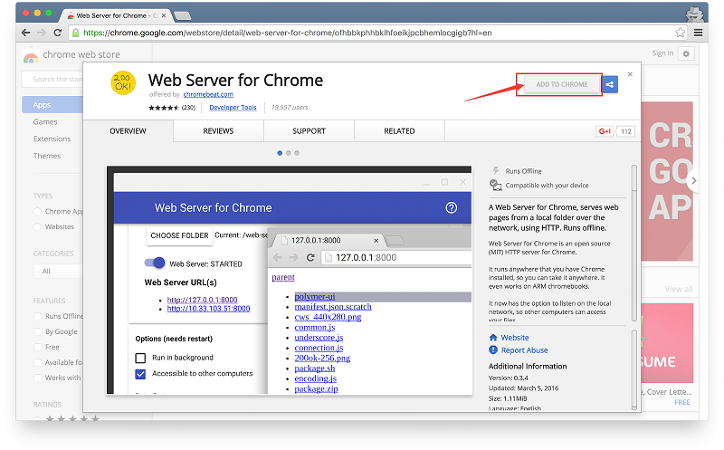
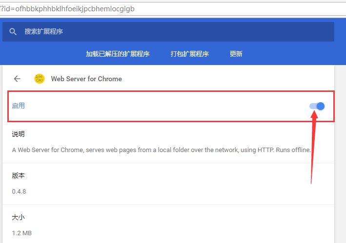

## 3. Get the sample code

## 3. 获取示例代码

## Download the code

## 下载代码

If you're familiar with git, you can download the code for this codelab from GitHub by cloning it:

如果有git工具, 直接用下面的脚本从GitHub克隆代码即可:

```
git clone https://github.com/googlecodelabs/webrtc-web
```


Alternatively, click the following button to download a .zip file of the code:

或者, 点击链接来下载 zip 压缩包:  <https://github.com/googlecodelabs/webrtc-web/archive/master.zip>

> 如果下载失败或者网络缓慢, 可通过小工具页面下载: <http://www.cncounter.com/tools/download.php?targetfilename=random.zip&origfileurl=https%3A%2F%2Fgithub.com%2Fgooglecodelabs%2Fwebrtc-web%2Farchive%2Fmaster.zip>


Open the downloaded zip file. This will unpack a project folder (**adaptive-web-media**) that contains one folder for each step of this codelab, along with all of the resources you will need.

下载完成后进行解压。里面是一个项目文件夹(**adaptive-web-media**), 其中包含多个文件夹, 分别对应教程中的各个步骤, 当然还有需要使用到的各种资源。

You'll be doing all your coding work in the directory named **work**.

执行编码任务的工作目录是 **work**。

The **step-nn** folders contain a finished version for each step of this codelab. They are there for reference.

而 **step-xx** 这一类文件夹, 则包含教程中每一个步骤的完成状态。仅供参考。

## Install and verify web server

## 安装并验证web server

While you're free to use your own web server, this codelab is designed to work well with the Chrome Web Server. If you don't have that app installed yet, you can install it from the Chrome Web Store.

可以使用你熟悉的web服务器, 如 Nginx, Tomcat, NodeJS等, 本节后面的内容主要讲解的是如何使用 Chrome Web Server 扩展应用。可以从 Chrome Web Store 安装。

[Install Web Server for Chrome](https://chrome.google.com/webstore/detail/web-server-for-chrome/ofhbbkphhbklhfoeikjpcbhemlocgigb?hl=en)




After installing the **Web Server for Chrome** app, click on the Chrome Apps shortcut from the bookmarks bar, a New Tab page, or from the App Launcher:

**Web Server for Chrome** 安装完成, 进入 "更多工具 -- 扩展程序 " 页面(<chrome://extensions/>) , 找到这个Chrome 应用, 点击详细信息, 启用:



接着往下拉, 在新版本的Chrome中, 可能需要在 Chrome 网上应用店中查看详情:


然后从 Chrome 网上应用店的页面中, 点击启动:


启动完成之后进行适当的配置, 如端口号等信息。

点击 **CHOOSE FOLDER** 可以配置WebRoot文件夹, 如选择我们解压后的 `/work` 目录。


Click the **CHOOSE FOLDER** button, and select the **work** folder you just created. This will enable you to view your work in progress in Chrome via the URL highlighted in the Web Server dialog in the **Web Server URL(s)** section.

在配置项 **Options** 下面, 选中 **Automatically show index.html** , 则可以自动展示 index 页面。 在 **Web Server URL(s)** 下面会出现相应的打开链接。


Then stop and restart the server by sliding the toggle labeled **Web Server: STARTED** to the left and then back to the right.

停止并重启 server, 通过滑动切换标签 **Web Server: STARTED**,  即先滑到左边, 再滑到到右边。


Now visit your work site in your web browser by clicking on the highlighted Web Server URL. You should see a page that looks like this, which corresponds to **work/index.html**:

在 **Web Server URL(s)** 下面会出现相应的打开链接。点击其中一个,  默认打开的就是 **`work/index.html`**

如下所示:


Obviously, this app is not yet doing anything interesting — so far, it's just a minimal skeleton we're using to make sure your web server is working properly. You'll add functionality and layout features in subsequent steps.

显然, 现在程序还什么都没有, 这只是一个架子, 目的是为了测试web服务器正常运行. 在下面的小节中， 会逐步添加功能和布局。

From this point forward, all testing and verification should be performed using this web server setup. You'll usually be able to get away with simply refreshing your test browser tab.

如果正常, 那么测试和验证都可以使用这个 web server 设置。 修改源文件并保存之后, 只需要刷新浏览器就可以查看最新效果。

