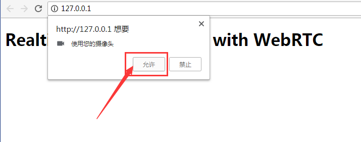
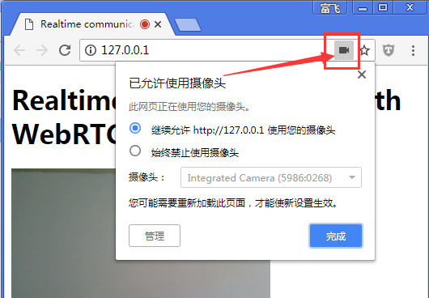

## 4. Stream video from your webcam

## 4. 从摄像头获取视频

## What you'll learn

## 本节要点

In this step you'll find out how to:

在本节的课程中, 我们将学习以下知识点:

*   Get a video stream from your webcam.
*   Manipulate stream playback.
*   Use CSS and SVG to manipulate video.

* 从摄像头(webcam)获取视频流(video stream)
* 操纵视频流的展示
* 通过CSS和SVG来处理视频。

A complete version of this step is in the `step-01` folder.

本节的完整版代码位于 `step-01` 文件夹中。

## A dash of HTML...

## HTML代码

Add a `video` element and a `script` element to `index.html` in your `work` directory:

在 `work` 目录下的 `index.html` 文件中, 增加 `video` 标签和 `script` 标签:

```
<!DOCTYPE html>
<html>
<head>
  <title>Realtime communication with WebRTC</title>
  <link rel="stylesheet" href="css/main.css" />
</head>

<body>
  <h1>Realtime communication with WebRTC</h1>
  <!-- 增加的代码在下面这里: -->
  <video autoplay playsinline></video>
  <script src="js/main.js"></script>
</body>

</html>
```

> 注意: 如果有中文字符, 则 `.html` 文件需要使用 UTF-8 编码保存/另存。


## ...and a pinch of JavaScript

## JavaScript代码

Add the following to **main.js** in your **js** folder:

在 `js` 目录下的 `main.js` 文件中, 加上下面的代码:


```
'use strict';

// 本节只需要使用到 video (video: true).
const mediaStreamConstraints = {
  video: true
};

// 用于播放视频流stream 的 video元素.
const localVideo = document.querySelector('video');

// Local stream that will be reproduced on the video.
let localStream;

// success 处理函数;  by adding the MediaStream to the video element.
function gotLocalMediaStream(mediaStream) {
  localStream = mediaStream;
  localVideo.srcObject = mediaStream;
}

// error 处理函数;  将 error 信息打印到 console.
function handleLocalMediaStreamError(error) {
  console.log('navigator.getUserMedia error: ', error);
}

// 初始化 media stream.
navigator.mediaDevices.getUserMedia(mediaStreamConstraints)
  .then(gotLocalMediaStream).catch(handleLocalMediaStreamError);

```


> All the JavaScript examples here use `'use strict';` to avoid common coding gotchas.

> 本教程中的 JavaScript 代码, 都在起始处加上 `'use strict';` 这样做可以避免很多新手常犯的编程错误。

> Find out more about what that means in [ECMAScript 5 Strict Mode, JSON, and More](http://ejohn.org/blog/ecmascript-5-strict-mode-json-and-more/).

> 关于严格模式的更多信息, 可以参考 [ECMAScript 5 Strict Mode, JSON, and More](http://ejohn.org/blog/ecmascript-5-strict-mode-json-and-more/)。

## Try it out

## 运行起来试试

Open `index.html` in your browser and you should see something like this (featuring the view from your webcam, of course!):

在浏览器中打开对应的 `index.html` 页面, 效果类似如下:


当然, 页面中展示的是摄像头实时拍摄的内容。


## How it works

## 原理解析


```
navigator.mediaDevices.getUserMedia(mediaStreamConstraints)
  .then(gotLocalMediaStream).catch(handleLocalMediaStreamError);

}
```


Following the `getUserMedia()` call, the browser requests permission from the user to access their camera (if this is the first time camera access has been requested for the current origin). If successful, a [MediaStream](https://developer.mozilla.org/en/docs/Web/API/MediaStream) is returned, which can be used by a media element via the `srcObject` attribute:

调用 `getUserMedia()` 方法之后, 浏览器会判断该 domain 是否具有读取摄像头的权限, 假如是第一次请求, 则会弹出对话框让用户决定是否允许。 如下图所示:




如果权限验证通过, 则返回 [MediaStream](https://developer.mozilla.org/en/docs/Web/API/MediaStream) 对象, 该对象可以赋值给 media 元素的 `srcObject` 属性:


```
function gotLocalMediaStream(mediaStream) {
  localVideo.srcObject = mediaStream;
}
```


The `constraints` argument allows you to specify what media to get. In this example, video only, since audio is disabled by default:

约束参数 `constraints` 可以指定获取哪些 media 信息。因为声音(audio)的默认值是禁用的, 所以这里只获取了 video 流:

```
const mediaStreamConstraints = {
  video: true
};
```


You can use constraints for additional requirements such as video resolution:

还可以加上更多的约束条件, 例如设置视频分辨率:

```
const hdConstraints = {
  video: {
    width: {
      min: 1280
    },
    height: {
      min: 720
    }
  }
}
```


The [MediaTrackConstraints specification](https://w3c.github.io/mediacapture-main/getusermedia.html#media-track-constraints) lists all potential constraint types, though not all options are supported by all browsers. If the resolution requested isn't supported by the currently selected camera, `getUserMedia()` will be rejected with an `OverconstrainedError` and the user will not be prompted to give permission to access their camera.

[MediaTrackConstraints 规范文档](https://w3c.github.io/mediacapture-main/getusermedia.html#media-track-constraints) 列出了所有可用的约束类型, 虽然有一些浏览器不兼容其中的某些选项。如果当前选择的摄像头不支持给定的约束选项, 调用 `getUserMedia()` 时则会抛出 `OverconstrainedError` 错误。默认也不会提示用户进行再次授权。

当然, 用户随时可以管理授权信息, 或者切换摄像头, 如下图所示:



各个版本的浏览器界面可能略有不同, 但应该都能找到管理授权的地方。搞不定的就上网搜索。


> You can view a demo showing how to use constraints to request different resolutions [here](https://simpl.info/getusermedia/constraints/), and a demo using constraints to choose camera and microphone [here](https://simpl.info/getusermedia/sources/).

> 关于限制不同分辨率的demo, 请参考 <https://simpl.info/getusermedia/constraints/>, 选择摄像头和麦克风的demo请参考: <https://simpl.info/getusermedia/sources/>。

If `getUserMedia()` is successful, the video stream from the webcam is set as the source of the video element:

如果 `getUserMedia()` 调用成功, 则将摄像头传过来的视频流, 赋给 video 标签:

```
function gotLocalMediaStream(mediaStream) {
  localVideo.srcObject = mediaStream;
}
```


## Bonus points

## 练习与实践

*   The `localStream` object passed to `getUserMedia()` is in global scope, so you can inspect it from the browser console: open the console, type _stream_ and press Return. (To view the console in Chrome, press Ctrl-Shift-J, or Command-Option-J if you're on a Mac.)
*   What does `localStream.getVideoTracks()` return?
*   Try calling `localStream.getVideoTracks()[0].stop()`.
*   Look at the constraints object: what happens when you change it to `{audio: true, video: true}`?
*   What size is the video element? How can you get the video's natural size from JavaScript, as opposed to display size? Use the Chrome Dev Tools to check.
*   Try adding CSS filters to the video element. For example:

* `localStream` 是一个全局变量, 所以可以从 console 中查看: 打开浏览器控制台, 输入 `localStream` 并按回车。 (打开控制台的方式: Windows下按F12并选择; 或者组合快捷键: `Ctrl-Shift-J`;  Mac则是 `Command-Option-J`)。
* `localStream.getVideoTracks()` 返回的是什么值呢?
* 查看 constraints 对象: 如果设置为 `{audio: true, video: true}`, 有什么效果呢?
* video 元素的大小是多少? 如何通过JavaScript获得视频的原生尺寸呢? 而不是仅仅获取显示出来的尺寸? 试着用 Chrome开发工具来查看相关的API。
* 尝试对 video 元素添加 CSS 过滤器。例如:


```
video {
  filter: blur(4px) invert(1) opacity(0.5);
}
```


* Try adding SVG filters. For example:

* 尝试添加SVG过滤器。例如:

```
video {
   filter: hue-rotate(180deg) saturate(200%);
}
```


## What you learned

## 你学到了什么

In this step you learned how to:

在这个步骤中,您了解了如何:

*   Get video from your webcam.
*   Set media constraints.
*   Mess with the video element.

* 从网络摄像头获取视频。
* 设置媒体约束(media constraint)。
* 放置视频元素。


A complete version of this step is in the **step-01** folder.

本节的完整版代码位于 **step-01** 文件夹下。

## Tips

## 提示

*   Don't forget the `autoplay` attribute on the `video` element. Without that, you'll only see a single frame!
*   There are lots more options for `getUserMedia()` constraints. Take a look at the demo at [webrtc.github.io/samples/src/content/peerconnection/constraints](https://webrtc.github.io/samples/src/content/peerconnection/constraints/). As you'll see, there are lots of interesting WebRTC samples on that site.

*   不要忘记 `video` 元素的 `autoplay` 属性。如果没有设置, 则只能看到第一帧画面!
*   `getUserMedia()`方法提供了很多选项, 请参考 <https://webrtc.github.io/samples/src/content/peerconnection/constraints/>. 当然, 其中也提供了很多有趣的 WebRTC 示例。

## Best practice

## 最佳实践

*   Make sure your video element doesn't overflow its container. We've added `width` and `max-width` to set a preferred size and a maximum size for the video. The browser will calculate the height automatically:

* 请确保 video 元素的内容不会溢出包裹他的容器。可以通过 `width` 和 `max-width` 样式来设置 video 的默认尺寸、以及最大尺寸。 浏览器自动计算对应的 height 属性:

```
video {
  max-width: 100%;
  width: 320px;
}
```


## Next up

## 下一步做什么呢?

You've got video, but how do you stream it? Find out in the next step!

既然获取到了 video 信息, 但是如何使用呢? 我们在下一小节讨论!

