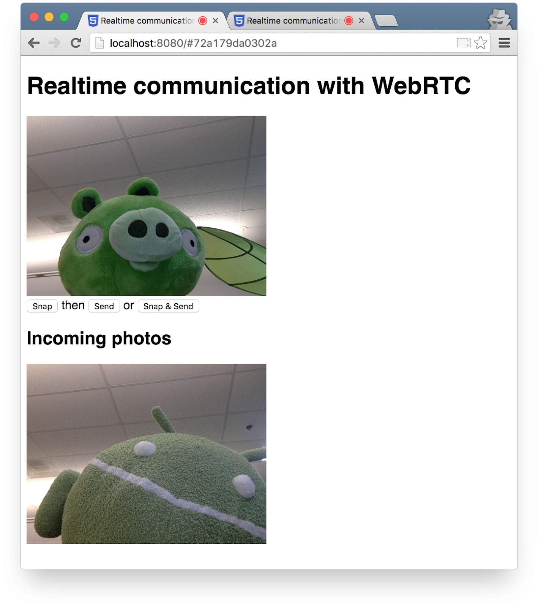

## 9. Take a photo and share it via a data channel

## WebRTC基础实践 - 9. 拍照并传给对方

## What you'll learn

## 本节内容

In this step you'll learn how to:

在本节课程中, 我们将学习以下内容:

- Take a photo and get the data from it using the canvas element.
- Exchange image data with a remote user.

- 拍照并通过canvas元素获取图像数据。
- 给对面发送图片。

A complete version of this step is in the **step-06** folder.

本节的完整版代码位于 `step-06` 文件夹中。

## How it works

## 工作原理

Previously you learned how to exchange text messages using RTCDataChannel.

前面的小节中, 我们使用 `RTCDataChannel` 来传递文本消息。

This step makes it possible to share entire files: in this example, photos captured via `getUserMedia()`.

本节课程, 将学习如何发送文件: 下面的示例发送的是通过 `getUserMedia()` 捕获的照片文件, 原理都是一样的。

The core parts of this step are as follows:

核心内容包括:

1. Establish a data channel. Note that you don't add any media streams to the peer connection in this step.
2. Capture the user's webcam video stream with `getUserMedia()`:

1. 建立数据通道。请注意, 本节不再将媒体流添加到对等连接中。
2. 使用 `getUserMedia()` 获取摄像头拍到的视频。

```
var video = document.getElementById('video');

function grabWebCamVideo() {
  console.log('Getting user media (video) ...');
  navigator.mediaDevices.getUserMedia({
    video: true
  })
  .then(gotStream)
  .catch(function(e) {
    alert('getUserMedia() error: ' + e.name);
  });
}
```


1. When the user clicks the **Snap** button, get a snapshot (a video frame) from the video stream and display it in a `canvas` element:

1. 点击 **Snap**(拍照)按钮, 会从 video 流中得到一份快照(一帧视频), 并通过 `canvas`元素来展示:

```
var photo = document.getElementById('photo');
var photoContext = photo.getContext('2d');

function snapPhoto() {
  photoContext.drawImage(video, 0, 0, photo.width, photo.height);
  show(photo, sendBtn);
}
```

1. When the user clicks the **Send** button, convert the image to bytes and send them via a data channel:

1. 点击 **Send**(发送)按钮, 会将图像转换为字节数组(bytes), 并通过数据通道发送给对方:

```
function sendPhoto() {
  // 将数据分块的字节数长度;
  var CHUNK_LEN = 64000;
  var img = photoContext.getImageData(0, 0, photoContextW, photoContextH),
    len = img.data.byteLength,
    n = len / CHUNK_LEN | 0;

  console.log('Sending a total of ' + len + ' byte(s)');
  dataChannel.send(len);

  // split the photo and send in chunks of about 64KB
  for (var i = 0; i < n; i++) {
    var start = i * CHUNK_LEN,
      end = (i + 1) * CHUNK_LEN;
    console.log(start + ' - ' + (end - 1));
    dataChannel.send(img.data.subarray(start, end));
  }

  // send the reminder, if any
  if (len % CHUNK_LEN) {
    console.log('last ' + len % CHUNK_LEN + ' byte(s)');
    dataChannel.send(img.data.subarray(n * CHUNK_LEN));
  }
}
```


1. The receiving side converts data channel message bytes back to an image and displays the image to the user:

1. 接收端, 则将收到的字节, 转换为图像, 并展示给用户:

```
function receiveDataChromeFactory() {
  var buf, count;

  return function onmessage(event) {
    if (typeof event.data === 'string') {
      buf = window.buf = new Uint8ClampedArray(parseInt(event.data));
      count = 0;
      console.log('Expecting a total of ' + buf.byteLength + ' bytes');
      return;
    }

    var data = new Uint8ClampedArray(event.data);
    buf.set(data, count);

    count += data.byteLength;
    console.log('count: ' + count);

    if (count === buf.byteLength) {
      // we're done: all data chunks have been received
      console.log('Done. Rendering photo.');
      renderPhoto(buf);
    }
  };
}

function renderPhoto(data) {
  var canvas = document.createElement('canvas');
  canvas.width = photoContextW;
  canvas.height = photoContextH;
  canvas.classList.add('incomingPhoto');
  // trail is the element holding the incoming images
  trail.insertBefore(canvas, trail.firstChild);

  var context = canvas.getContext('2d');
  var img = context.createImageData(photoContextW, photoContextH);
  img.data.set(data);
  context.putImageData(img, 0, 0);
}
```


## Get the code

## 实现代码

Replace the contents of your **work** folder with the contents of **step-06**. Your **index.html **file in **work** should now look like this**:**

将 **step-06** 文件夹下的内容, 复制到 **work** 目录中。

**index.html**文件的内容为:

```
<!DOCTYPE html>
<html>

<head>
  <title>Realtime communication with WebRTC</title>
  <link rel="stylesheet" href="/css/main.css" />
</head>

<body>
  <h1>Realtime communication with WebRTC</h1>

  <h2>
    <span>Room URL: </span><span id="url">...</span>
  </h2>

  <div id="videoCanvas">
    <video id="camera" autoplay></video>
    <canvas id="photo"></canvas>
  </div>

  <div id="buttons">
    <button id="snap">Snap</button><span> then </span><button id="send">Send</button>
    <span> or </span>
    <button id="snapAndSend">Snap &amp; Send</button>
  </div>

  <div id="incoming">
    <h2>Incoming photos</h2>
    <div id="trail"></div>
  </div>

  <script src="/socket.io/socket.io.js"></script>
  <script src="https://webrtc.github.io/adapter/adapter-latest.js"></script>
  <script src="js/main.js"></script>

</body>
</html>
```


If you are not following this codelab from your **work** directory, you may need to install the dependencies for the **step-06**folder or your current working folder. Simply run the following command from your working directory:


如果没有执行上一节的操作, 需要在 **step-06**目录, 或者工作目录下, 安装相应的依赖, 命令如下:


```
cnpm install
```


Once installed, if your Node.js server is not running, start it by calling the following command from your **work** directory:

安装完成后, 需要启动 Node.js 服务器, 在**work**目录下执行命令:


```
node index.js
```


Make sure you're using the version of **index.js** that implements Socket.IO, and remember to restart your Node.js server if you make changes. For more information on Node and Socket IO, review the section "Set up a signaling service to exchange messages".


请确认 **index.js** 文件的内容中包含了 Socket.IO 相关的内容, 参考前一小节。更多关于Node和Socket.IO的内容, 请参考 [7_Set_up_signaling_service.md](./7_Set_up_signaling_service.md)。

If necessary, click on the **Allow** button to allow the app to use your webcam.

如果弹出对话框, 请点击**Allow**(允许)按钮, 授权使用本地摄像头。

The app will create a random room ID and add that ID to the URL. Open the URL from the address bar in a new browser tab or window.

本应用会创建一个随机的房间ID, 并将此ID加入URL中。

然后在一个新的标签或窗口打开同样的URL。

Click the **Snap & Send** button and then look at the Incoming area in the other tab at the bottom of the page. The app transfers photos between tabs.

点击 `Snap` 和 `Send` 按钮, 然后查看另一个标签页中, 是否显示了传过去的照片。 

这个应用主要是实现了在不同标签页/不同窗口之间传输照片。

You should see something like this:

界面看起来类似这样:




## Bonus points

## 练习与实践

1. How can you change the code to make it possible to share any file type?

1. 修改代码, 以传输任意类型的文件。

## Find out more

## 了解更多

- [The MediaStream Image Capture API](https://www.chromestatus.com/features/4843864737185792): an API for taking photographs and controlling cameras — coming soon to a browser near you!
- The MediaRecorder API, for recording audio and video: [demo](https://webrtc.github.io/samples/src/content/getusermedia/record/), [documentation](https://www.chromestatus.com/features/5929649028726784).

- MediaStream 图像捕捉API,用于控制相机拍照的API, 让浏览器拍照变得简单易用: <https://www.chromestatus.com/features/4843864737185792>
- MediaRecorder API, 用于录制音频和视频, 相关示例: <https://webrtc.github.io/samples/src/content/getusermedia/record/>; 相关文档: <https://www.chromestatus.com/features/5929649028726784>。

## What you learned

## 内容回顾

- How to take a photo and get the data from it using the canvas element.
- How to exchange that data with a remote user.

- 拍照并通过canvas元素获取图像数据。
- 给对面发送图片。

A complete version of this step is in the **step-06** folder.

本节的完整版代码位于 `step-06` 文件夹中。


原文链接: <https://codelabs.developers.google.com/codelabs/webrtc-web/#7>

翻译人员: 铁锚 - <https://blog.csdn.net/renfufei>

翻译日期: 2018年08月27日

