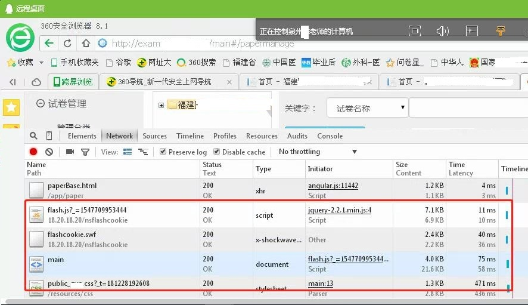
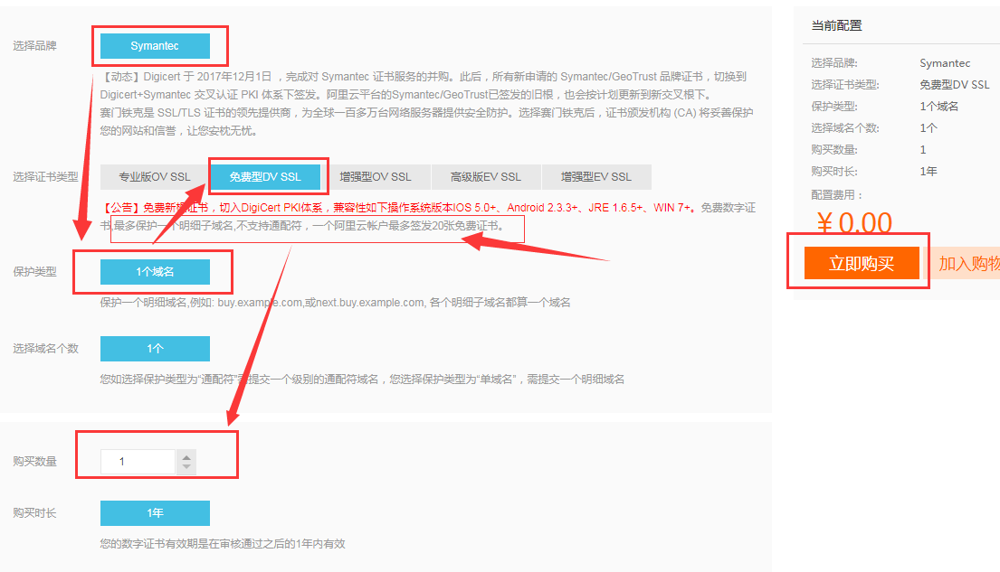

# 升级https - 解决系统被网络运营商植入广告等问题


### 情景回顾

福建泉州的客户反馈, 说系统使用不正常, 经常提示 "网络错误", 或者点击某些按钮时会进行页面跳转。

让客户试过各种“万能”手段: 比如清缓存, 换浏览器, 换电脑等等,问题依然会复现。

通过QQ远程桌面连接客户的电脑, 使用浏览器的Network控制台, 看到监控信息中莫名出现的加载内容, 如下图所示:




怀疑是客户所使用的宽带运营商存在网页劫持和篡改行为。

让客户换运营商有点不太现实。

然后, 我们将后台管理系统升级为支持https的方式, 成功防止了无良网络运营商的广告注入、以及造成的系统不可用问题。

OK，成功搞定！

其中有一些值得记录下来的点:

- 1、https网页中的js和css等控制资源, 不能加载 http协议下的资源, 所以使用CDN时需要注意。
- 2、如果需要兼容 http与https, 则资源可以通过`//`开头, 如`<script src="//xxx.com/xxxx.js" ...`。
- 3、https网页中的图片，可以引用http协议的资源。
- 4、各种http跳转码是运营商的最爱,比如302,404,500等等。
- 5、GET请求也是安全的，不加密的内容只有域名、IP、端口。
- 6、HTTPS的好处: 加密传输、防止劫持、冒充、篡改、信息泄露。


HTTPS, HTTP over TLS, 主要强调的就是传输安全。 详细介绍请参考维基百科: [HTTPS-超文本传输安全协议](https://zh.wikipedia.org/wiki/%E8%B6%85%E6%96%87%E6%9C%AC%E4%BC%A0%E8%BE%93%E5%AE%89%E5%85%A8%E5%8D%8F%E8%AE%AE)

如今各大互联网公司都已强制全站使用HTTPS。 国内比较知名的有:

- <https://www.qq.com>
- <https://www.baidu.com>
- <https://www.jd.com/>
- <https://www.mi.com/>


HTTPS比起HTTP有很多好处, 当然, 成本会高一些, 比如证书的价格问题。


### 申请证书


现在申请顶级安全提供商的HTTPS证书, 价格已下降很多, 而且针对单个域名还有免费的证书可以申请。

如今各大云厂商都可以申请免费的HTTPS证书, 比如阿里云, 腾讯云等等, 一般来说需要你的域名托管在他们的平台, 否则的话申请会比较麻烦、需要进行一些配置与验证才会颁发证书。


### 申请免费证书

比如 阿里云免费提供的 "SSL证书", 由 Symantec. 签发, 每个订单只支持单个明细子域名, 每人最多同时持有20个免费证书。

访问: <https://www.aliyun.com/product/cas>


然后购买产品时选择具体的购买类型即可。




订单确认之后, 填写具体的域名信息, 如根域名 `cncounter.com`, 

> www与根域名可使用同一张明细子域名证书。如 <https://cncounter.com> 与<https://www.cncounter.com>;

关于 DV, OV, EV 的区别, 请参考: <https://blog.csdn.net/diandianxiyu_geek/article/details/53175214>

当然, 企业使用一般得购买通配符证书, 类似 `*.cncounter.com` 这种。

各家厂商的价格不一样, DV型的通配符域名证书每年约2000左右, OV通配符证书一般上万;

我们单位购买的是 GeoTrust 签发的通配符证书、一次性多购买几年, 算下来价格会优惠很多。

如果查看阿里云官方网站的Https证书，可以看到有效期只有2个月，这样能有效防止证书泄露或者被破解。当然，这需要的人力和IT运维资源也会增加。


### 部署SSL证书

如果使用阿里云, 可以下载格式的证书, 支持 Nginx, Apache, IIS, Tomcat等等。

以 Nginx 为例, 参考: <http://www.nginx.cn/doc/optional/ssl.html>

下载之后的证书文件，最好是修改为站点相关的名称,例如 `cncounter.com.crt` 等。


```
server {
    listen              80;
    listen              443 ssl;
    server_name         cncounter.com *.cncounter.com;
    ssl_certificate     /usr.local/www/cncounter.com.crt;
    ssl_certificate_key /usr.local/www/cncounter.key;
    ...

    proxy_set_header X-Forwarded-Proto $scheme;
}
```

可在Nginx中配置请求头 `proxy_set_header`, 将真实的协议传给Tomcat之类的后端服务器。


在Tomcat的配置文件`server.xml`中增加Valve, 请搜索`RemoteIpValve`, 可大致参考: <https://www.oschina.net/question/12_213459>

```
<Valve className="org.apache.catalina.valves.RemoteIpValve" 
remoteIpHeader="x-forwarded-for" proxiesHeader="x-forwarded-by" 
protocolHeader="x-forwarded-proto" />
```

指定 `protocolHeader="x-forwarded-proto"`, 会将HTTP请求头中 `x-forwarded-proto` 的值设置为scheme, 这样 `request.getScheme()`, `request.getRequestURL()` 方法就能正确获取到客户端真实的h协议, 如 https;

当然, 这里是因为我们的部署结构为: Nginx + Tomcat, Shiro拦截的时候需要读取这一信息。


RemoteIpValve的官方文档为: <https://tomcat.apache.org/tomcat-8.0-doc/api/org/apache/catalina/valves/RemoteIpValve.html>

> **注意**: 如果Tomcat版本不一致，则 RemoteIpValve 可配置的属性会有些差别，参考官方文档进行配置即可。


日期: 2019年01月23日

作者: 铁锚 - <https://blog.csdn.net/renfufei>

